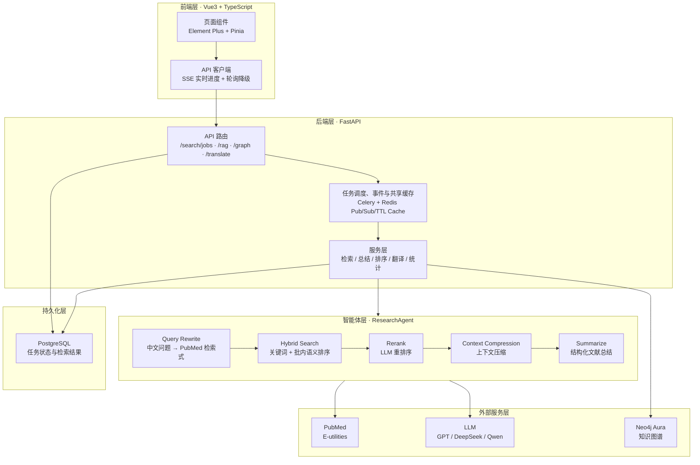
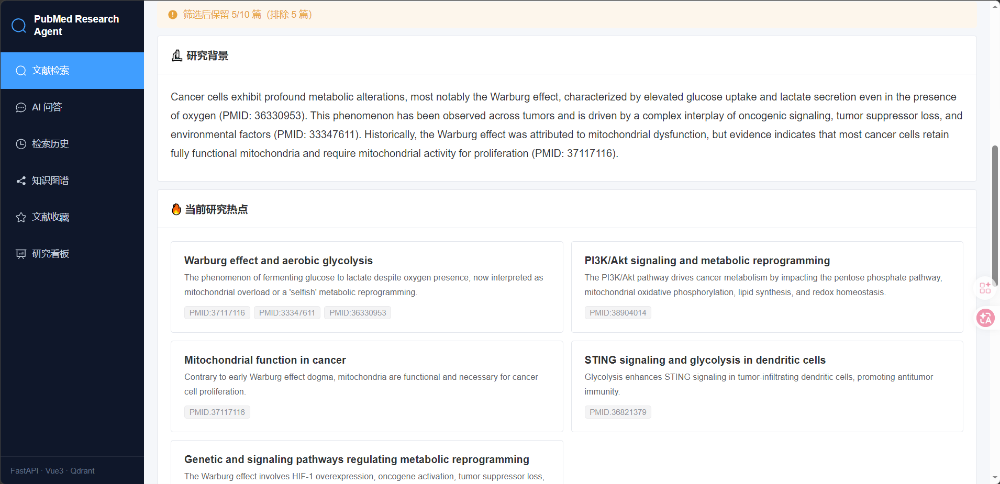
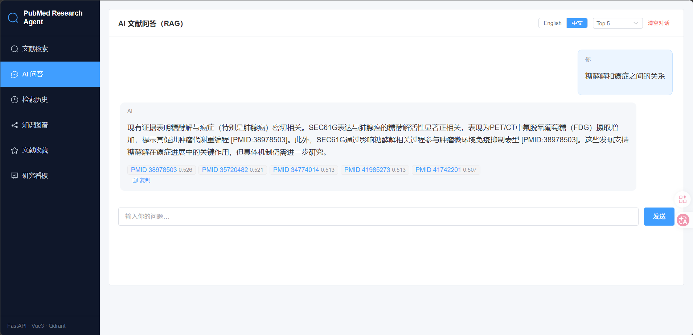
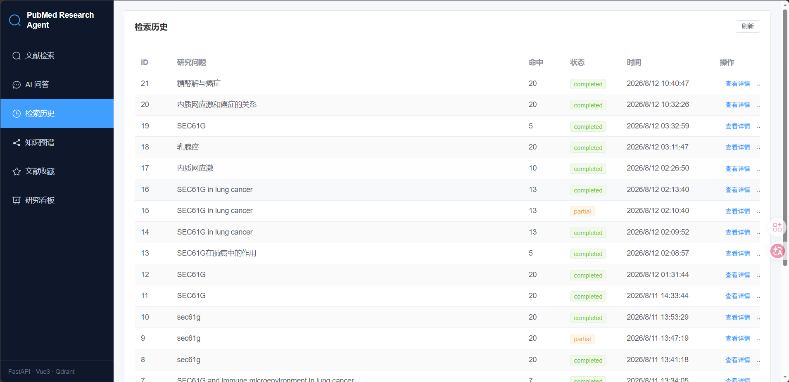

# PubMed Research Agent 🔬

> AI 驱动的医学文献智能分析系统：输入一个研究问题（如 **"SEC61G in Lung Cancer"**），
> 自动检索 PubMed、总结文献、提炼研究热点与未来方向，并支持 RAG 问答与知识图谱可视化。

> 本项目为 Hello-Agents 第 16 章毕业设计，作者 [@0609x](https://github.com/0609x)。
> 独立项目仓库：[0609x/PubMed-Research-Agent](https://github.com/0609x/PubMed-Research-Agent)。

[](https://www.python.org/downloads/)
[](https://fastapi.tiangolo.com/)
[](https://vuejs.org/)
[]()

---

## 目录

- [功能特性](#功能特性)
- [系统架构](#系统架构)
- [页面详情](#页面详情)
- [快速开始](#快速开始)
- [API 概览](#api-概览)
- [运行测试](#运行测试)
- [生产部署](docs/PRODUCTION_DEPLOYMENT.md)
- [常见问题](#常见问题)
- [项目亮点](#项目亮点)
- [未来计划](#未来计划)
- [作者与致谢](#作者与致谢)

---

## 功能特性

| 能力 | 说明 |
|------|------|
| 🔍 PubMed 检索 | 关键词检索 / 高级检索（问题改写），支持时间、相关度排序与年份、影响因子筛选 |
| 🧠 AI 总结 | 大模型输出研究背景、当前热点、主要发现、研究方法、未来方向 |
| 📊 研究看板 | 检索统计、热门词趋势、期刊/年份/影响因子分布，支持关键词管理 |
| 🕸️ 知识图谱 | 文献/作者/期刊关系入库 Neo4j，子图查询与相关文献推荐 |
| 💬 收藏文献 RAG 问答 | 仅基于浏览器收藏夹中的文献回答，答案附带 PMID 来源引用 |
| 📚 文献收藏 | 收藏重要文献并导出 BibTeX，支持中英文摘要互译 |
| ⚡ 性能与反馈 | 后台任务、SSE 实时进度、Redis 共享缓存与防击穿锁、Hybrid Search、Rerank |

---

## 系统架构



### 分层说明

| 层 | 技术 | 职责 |
|----|------|------|
| 前端层 | Vue3 + TypeScript + Element Plus + Pinia | 页面展示、交互、状态管理；Vite 代理 `/api` 到后端 |
| 后端层 | FastAPI + Celery + Redis | REST API、后台任务调度、状态查询与取消 |
| 持久化层 | PostgreSQL + SQLAlchemy(async) | 任务状态、检索结果与分析报告的唯一数据来源 |
| 智能体层 | ResearchAgent 管线 | 问题改写 → 混合检索 → 重排 → 压缩 → 总结 |
| 外部服务层 | PubMed / LLM / Neo4j | 文献数据源、模型推理、知识图谱 |

### 目录结构

项目采用 **5 大目录** 组织，根目录只保留入口配置：

```
PubMed-Research-Agent/
├── backend/                  # 后端全部 Python 代码
│   ├── app/                  # FastAPI 应用（api / core / models / schemas）
│   ├── agents/               # 智能体（ResearchAgent、QueryRewriter）
│   ├── services/             # 业务服务（检索、总结、向量、图谱、排序等）
│   ├── tools/                # 外部工具封装（PubMedSearchTool）
│   ├── tests/                # 单元测试 + 集成测试
│   └── alembic/              # 数据库迁移
├── frontend/                 # Vue3 前端（Vite + TS）
│   └── src/views/            # 6 个页面视图
├── data/                     # 本地 SQLite、会话与期刊指标表（线上缓存使用 Redis）
├── deploy/                   # 部署文件（Docker Compose、Dockerfile）
├── docs/                     # 项目文档与截图
├── .env.example              # 环境变量模板
├── requirements.txt          # Python 依赖（开发/测试）
└── README.md
```

---

## 页面详情

系统共 6 个页面，通过左侧菜单导航切换。

### 1. 文献检索（`/search`）

默认首页。输入研究问题，一键完成"检索 → 总结 → 分析"。

- **检索方式**：关键词检索（直接匹配） / 高级检索（自动改写为 PubMed 检索式，支持中文输入）
- **排序与筛选**：相关度、发表时间（升/降序）；按年份区间、影响因子阈值过滤
- **结果列表**：标题、摘要、PMID、DOI、作者、期刊、发表日期
- **AI 总结**：研究背景 / 当前研究热点 / 主要发现 / 实验验证方法 / 未来研究方向
- **交互**：分阶段实时进度、任务取消、断线自动降级轮询、单篇翻译、收藏文献、复制结果




### 2. AI 问答（`/chat`）

基于个人收藏文献的本地检索增强问答，支持中英文回答，答案附带 PMID 来源引用。收藏夹
保存在浏览器本地，提问时仅发送选出的收藏文献内容作为回答证据。



### 3. 检索历史（`/history`）

展示历史检索记录（查询词、时间等），可一键重新加载历史结果。



### 4. 知识图谱（`/graph`）

文献-作者-期刊关系图谱：

- **图谱状态**：显示 Neo4j 连接是否就绪
- **可视化导航**：单击文献节点即可设为新的探索中心，URL 可分享并支持浏览器前进/后退
- **关联解释**：明确展示共同作者、同一期刊及共现数量，不只给出黑盒推荐
- **科研闭环**：查看摘要和作者、打开 PubMed，并将图谱发现一键收藏到个人 RAG 文献库
- **快速入口**：直接列出最近进入图谱的文献，无需预先记住 PMID


### 5. 文献收藏（`/library`）

收藏的文献列表，支持 **BibTeX 导出**，便于引用管理。


### 6. 研究看板（`/dashboard`）

检索行为统计与热点分析：

- 总检索次数、总文献数、期刊分布、年份分布、影响因子分布
- **热门检索词**：自动从改写后的英文检索词与中文查询中提取，支持关键词管理（单条/全部删除）


---

## 快速开始

### 环境要求

- Python 3.11+（推荐 3.13）
- Node.js 18+（推荐 22）
- 一个 OpenAI 兼容的 LLM API（DeepSeek / Qwen / GPT 均可）
- （可选）Neo4j Aura 实例，用于知识图谱

### 1. 配置环境变量

```bash
# 复制模板并填写密钥
cp .env.example .env
```

| 变量 | 必填 | 说明 |
|------|------|------|
| `LLM_API_BASE` | ✅ | OpenAI 兼容接口地址，如 `https://api.deepseek.com` |
| `LLM_API_KEY` | ✅ | 模型 API Key |
| `LLM_MODEL` | ✅ | 模型名，如 `deepseek-chat` / `gpt-4o` / `qwen-plus` |
| `CHROMA_PERSIST_DIR` / `CHROMA_COLLECTION_NAME` | 可选 | 本地 ChromaDB 向量库（收藏文献 RAG） |
| `NEO4J_URI` / `NEO4J_USERNAME` / `NEO4J_PASSWORD` | 可选 | 知识图谱 |
| `EMBED_API_KEY` / `EMBED_MODEL_NAME` | 可选 | DashScope 嵌入模型（向量化） |
| `PUBMED_API_KEY` | 可选 | NCBI Key，提升检索限流（10 次/秒） |
| `REDIS_URL` | 本地开发必填 | Celery 消息队列，例如 `redis://localhost:6379/0` |
| `PROMPT_CACHE_REDIS_URL` | 线上必填 | 跨 Worker 共享的 LLM/查询缓存，建议使用独立 Redis DB |
| `PROMPT_CACHE_TTL_HOURS` | 可选 | 共享缓存有效期，默认 24 小时 |

### 2. 启动本地开发环境

```bash
# 创建虚拟环境（首次）
python -m venv .venv
.venv\Scripts\activate          # Windows
# source .venv/bin/activate      # macOS / Linux

# 安装依赖
pip install -r requirements.txt

# 初始化或升级数据库
alembic upgrade head

# 终端 1：启动后端（在项目根目录）
uvicorn backend.app.main:app --host 0.0.0.0 --port 8000 --reload

# 终端 2：启动 Worker（Windows 本地使用 solo 池）
celery -A backend.worker:celery_app worker --loglevel=INFO --pool=solo
```

启动上述命令前需有一个可用的 Redis；本地可以运行
`docker run --rm -p 6379:6379 redis:7-alpine`。开发环境可继续使用 SQLite，
线上部署统一使用 PostgreSQL。

如果已有旧版 SQLite 数据库且尚未使用 Alembic，请先备份数据库，然后执行：

```bash
alembic stamp 0001_initial
alembic upgrade head
```

后端启动后访问 http://localhost:8000/docs 查看 Swagger 文档。

检索采用后台任务接口：`POST /api/v1/search/jobs` 创建任务，
`GET /api/v1/search/jobs/{job_id}` 查询状态，
`GET /api/v1/search/jobs/{job_id}/events` 订阅 SSE 实时进度，
`POST /api/v1/search/jobs/{job_id}/cancel` 请求取消。长时间的 PubMed/LLM
处理在 Worker 内执行，不会占住 API 请求；SSE 断线时前端自动切换为状态轮询。

### 3. 启动前端

```bash
cd frontend
npm install          # 首次
npm run dev
```

浏览器访问 http://localhost:5173 ，Vite 已将 `/api` 代理到后端 :8000。

### 4. Docker 一键部署

```bash
# 在项目根目录执行
docker compose -f deploy/docker-compose.yml up -d --build
```

部署前请在根目录 `.env` 或主机环境中设置强随机的 `POSTGRES_PASSWORD`；
若密码含 URL 特殊字符，请设置完整且已编码的 `POSTGRES_DATABASE_URL`。
Compose 会同时启动 PostgreSQL、Redis、FastAPI、Celery Worker 与前端。
完整的生产配置、健康检查、扩容、备份和安全边界见
[生产部署与验收](docs/PRODUCTION_DEPLOYMENT.md)。

- 后端：http://localhost:8000
- 前端：http://localhost:8080
- PostgreSQL 与 Redis 使用命名卷持久化；提示词与查询缓存位于 Redis DB 1，`data/` 不再承担线上缓存共享

---

## API 概览

| 方法 | 路径 | 说明 |
|------|------|------|
| GET | `/api/v1/health` | 健康检查 |
| GET | `/api/v1/health/live` | API 进程存活检查 |
| GET | `/api/v1/health/ready` | PostgreSQL 与 Redis 就绪检查 |
| POST | `/api/v1/search/jobs` | 创建后台文献检索任务（返回 202） |
| GET | `/api/v1/search/jobs/{job_id}` | 查询任务状态 |
| GET | `/api/v1/search/jobs/{job_id}/events` | 订阅 SSE 实时进度事件 |
| POST | `/api/v1/search/jobs/{job_id}/cancel` | 取消排队或运行中的任务 |
| GET | `/api/v1/search/{search_id}` | 获取已持久化的检索结果 |
| GET | `/api/v1/search/stats` | 研究看板统计 |
| POST | `/api/v1/search/keywords/action` | 热门检索词管理 |
| POST | `/api/v1/rag/query` | RAG 问答 |
| GET | `/api/v1/graph/stats` | 知识图谱状态 |
| GET | `/api/v1/graph/papers` | 最近进入图谱的文献 |
| GET | `/api/v1/graph/paper/{pmid}` | 图谱论文详情 |
| GET | `/api/v1/graph/subgraph/{pmid}` | 子图查询 |
| GET | `/api/v1/graph/related/{pmid}` | 带关联依据的相关文献 |
| POST | `/api/v1/translate` | 摘要翻译 |

---

## 运行测试

```bash
# 后端测试（在项目根目录）
.venv\Scripts\python.exe -m pytest backend/tests -q

# 前端类型检查与构建
cd frontend
npm run build        # vue-tsc + vite build
```

---

## 常见问题

**Q：搜索结果都是英文，能翻译吗？**
可以。文献详情提供中英文摘要互译，AI 问答也支持语言选择。

**Q：检索提示 PubMed 限流？**
在 `.env` 配置 `PUBMED_API_KEY`（NCBI 免费申请），速率提升至 10 次/秒。

**Q：Neo4j 报认证失败？**
确认 `.env` 中的地址、用户名、密码和数据库名与 Aura 控制台一致；新建实例后通常等待 1 分钟左右才能连接。

**Q：不想使用知识图谱？**
在 `.env` 设置 `NEO4J_ENABLED=false` 关闭该功能。

---

## 项目亮点

- 从自然语言研究问题到 PubMed 检索式、文献集和结构化研究报告的完整智能体工作流。
- Celery 后台任务配合 SSE 进度事件，长时间检索和总结过程可见、可取消。
- 收藏文献直接组成个人 RAG 证据库，回答附 PMID 引用，减少无来源内容。
- Neo4j 文献—作者—期刊图谱支持可视化导航、关联解释和相关文献回收。
- 包含后端单元/集成测试、前端类型检查与容器化部署配置。

## 未来计划

- 增加标准化检索评估集，持续跟踪召回率、引用准确性和端到端延迟。
- 扩展跨文献实体对齐，提高基因、疾病、药物和实验方法的图谱关联质量。
- 支持团队级文献库、导出格式与可复现的研究工作流。

## 作者与致谢

- 作者：[@0609x](https://github.com/0609x)
- 感谢 [Datawhale](https://github.com/datawhalechina) 社区与
  [Hello-Agents](https://github.com/datawhalechina/hello-agents) 教程提供的学习与共创平台。
