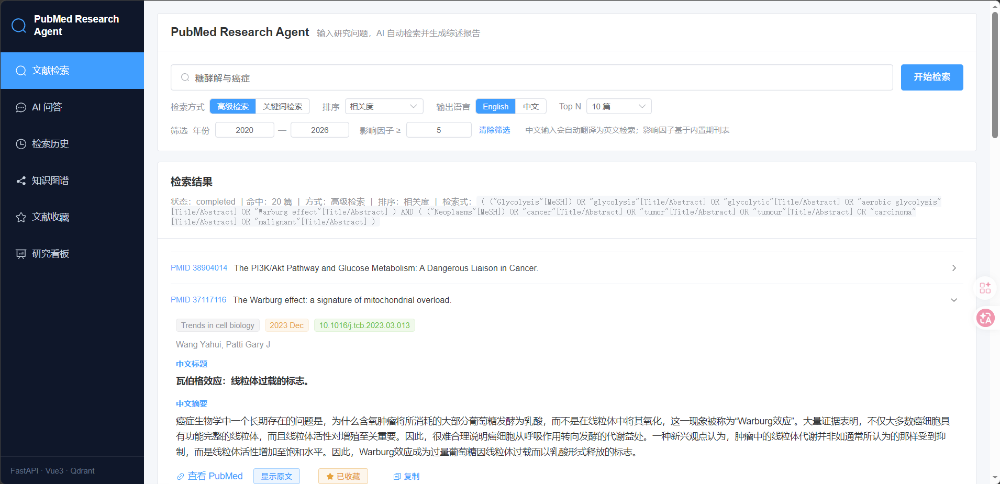
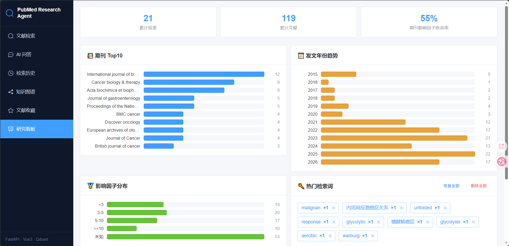
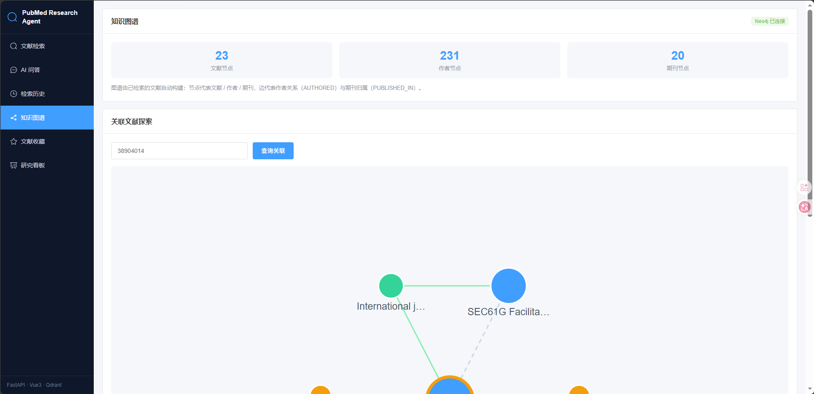
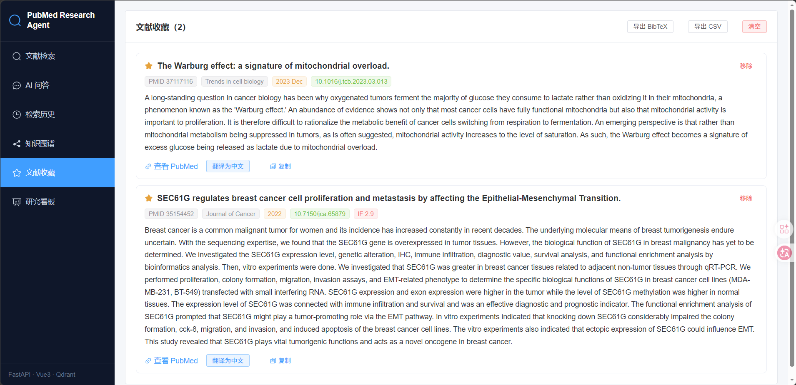

# PubMed-Research-Agent - 智能文献检索与分析系统

> 输入一个研究问题（如 "SEC61G in Lung Cancer"），自动检索 PubMed、调用大模型分析文献，输出结构化研究报告。

## 📝 项目简介

PubMed-Research-Agent 是一个面向科研场景的 AI 文献检索与分析系统。用户只需输入一个研究问题，系统会自动完成「问题改写 → PubMed 检索 → 文献获取 → 大模型总结 → 结构化报告」的完整链路，输出研究背景、当前研究热点、主要发现、实验验证方法和未来研究方向。

- **解决什么问题**：科研人员手动在 PubMed 检索、逐篇阅读摘要、归纳研究热点耗时费力。
- **特色功能**：中文问题自动翻译改写、关键词/高级两种检索模式、时间与相关度排序、影响因子与年份筛选、RAG 混合检索、知识图谱、研究看板。
- **适用场景**：开题调研、文献综述、研究热点追踪、AI 应用开发学习。

本仓库是 Hello-Agents 毕业设计版本：使用 HelloAgents 框架（`SimpleAgent` + `ToolRegistry`）将核心能力封装为可复用的智能体工具，并提供可一键运行的 Jupyter Notebook 演示。

## ✨ 核心功能

- [x] PubMed 检索：调用 NCBI E-utilities（ESearch + EFetch），返回标题、摘要、PMID、DOI、作者、期刊、发表日期
- [x] 中文自动改写：中文问题自动翻译为英文关键词后再检索（关键词模式）
- [x] 高级检索：大模型将研究问题改写为 PubMed 检索式（MeSH / 布尔逻辑）
- [x] 文献总结：OpenAI 兼容接口（DeepSeek / Qwen / GPT）生成 5 维度结构化综述
- [x] 排序与筛选：相关度 / 时间（升、降序）、年份与影响因子筛选
- [x] RAG 增强检索：关键词检索 + Qdrant 向量语义检索的 RRF 融合
- [x] LLM Rerank：对检索结果进行大模型相关性重排
- [x] 知识图谱：检索结果自动写入 Neo4j，构建文献关联图谱
- [x] Prompt 缓存与多轮记忆：降低重复调用成本，支持多轮研究会话
- [x] HelloAgents 封装：`PubMedSearchTool` / `LiteratureSummaryTool` + `SimpleAgent` 智能体工作流

## 🛠️ 技术栈

- HelloAgents 框架（`SimpleAgent` + `ToolRegistry` + `HelloAgentsLLM`）
- NCBI E-utilities（PubMed API，Biopython）
- OpenAI 兼容大模型接口（DeepSeek / Qwen / GPT）
- Qdrant 向量库（语义检索）、Neo4j（知识图谱）
- FastAPI（后端 API）、Vue 3 + TypeScript（前端页面）
- SQLite / SQLAlchemy（数据持久化）

## 🚀 快速开始

### 环境要求

- Python 3.10+
- 一个 OpenAI 兼容的大模型 API Key（DeepSeek / Qwen / OpenAI 均可）
- 可选：NCBI API Key（提高 PubMed 限流至 10 req/s）

### 安装依赖

```bash
pip install -r requirements.txt
```

### 配置 API 密钥

```bash
# 复制示例配置
cp .env.example .env

# 编辑 .env，至少填写以下两项：
# LLM_API_KEY=sk-你的大模型密钥
# LLM_MODEL=deepseek-chat
```

项目同时兼容项目原有的 `LLM_API_BASE` / `LLM_MODEL` 变量，Notebook 会自动映射到 HelloAgents 的 `LLM_*` 环境变量。

### 运行毕业设计 Demo（推荐）

```bash
jupyter lab
# 打开 main.ipynb，依次运行所有单元格
```

Demo 会展示两条路径：

1. **直接调用工具**：`PubMedSearchTool` 检索文献 → `LiteratureSummaryTool` 生成综述
2. **智能体调用**：`SimpleAgent` 自动规划并依次调用两个工具，输出研究报告

报告自动保存到 `outputs/sample_report.md`。

### 运行完整系统（可选）

完整系统包含 FastAPI 后端与 Vue 3 前端，源码位于 `src/backend/`：

```bash
# 后端
cd src/backend
uvicorn app.main:app --reload --port 8000
# 前端请参考项目仓库中的 frontend/ 目录
```

## 📖 使用示例

在 `main.ipynb` 中修改查询词即可体验：

```python
agent_result = agent.run("SEC61G in Lung Cancer")
# 或使用中文，系统会自动翻译改写
agent_result = agent.run("SEC61G 在肺癌中的作用")
```

检索结果示例（`PubMedSearchTool` 输出结构）：

```json
{
  "pmid": "38503487",
  "title": "...",
  "abstract": "...",
  "doi": "10.1007/...",
  "authors": ["Zhang Y", "Li X"],
  "journal": "Front Oncol",
  "publish_date": "2024-03-15"
}
```

## 🖼️ 演示效果

| 文献检索与 AI 总结 | 研究看板（研究热点 / 热门检索词） |
| --- | --- |
|  |  |

| 知识图谱 | 检索历史 / 文献库 |
| --- | --- |
|  |  |

> 完整演示截图见 `outputs/screenshots/`。

## 🎯 项目亮点

- **完整智能体链路**：从问题到报告的端到端自动化，HelloAgents 工具系统封装真实业务能力
- **工程化质量**：183 项单元/集成测试全部通过，代码遵循 PEP8、类型注解、异常处理与日志记录
- **生产级组件**：RAG 混合检索、LLM Rerank、Prompt Cache、多轮记忆、知识图谱等组件可按需启停、优雅降级
- **多模型兼容**：统一 OpenAI 兼容接口，DeepSeek / Qwen / GPT 一键切换

## 📊 性能评估

- **测试覆盖**：183 项单元/集成测试全部通过（`pytest src/backend/tests/unit -q`）
- **检索能力**：PubMed 检索遵循 NCBI 限流（默认 3 req/s，配置 API Key 后 10 req/s），单次检索耗时自动记录于结果中
- **摘要质量**：由所选大模型决定，支持输出语言（中/英）切换
- **成本控制**：Prompt Cache 命中后跳过重复 LLM 调用

## 📂 项目结构

```
0609x-PubMed-Research-Agent/
├── README.md                 # 项目文档
├── requirements.txt          # 依赖列表
├── .env.example              # 环境变量示例
├── .gitignore                # Git 忽略规则
├── main.ipynb                # 毕业设计 Demo（HelloAgents 智能体）
├── data/
│   └── sample_queries.json   # 示例研究问题
├── outputs/
│   ├── sample_report.md      # 示例研究报告
│   └── screenshots/          # 演示截图
└── src/backend/              # 核心源码
    ├── agents/               # ResearchAgent / QueryRewriter
    ├── services/             # 摘要、RAG、重排、压缩、缓存、记忆、图谱等
    ├── tools/                # PubMedSearchTool
    ├── app/                  # FastAPI 后端
    └── tests/                # 单元测试
```

## 🚧 未来计划

- [ ] 支持更多检索源（bioRxiv、Google Scholar）
- [ ] 增加文献引用格式导出（BibTeX / RIS）
- [ ] 基于 Neo4j 图谱的研究趋势可视化增强
- [ ] 多智能体协作：检索、综述、审稿意见分离

## 🤝 贡献指南

欢迎提出 Issue 和 Pull Request！

## 📄 许可证

本项目采用 MIT License。

## 👤 作者

- GitHub: [@0609x](https://github.com/0609x)
- 项目：PubMed-Research-Agent

## 🙏 致谢

感谢 Datawhale 社区和 Hello-Agents 项目！
