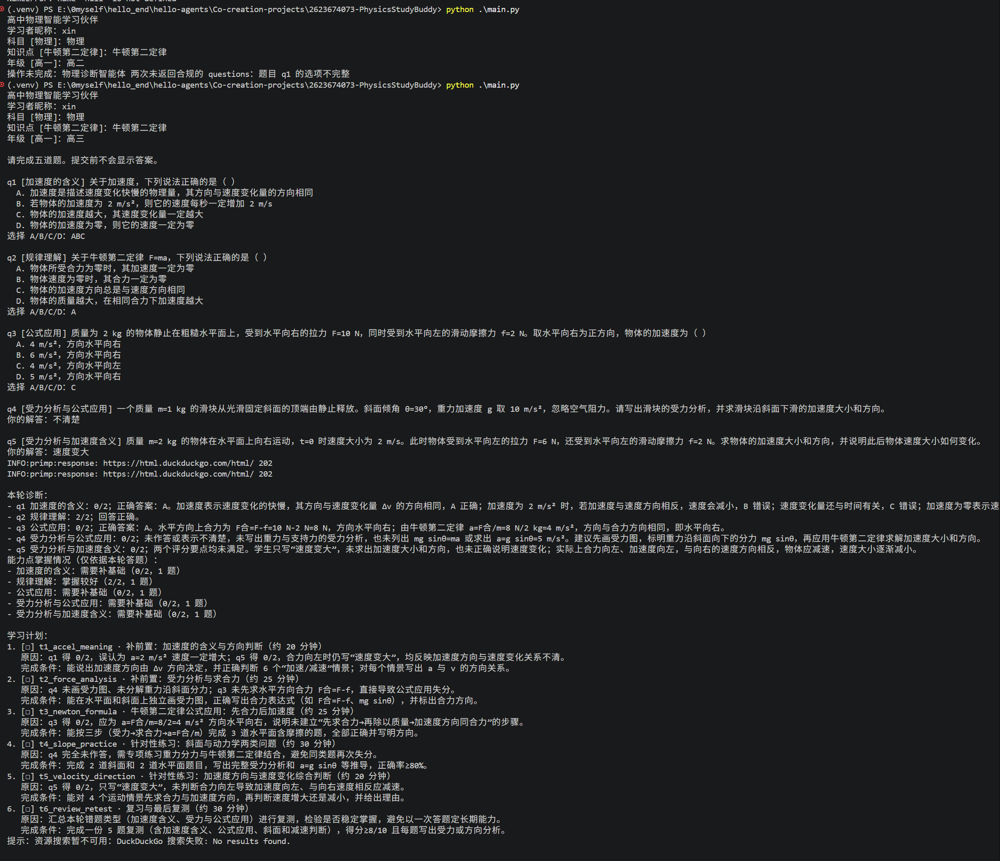
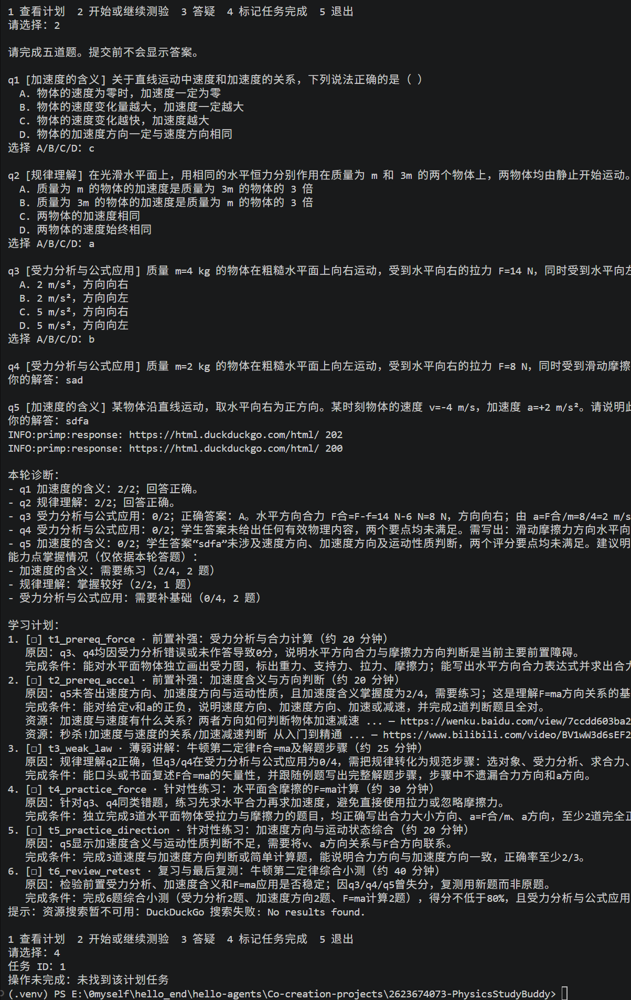

# PhysicsStudyBuddy · 高中物理智能学习伙伴

输入一个高中物理知识点，先做诊断测验，再获得依据答题情况制定的学习计划。完成学习任务后可以复测，系统会据此更新计划。

这是基于 [HelloAgents](https://github.com/datawhalechina/hello-agents) 的毕业设计项目。当前聚焦高中物理，提供命令行真实模式、无密钥离线演示和 Jupyter Notebook 演示。

## 它如何工作

```text
科目、年级、知识点
        ↓
3 道选择题 + 2 道简答题
        ↓
按能力点评分、说明错因
        ↓
生成前置知识 → 讲解 → 练习 → 复测的任务清单
        ↓
标记完成、答疑、复测并更新计划
```

- **诊断智能体**生成题目，按两个评分要点评价简答题；选择题由程序对照答案判分。
- **规划智能体**读取逐题结果和能力点得分，给出任务顺序、预计用时、安排原因和完成条件。
- **辅导智能体**回答当前主题的问题。程序负责流程控制、题目格式校验和进度保存。
- **联网资源**来自 HelloAgents `SearchTool` 的 DuckDuckGo 搜索。它不使用 `LLM_BASE_URL`，也无需另配搜索密钥；只展示搜索实际返回的标题和链接。搜索失败不影响测验与计划。

三个内置主题——牛顿第二定律、匀变速直线运动、功与动能定理——提供学习目标和前置知识提示。**只有牛顿第二定律有离线固定题**；真实模式的题目仍由模型生成。其他高中物理知识点也可输入，但尚未经过项目样例验证。

## 快速开始

以下命令适用于 Windows PowerShell，请先进入本项目目录。建议使用 Python 3.11。

```powershell
python -m venv .venv
.\.venv\Scripts\python.exe -m pip install -r requirements.txt
$env:PYTHONIOENCODING = 'utf-8'
```

### 先运行离线演示

```powershell
.\.venv\Scripts\python.exe main.py --auto-demo
```

该命令自动展示一轮“牛顿第二定律”测验、评分和计划，无需网络或模型密钥。要亲自答题，运行：

```powershell
.\.venv\Scripts\python.exe main.py --demo
```

离线模式只支持牛顿第二定律，简答题采用简化关键词判分，仅用于演示流程。也可以运行 `.\.venv\Scripts\python.exe -m notebook`，顺序执行 `main.ipynb`，查看首轮诊断和复测后的计划变化。

### 使用真实模型和联网资源

首次配置时，若还没有 `.env`，复制示例文件并填写模型服务的信息：

```powershell
if (-not (Test-Path -LiteralPath .env)) { Copy-Item .env.example .env }
```

| 变量 | 用途 |
| --- | --- |
| `LLM_MODEL_ID` | OpenAI 兼容接口中的模型名称 |
| `LLM_BASE_URL` | **模型**服务地址，不是搜索地址 |
| `LLM_API_KEY` | 模型服务密钥 |

然后运行：

```powershell
.\.venv\Scripts\python.exe main.py
```

例如依次输入昵称 `xin`、科目 `物理`、知识点 `牛顿第二定律`、年级 `高二`。提交五道题后，程序显示逐题反馈、能力点结果和学习计划。菜单支持查看计划、开始复测、答疑、按任务 ID 标记完成。再次用相同昵称、科目和知识点运行，可继续本地记录。

`.env` 已被 Git 忽略，请勿把密钥填进 Notebook 或源码。使用 DeepSeek 服务时，结构化调用会启用 JSON 输出及较低推理量；生成的四项列表选项也会转换成 `A`–`D` 格式。其他 OpenAI 兼容服务保留提示词输出方式，其表现需按实际模型验证。

## 结果与数据

每个能力点会显示本轮得分、题数，以及“需要补基础／需要练习／掌握较好”。这些判断只依据本轮五道题，不能当作长期掌握度。计划会优先处理测验暴露的薄弱能力和必要的前置知识；复测后重新生成任务。

离线示例中，受力分析两题均答错时会出现类似结果：

```text
受力分析：需要补基础（0/4，2 题）
1. forces · 补习合力与受力分析（约 20 分钟）
完成条件：能标出水平作用力并求出合力大小与方向
```

真实模式的记录保存在 `outputs/progress/` 下的本地 JSON 文件，包含题目、作答、反馈和计划；该目录已被 Git 忽略。搜索只针对新计划的前两项任务，最多为每项展示两条结果。当前**没有教材知识库或 RAG**：搜索结果用于推荐阅读，出题、简答评分和答疑并未以检索网页作为事实依据，正式学习时应核对物理内容与资源质量。

## 验证与排错

```powershell
.\.venv\Scripts\python.exe -m unittest discover -s tests -v
.\.venv\Scripts\python.exe main.py --auto-demo
```

现有 9 项测试覆盖学习闭环、进度恢复、列表选项转换、无效 JSON 重试及搜索失败处理。真实 DeepSeek 配置下也已验证五题评分、计划、联网资源、答疑、复测出题和命令行交互。

如果提示缺少 `LLM_MODEL_ID`、`LLM_BASE_URL` 或 `LLM_API_KEY`，检查 `.env` 是否位于本项目目录。若两次生成后仍报题目结构错误，说明模型未返回符合要求的完整题目；可以重试或先用 `--demo` 检查本地流程。搜索失败只会减少资源链接，不会丢失已完成的测验。

## 演示结果





## 项目结构

```text
main.py                    命令行入口
main.ipynb                 离线毕业设计演示
src/study_buddy/core.py    测验流程、汇总与进度保存
src/study_buddy/agents.py  HelloAgents 智能体与联网搜索
src/study_buddy/demo.py    牛顿第二定律离线示例
tests/                     行为回归测试
```

## 项目说明与反馈

当前项目仍是演示版本。由于开发时间有限，如在使用过程中遇到问题，敬请包涵，并欢迎发送邮件至 [2623674073@qq.com](mailto:2623674073@qq.com) 反馈。

作者：[@2623674073](https://github.com/2623674073) · [共创项目 PR #943](https://github.com/datawhalechina/hello-agents/pull/943)
