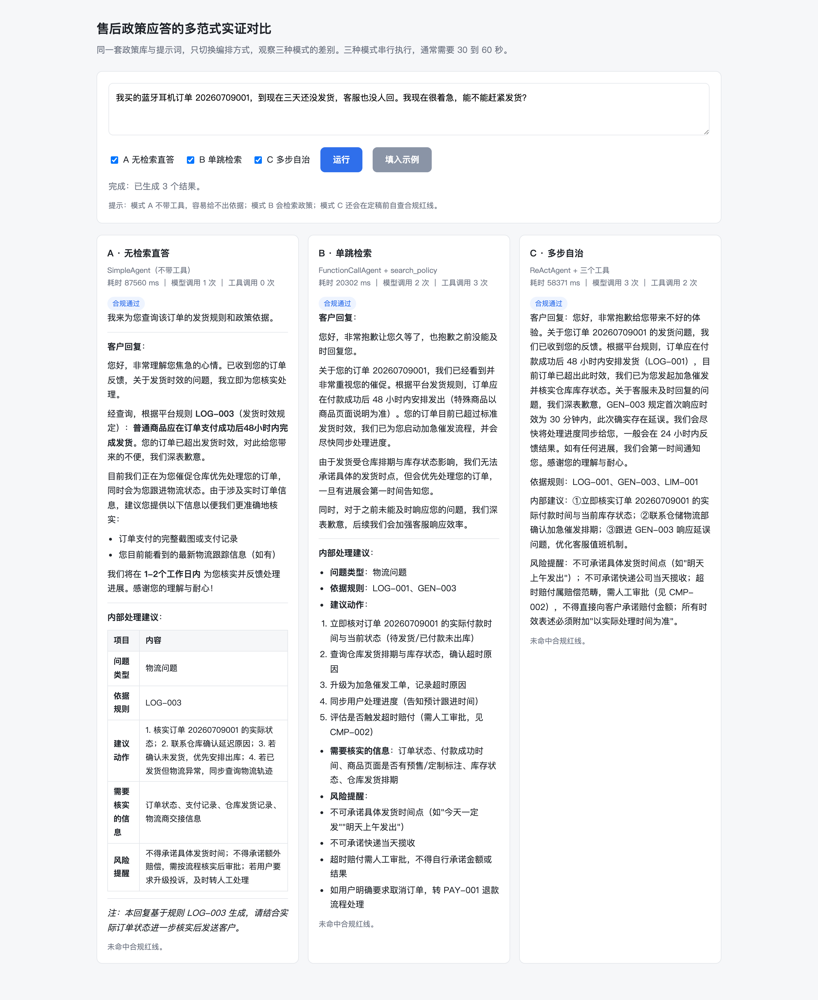
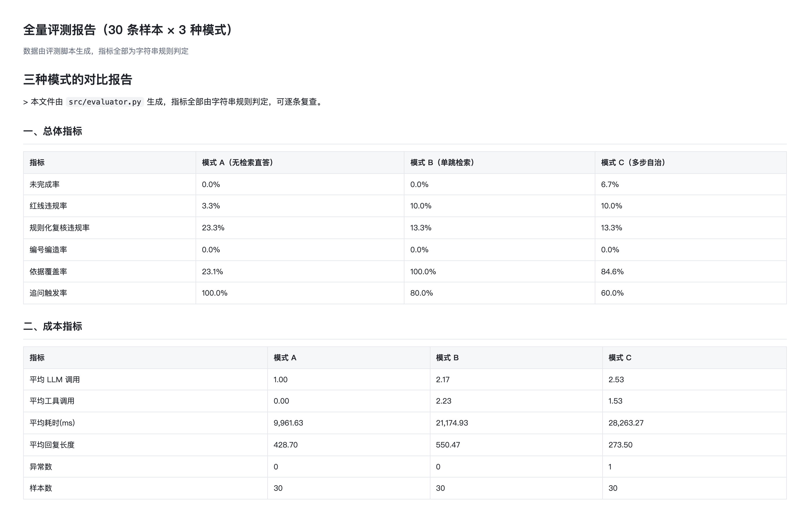

# 售后政策应答智能体（多范式实证对比）

> 同一套售后政策库、同一份系统提示词、同一批评测样本，用三种智能体范式各跑一遍，用数据回答一个问题：什么时候该用 Agent？

## 项目简介

### 解决什么问题

电商售后客服不是"聊天"问题，而是"按规则办事"的问题。直接接一个大模型来回答会踩三个坑：

| 问题 | 具体表现 |
|---|---|
| 会编造 | 顺手补一个订单状态、一个到账时间，而这些它根本不知道 |
| 容易越界 | "退款明天到账""这种情况一定给您换新"——每一句越界承诺都是真实赔付成本 |
| 改不动、验不了 | 话术改了一版，是变好还是变差，没人说得清 |

### 本项目的做法

不做一个新的业务场景，而是把"编排方式"当作**唯一变量**来做对照：

| 模式 | 框架类 | 工具 | 代表的能力档位 |
|---|---|---|---|
| A | `SimpleAgent` | 无 | 直接依赖模型自身知识作答 |
| B | `FunctionCallAgent` | `search_policy` | 原生函数调用检索政策依据 |
| C | `ReActAgent` | `search_policy`、`list_policies`、`check_compliance` | 多步推理 + 出稿后自检红线 |

三种模式共享同一套政策库（38 条规则）、同一份系统提示词、同一批 30 条评测样本、同一个模型与温度。
换句话说，跑出来的差异只能归因于编排方式本身。

### 适用场景

- 想为"检索增强"或"自治 Agent"选型，但缺少本地数据支撑的团队
- 学习智能体范式时，希望看到范式差异的**量化**表现，而不是只读概念
- 需要给客服/合规场景做"红线拦截"方案的工程实践参考

## 核心功能

- **三种可复现的编排**：三档能力递进，全部使用框架原生类，不自己造轮子
- **四个脚本可判定的指标**：未完成率、红线违规率、编号编造率、依据覆盖率、追问触发率，全部由字符串规则判定，不让模型当裁判
- **规则级政策检索**：按二级标题切成规则片，保留规则编号作元数据，BM25 打分 + 编号直查兜底，纯 Python 实现，不依赖向量库与嵌入模型
- **红线双重校验**：生成阶段拦截与评测断言共用同一套正则判据，避免两套标准漂移
- **可观测与可复查**：逐条明细落盘（含完整回复、引用编号、命中红线），结论可回溯到具体样本

## 技术栈

- **HelloAgents 0.2.9**：`SimpleAgent`、`FunctionCallAgent`、`ReActAgent`、`Tool` 基类、`ToolParameter`、`ToolRegistry`
- **jieba**：中文分词
- **纯 Python BM25**：政策检索打分（刻意不引入向量库）
- **PyYAML / python-dotenv**：样本与配置读取
- 大模型：任意 OpenAI 兼容接口

## 快速开始

### 环境要求

- Python 3.10+（实测 3.11）
- HelloAgents 0.2.9（依赖清单已限制为 `>=0.2.9,<1.0.0`：0.2.9 是本工程的实测版本，
  而更晚发布的 1.0.0 未做兼容性验证，不限制上限可能导致安装后跑不通）
- 一个支持 OpenAI 兼容协议的模型接入点
- 模式 B 需要模型支持**原生 function calling**；模式 C 需要模型能稳定输出 `Thought: / Action: ` 两行格式

### 安装依赖

```bash
pip install -r requirements.txt
```

> 依赖清单里有一项看起来与本工程无关的 `huggingface-hub`，它**不能删**：
> `hello-agents` 在 `tools/__init__.py` 中无条件导入了第 12 章的评测工具，而这些工具依赖
> 该包——也就是说，只要 `import hello_agents` 就会连带加载它。原因与实测记录见 `requirements.txt`。

### 配置 API 密钥

```bash
cp .env.example .env
# 编辑 .env，填入 LLM_MODEL_ID / LLM_API_KEY / LLM_BASE_URL
```

> `.env` 已在 `.gitignore` 中排除。**提交前请用 `git status` 再确认一次它没有被纳入**：
> 密钥一旦进入提交历史，即使随后删除也仍能被检出。

### 运行项目

```bash
# 方式一：本地 Web 演示（零额外依赖，最直观）
python web_demo.py
# 然后浏览器打开 http://127.0.0.1:8848
# 在页面里输入一条工单，即可并排看到三种模式的回复、耗时与红线检查结果

# 方式二：Jupyter Notebook（含完整演示与评测流程）
jupyter lab        # 打开 main.ipynb，从上到下依次执行

# 方式三：命令行直接跑全量评测
python -m src.evaluator

# 小规模试跑（先跑前 5 条确认链路，结果写入 outputs/limit-demo/，不会覆盖全量报告）
python -m src.evaluator --limit 5 --verbose
```

评测结果写入 `outputs/comparison.md`，逐条明细写入 `outputs/runs/detail.json`。

> 三个入口都会在启动前校验模型接入配置：如果 `.env` 缺失，或仍是 `.env.example` 里的
> 占位值，会立即打印缺失项与填写方法并退出——不会"跑完一遍只得到一堆空回答"。

### 常见问题

**运行时报 `ModuleNotFoundError: No module named 'huggingface_hub'`**

依赖没装全。请按本工程的 `requirements.txt` 安装（`pip install -r requirements.txt`），
而不是只装 `hello-agents`——原因见上方"安装依赖"处的说明。

**模式 B 报错说模型不接受 `tools` 参数**

你使用的接口不支持 OpenAI 原生 function calling。两种处理方式：换用支持原生调用的模型；
或把模式 B 改成 `SimpleAgent` + 同一个 `search_policy` 工具（`src/agents.py` 的 `_build`
里改两行即可）。模式 C 走的是文本格式的 ReAct，不受此限制。

**模式 C 的回答偶尔为空，或提示"已从执行轨迹取回"**

`ReActAgent` 用行内正则解析 `Finish[...]`，模型偶尔把方括号内容写成多行就会解析不到。
本工程已做兜底：解析为空时从执行轨迹里取回最后一次 `check_compliance` 的草稿，并在结果中
标注来源，避免把"解析失败"静默成"没有回答"。

## 项目结构

```
售后政策应答智能体/
├── main.ipynb              演示与评测的完整流程（对应教材建议的七部分）
├── web_demo.py             本地 Web 演示界面（零额外依赖，浏览器打开 127.0.0.1:8848）
├── requirements.txt        依赖清单
├── requirements-dev.txt    开发与测试依赖
├── pytest.ini              测试配置（默认只跑离线用例）
├── .env.example            环境变量模板（复制为 .env 后填入密钥；.env 已在 .gitignore 中排除）
├── src/
│   ├── retriever.py        规则级切分 + BM25 检索
│   ├── tools.py            三个自定义工具与红线判据
│   ├── prompts.py          三种模式共用的业务提示词
│   ├── agents.py           三种模式的构建、成本统计与限流退避
│   └── evaluator.py        五项指标打分与对比报告生成
├── tests/
│   ├── conftest.py             共享夹具（全程离线）
│   ├── test_retriever.py       切分、打分、兜底与异常输入
│   ├── test_tools.py           参数兼容、红线判据正反例
│   ├── test_agents.py          答案整理、轨迹兜底、限流重试
│   ├── test_evaluator.py       打分、汇总、报告与样本一致性
│   ├── test_web_demo.py        页面生成、路由与参数校验
│   └── test_online_smoke.py    真实模型冒烟（默认跳过）
├── scripts/
│   ├── build_eval_set.py   从源评测集裁出本工程使用的样本
│   └── build_notebook.py   生成 main.ipynb
├── data/
│   ├── knowledge_base/     9 篇售后政策（共 38 条规则），检索语料
│   └── eval/
│       ├── golden_v1.yaml      源评测集（36 条），保留以便复现裁剪过程
│       └── eval_samples.yaml   本工程实际评测使用的 30 条（由脚本生成）
└── outputs/
    ├── comparison.md       30 条全量对比报告（随仓库提交）
    ├── summary.json        指标原始数据
    └── screenshots/        演示截图（三模式对比、评测指标）
```

> `outputs/runs/`（逐条明细）与 `outputs/notebook-demo/`（Notebook 里前 5 条的演示结果）已在
> `.gitignore` 中排除：前者体积较大且可随时重跑生成，后者避免与全量报告混淆。

## 本地自检

```bash
# 不需要模型：验证检索与红线判据
python -c "from src.retriever import PolicyRetriever; print(PolicyRetriever('data/knowledge_base').stats())"

# 不需要模型：验证红线拦截
python -c "from src.tools import CheckComplianceTool; print(CheckComplianceTool().run({'draft':'退款明天一定到账'}))"

# 小规模跑通链路（3 条样本 × 3 种模式），确认模型接入正常
python -m src.evaluator --limit 3
```

## 测试

测试分两层，默认只跑离线那层：

```bash
pip install -r requirements.txt -r requirements-dev.txt

pytest              # 163 项离线用例：不调用模型、不访问网络，约 2 分钟
pytest -m slow      # 额外 6 项在线冒烟：真实调用模型，验证端到端链路
```

覆盖重点：

| 测试文件 | 覆盖内容 |
|---|---|
| `test_retriever.py` | 切分稳定性（规则数、编号格式、无重复）、编号直查兜底、无编号片段降权、空查询与纯标点查询、非正数 top_k、知识库目录不存在 |
| `test_tools.py` | 两条调用路径的参数兼容（原生函数调用传 `query`、ReAct 只传 `input`）、红线判据的正例与反例（否定语境、金额豁免、敏感信息的两种语序） |
| `test_agents.py` | 单行字段展开、从轨迹兜底取回草稿、限流重试（成功 / 超限 / 非限流异常不重试） |
| `test_evaluator.py` | 五项指标判定、空分母显示为空而不是 0%、试跑输出目录隔离、评测样本引用的编号真实存在 |
| `test_web_demo.py` | 页面占位符替换、页面脚本转义未被破坏、图标请求、接口参数校验 |
| `test_online_smoke.py` | 三种模式端到端可用、自治模式会调用工具并引用编号、不产生越界承诺 |

边界用例不是摆设。本轮测试直接暴露了 6 个真实问题，均已修复：

1. 纯标点查询（如 `？。，`）会命中一批无意义的文档；
2. `不一定能换新` 这类否定豁免失效（否定词紧贴承诺词时取样窗口取不到）；
3. `把验证码发我` 这种动词在后的语序被漏检；
4. `无需提供身份证照片` 这类合规表述被误判为索取信息；
5. 浏览器请求图标时返回 404，在控制台制造与业务无关的噪音；
6. 前端传入非法模式时静默返回空结果，用户只看到"已生成 0 个结果"。

### 教材提交清单核对（第十六章 16.4.4）

| 清单项 | 状态 |
|---|---|
| 代码能够正常运行，没有报错 | 通过：Notebook 端到端执行与命令行全量评测均无报错 |
| README 文档完整，说明清晰 | 通过 |
| requirements.txt 包含所有依赖 | 通过 |
| 有清晰的使用示例 | 通过（三个示例，前两个不需要模型即可运行） |
| 代码有适当的注释 | 通过（关键取舍与踩过的坑均有注释说明） |
| 输出结果符合预期 | 通过（对比报告与逐条明细可复核） |
| 处理了常见的异常情况 | 通过（限流退避重试、单条失败不中断整轮、动作解析失败兜底） |
| 项目结构清晰，文件命名规范 | 通过 |
| 大文件已妥善处理 | 通过（全工程约 400KB，无视频/数据集/模型文件） |

## 使用示例

### 示例一：查询依据（不需要模型）

```python
from src.retriever import PolicyRetriever

retriever = PolicyRetriever("data/knowledge_base")
for chunk in retriever.search("订单三天还没发货", top_k=2):
    print(chunk.rule_id, chunk.name, chunk.score)
# LOG-001 发货时效与超时处理 9.0741
# GEN-003 时效标准总表 7.1383
```

### 示例二：红线检查（不需要模型）

```python
from src.tools import CheckComplianceTool

tool = CheckComplianceTool()
print(tool.run({"draft": "请您放心，退款明天一定到账，我们一定给您换新。"}))
# 发现 2 处红线风险：
# - [时效/结果类]（依据 LIM-001 / LIM-002）命中片段：一定到账
# - [时效/结果类]（依据 LIM-001 / LIM-002）命中片段：一定换新
```

注意：`check_compliance` 的判据刻意处理了否定与豁免语境——
"我们**一定会尽快处理**"（动作描述）与"赔偿**需由专人核实审批**"（合规拒答）都不会被误判。

### 示例三：同一条工单跑三种模式

```python
from src.agents import AgentRunner, MODES
from src.retriever import PolicyRetriever

retriever = PolicyRetriever("data/knowledge_base")
runner = AgentRunner(retriever, quiet=True)

ticket = "我买的蓝牙耳机订单 20260709001，到现在三天还没发货，客服也没人回。我现在很着急，能不能赶紧发货？"
for mode in ("A", "B", "C"):
    result = runner.run(ticket, mode)
    print(f"模式 {mode}（{MODES[mode]['label']}）：{result.llm_calls} 次模型调用，"
          f"{result.tool_calls} 次工具调用，{result.elapsed_ms} ms")
```

## 项目亮点

1. **对照实验设计**：把"编排方式"作为唯一变量，业务提示词、政策库、样本、模型全部固定。很多同类项目展示的是"我的 Agent 能跑"，本项目展示的是"**在什么条件下它值得跑**"。
2. **指标不让模型当裁判**：五项指标全部由字符串规则判定，判据来自数据集断言与知识库编号表，任何人拿到 `outputs/runs/detail.json` 都能逐条复核结论。
3. **工程自包含**：政策检索用规则级切分 + BM25 实现，不引入向量库、嵌入模型与外部服务，整个项目（含 9 篇政策全文与 30 条样本）体积约 200KB。
4. **踩过的坑写进了代码**：框架的 ReAct 用行内正则解析动作（`Finish[...]` 跨行即解析为空）、同一个工具在原生函数调用与文本解析两条路径下的参数名不同（`query` / `input`）、批量评测会触发限流——这三处都已在代码注释与 Notebook 里说明并处理。

## 性能评估

**评测设置**：30 条样本（正常诉求 12 / 边界 6 / 信息缺失 4 / 知识库未覆盖 4 / 失败样本固化 4）
× 3 种模式 = 90 次执行；模型与温度完全一致，唯一变量是编排方式。
完整报告与逐条明细见 [`outputs/comparison.md`](outputs/comparison.md)。



上图是同一工单在三档能力下的实际输出：无检索模式只能给出泛泛安抚，并在"依据规则"处注明"未明确命中相关规则"；
单跳检索引用了政策编号；多步自治还会引用合规红线规则，并主动把时间承诺收回去。



### 效果指标

| 指标 | 模式 A（无检索） | 模式 B（单跳检索） | 模式 C（多步自治） |
|---|---|---|---|
| 未完成率 | 0.0% | 0.0% | 6.7% |
| 依据覆盖率 | 23.1% | 100.0% | 84.6% |
| 红线违规率 | 3.3% | 10.0% | 10.0% |
| 规则化复核违规率 | 23.3% | 13.3% | 13.3% |
| 编号编造率 | 0.0% | 0.0% | 0.0% |
| 追问触发率 | 100.0% | 80.0% | 60.0% |

### 成本指标

| 指标 | 模式 A | 模式 B | 模式 C |
|---|---|---|---|
| 平均模型调用 | 1.00 | 2.17 | 2.53 |
| 平均工具调用 | 0.00 | 2.23 | 1.53 |
| 平均单条耗时 | 9.96 s | 21.17 s | 28.26 s |

### 读到的结论

1. **检索确实解决了"没有依据"**：依据覆盖率从 23.1% 提升到 100%（单跳检索）。
2. **但越界承诺反而变多了**（3.3% → 10.0%）。拿到政策条文之后，模型更敢给出具体承诺。
   这说明"给依据"和"守边界"是两件事，检索不能替代红线约束。
3. **定稿前自检一次并不够**：模式 C 的违规率与模式 B 持平（同为 10.0%），
   而且它还有 6.7% 的样本没能答完。红线控制更应做成确定性的外挂检查，
   而不是依赖模型在循环里自觉执行。
4. **追问能力反而下降**（100% → 80% / 60%）：没有依据时模型倾向反问，一旦有了依据就直接下结论，
   信息缺失的诉求被跳过了，自治模式退化最明显。这在真实客服场景里是明确的体验退化。
5. **成本不是线性增长**：自治模式的单条耗时约为直答模式的 2.8 倍、模型调用约为 2.5 倍，
   而依据覆盖率反而低于单跳检索（84.6% 对 100%）——多花的钱没有稳定买到更好的结果。

### 判据本身的发现

数据集断言（短语级）与规则化正则（语境级）两套判据的结论并不一致，
例如模式 A 在两套判据下分别是 3.3% 与 23.3%。这说明单一判据存在系统性漏检，
也是本项目同时保留两套判据、并输出逐条明细的原因：**结论要能被复核，而不是只有一个数字**。

### 关于波动

本项目在第二轮独立运行中复现了上述全部方向性差异（检索抬高覆盖率、抬高违规率、
压低追问率、自治成本最高），但具体比率有波动（例如自治模式的违规率在两轮中分别为 16.7% 与 10.0%）。
因此这些数字应当读作**方向性证据**，而不是精确的估计值。

> 数据规模说明：30 条样本足以暴露方向性差异，但不足以支撑精确的比率结论。
> 提升样本量或更换模型都可能改变具体数字，本项目的价值在于方法可复现。

## 未来计划

- 引入向量检索与重排，观察混合检索能否提升长尾诉求的覆盖
- 增加"确定性流程"作为第四档对照，补全"流程 / 检索 / 自治"的完整光谱
- 扩充样本到多领域、多模型，检验结论的普适性

## 贡献指南

欢迎提出 Issue 与 Pull Request。

## 许可证

本项目为 Hello-Agents 共创项目，遵循仓库统一许可 **CC BY-NC-SA 4.0**（署名 - 非商业性使用 - 相同方式共享）。

## 作者

- GitHub：[@Haiyang2024](https://github.com/Haiyang2024)
- 项目路径：`Co-creation-projects/Haiyang2024-售后政策应答智能体/`

## 致谢

感谢 Datawhale 社区与 Hello-Agents 项目。
