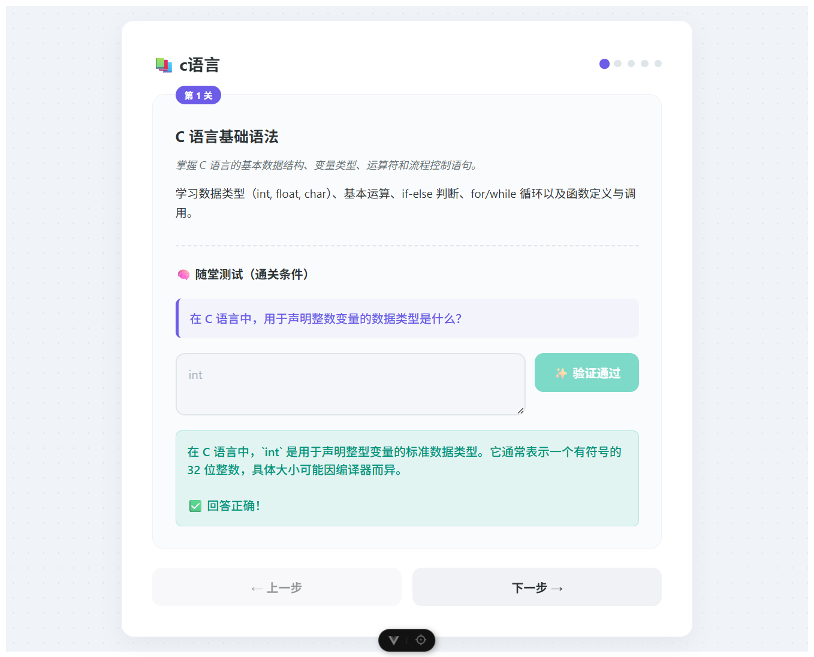

# AgentLearningHelper - 智能学习助手

> 这是一个 Demo 项目。
> 项目链接：
> [前端项目](https://github.com/LYGreen/agent-learning-helper-frontend)
> [后端项目](https://github.com/LYGreen/agent-learning-helper-backend)

## 📝 项目简介

AgentLearningHelper 是一个智能学习助手，能够帮助用户生成学习课程、生成练习题、答疑解惑

### 核心功能

- **学科导向课程生成**：根据用户输入的特定学科或知识点，利用 LLM 动态构建结构化的课程大纲。

- **自适应习题库**：为每个章节实时生成配套练习题，确保题目难度与教学内容匹配。

- **智能判题与反馈**：利用 AI 进行语义分析，指出用户答案中的知识盲区并给出改进建议。

## 🛠️ 技术栈

- FastAPI（服务端）
- OpenAI API（调用大模型）
- Vue（客户端）

## 🚀 快速开始

### 安装依赖

```bash
cd backend
pip install -r requirements.txt
cd ../frontend
npm install
```

### 配置参数
- 后端：
```
MODEL=
BASE_URL=
OPENAI_API_KEY=
```

- 前端：
```
VITE_BACKEND_URL=
```

### 运行项目

- 运行前端：
```bash
cd frontend
npm run dev
```

- 运行后端：
```bash
cd backend
uvicorn main:app --reload
```

## 📖 使用示例

在浏览器中输入 `http://localhost:5173` 访问

## 📂 项目结构

```
agent-learning-helper/
├── backend/
│   ├── ...
│   ├── main.py             # 主程序
│   ├── requirements.txt    # 依赖列表
│   └── .env.example        # 环境变量示例
├── frontend/
│   ├── ...
│   └── .env.example        # 环境变量示例
├── img/
│   └── ...                 # README.md 图片
├── .gitignore              # Git忽略文件
└── README.md               # 项目说明文档
```

## 🔧 技术实现

- **课程生成智能体**：根据用户输入的学科生成课程
- **习题生成智能体**：根据用户当前的学习进度生成习题
- **答疑解惑智能体**：判断用户的答案是否正确

## 📊 示例输出



## 🚧 未来改进

- [ ] 添加知识库，使生成的课程不具有误导性，同时增加答疑解惑的正确性
- [ ] RAG 检索知识库
- [ ] LaTeX 渲染
- [ ] ...

## 🙏 致谢

感谢 [Datawhale](https://github.com/datawhalechina) 社区和 [Hello-Agents](https://github.com/datawhalechina/hello-agents) 项目！

## 📄 许可证

本项目采用 MIT 许可证。

