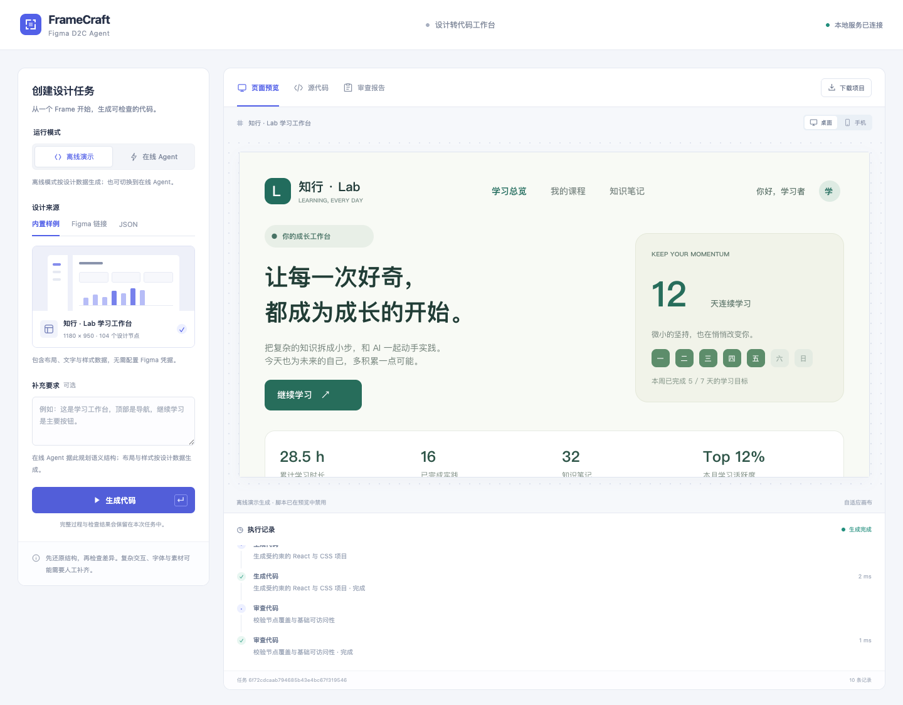

# FrameCraft · Figma D2C Agent

把一个 Figma Frame 转成可检查、可预览、可导出的 React 页面骨架。项目基于 HelloAgents，面向 Hello-Agents 第 16 章毕业设计。

FrameCraft 把设计读取、设计分析、组件规划、代码生成和评审连接成一条可追踪流程。在线模式使用四个真实的 `SimpleAgent`；模型负责结构理解和语义计划，确定性编译器负责生成 React、TypeScript 和 CSS。代码和模型的判断都有对应的设计节点与产物可查。

作者：[Loveiuer](https://github.com/Loveiuer)。项目分类：生产力工具。

这是一个范围明确的单页 D2C 原型。它适合布局简单、文本和基础样式占主要部分的 Frame，不能保证任意设计的像素级还原，也不会从按钮外观推断支付、登录等业务逻辑。

## 功能与范围

| 能力 | 当前行为 |
| --- | --- |
| 设计输入 | 内置示例、本地 Figma REST 格式 JSON、带节点信息的 Figma 链接 |
| 设计解析 | 保留节点 ID、层级、文本、尺寸、常用布局与样式；提取颜色和字体 |
| 多智能体 | DesignAnalyst → ComponentPlanner → CodeEngineer → Reviewer |
| 代码输出 | React + TypeScript + Vite 项目、CSS、无需构建的 `preview.html` |
| 质量反馈 | 结构检查、节点覆盖、占位提示、语义计划评审，最多一次修复重编译 |
| 使用入口 | CLI、本地 Web 工作台、源文件查看、ZIP 下载 |
| 可解释证据 | 设计模型、组件计划、执行轨迹、评审报告、生成文件清单 |

模型只能返回规定的 JSON 数据，不能提交任意源码、执行命令、指定输出路径。按钮默认禁用，等待开发者补充明确的交互规格。图片、矢量、渐变等不支持内容会产生占位和警告；混合文本样式、旋转、部分效果等也需要人工检查。

## 快速运行

需要 Python 3.10+。本项目已针对本地安装的 `hello-agents==0.2.2` 接口实现；不要直接复制教程早期的 `BaseTool` 示例，因为该版本提供的是 `Tool`。第 16 章的 `hello-agents[all]>=0.2.7` 是依赖示例，版本迁移需重新验证接口。

在本项目目录运行：

```bash
python3 -m venv .venv
source .venv/bin/activate
python -m pip install -r requirements.txt
python main.py demo --output outputs/demo
```

打开 `outputs/demo/preview.html` 即可查看结果。`--output` 必须指向尚不存在的目录，重复演示请换一个目录名；不传此参数时会自动创建带时间戳的目录。

**Demo 是确定性离线演示，不调用 LLM，也不是四个真实 Agent 的运行证明。** 它用于检查导入、编译、报告和交付流程，完全不需要 API Key。

项目同时提供符合共创目录要求的 [main.ipynb](main.ipynb)，逐步展示设计导入、生成、评估与导出。使用 Notebook 时额外安装可选依赖：

```bash
python -m pip install -r requirements-notebook.txt
jupyter notebook main.ipynb
```

Notebook 默认只运行离线流程；在线调用示例以说明文字提供，不会在「运行全部」时产生模型费用。

启动工作台：

```bash
python main.py serve
```

浏览器访问 [http://127.0.0.1:7860](http://127.0.0.1:7860)。可使用内置示例、导入 JSON 或提交 Figma Frame 链接；运行后查看预览、文件和报告，再下载 ZIP。任务产物保存到 `outputs/runs/`。工作台是本机工具，没有多用户身份认证，不应直接部署到公网。



## 在线多智能体模式

将 `.env.example` 复制为本项目的 `.env`，填写可用的 OpenAI 兼容模型配置：

```dotenv
LLM_API_KEY=your-key
LLM_BASE_URL=https://your-provider.example/v1
LLM_MODEL_ID=your-model-id
FIGMA_ACCESS_TOKEN=your-figma-token
```

`FIGMA_ACCESS_TOKEN` 只在通过链接读取 Figma 时需要。个人本地工具可以使用 Figma Personal Access Token；读取文件内容需要 `file_content:read` 权限，账号还必须能访问目标文件。参见 [Figma 身份验证文档](https://developers.figma.com/docs/rest-api/authentication/)。

首次接入建议使用 6 节点的小 Frame 验证真实模型配置：

```bash
python main.py generate \
  --input data/smoke-design.json \
  --mode live \
  --output outputs/live
```

`data/sample-design.json` 是工作台使用的 104 节点完整样例；确认小 Frame 能通过后再切换。大样例需要更多上下文和模型等待时间，部分角色可能收到截短摘要。

Figma Frame + 真实模型：

```bash
python main.py generate \
  --figma-url 'https://www.figma.com/design/FILE_KEY/Example?node-id=1-2' \
  --mode live \
  --output outputs/figma-live
```

把示例链接替换成真实 Frame 链接。也可用 `--node-id '1:2'` 指定目标节点；此参数优先于 URL 中的节点。Figma 读取使用官方 [GET file nodes 接口](https://developers.figma.com/docs/rest-api/file-endpoints/#get-file-nodes)。本地 JSON 接受单个节点、含 `document` 的响应或含 `nodes` 的响应；多页文件应明确指定节点。

每个子命令都支持 `--env-file`：

```bash
python main.py generate \
  --input data/sample-design.json \
  --mode live \
  --output outputs/live-explicit \
  --env-file /absolute/path/to/project.env
```

默认只读取本项目目录的 `.env`，不会向上查找祖先目录；已存在的进程环境变量优先。在线模式会把设计节点摘要、页面补充说明和前序分析发送到所配置的模型端点。不要把未经许可的设计发送到外部服务。

`LLM_TIMEOUT` 默认 60 秒，可配置 5–120 秒；`LLM_MAX_TOKENS` 默认 4096，可配置 512–8192。推理模型需要同时为推理与 JSON 输出留出预算。超时、认证、限流和模型输出格式错误会明确失败；自动重试关闭，避免重复调用与隐含费用。

`LLM_JSON_MODE=true` 默认向模型请求 JSON 对象格式，返回值仍需通过字段、节点引用和标签校验。如果模型服务不支持 `response_format`，可显式设置为 `false`；这会更依赖模型遵循格式指令，不会放宽本地校验。

## 产物与使用

| 文件 | 用途 |
| --- | --- |
| `preview.html` | 无需 npm 的静态预览；不代表 React 已成功构建 |
| React / TypeScript / CSS 源文件 | 可以继续开发的页面骨架，以输出项目 README 为准 |
| `design-model.json` | 导入后的设计节点、样式、警告和统计 |
| `design-analysis.json` | 规则或模型给出的设计分析，来源由运行模式区分 |
| `component-plan.json` | 经过校验的组件语义计划 |
| `agent-trace.json` | 实际执行阶段与状态；用于区分 demo 和 live |
| `review-report.json` | 结构检查、模型意见、运行指标及模式 |
| `manifest.json` | 设计节点、CSS 类和 React 组件的映射，以及警告和限制 |

完整 React 构建需要 Node.js 20.19+ 和 npm，进入输出目录按生成项目 README 操作。通常是 `npm install`、`npm run build` 和 `npm run dev`。依赖安装需要网络；FrameCraft 自身不会替模型自动执行生成代码。

## 验证与评价

执行项目测试：

```bash
python -m unittest discover -s tests -v
python evaluate.py --output outputs/evaluation.json
```

`evaluate.py` 分别运行 Auto Layout 示例、自由布局和未支持素材三个离线场景，保存实际结构检查、节点统计与耗时。测试、离线演示、React 构建、浏览器检查和真实服务联调是不同证据。已保存的评估见 [docs/evaluation.json](docs/evaluation.json)，以其中实际状态和输出为准；未执行项目必须保持未验证，不能用 demo 或桩对象测试替代在线结果。重新运行评估请保留新的报告，不要把离线报告当成独立的在线验证记录。

本次交付的综合验证记录见 [docs/validation.json](docs/validation.json)。可选的浏览器检查脚本为 `tests/browser-smoke.mjs`，需要安装 Playwright 并有本机 Google Chrome；先启动工作台，再运行：

```bash
npm install --prefix /tmp/framecraft-browser-check playwright
PLAYWRIGHT_MODULE=/tmp/framecraft-browser-check/node_modules/playwright/index.mjs \
  node tests/browser-smoke.mjs
```

浏览器检查会保存实际结果到 `outputs/browser-check/`，覆盖生成、预览、复制、下载、错误提示和重试。它不计算与 Figma 原图的像素差异。

本次记录包含 44 项通过的单元测试、8 项通过的工作台浏览器检查，以及 104 节点离线工程的 TypeScript / Vite 构建与桌面、手机渲染。6 节点小 Frame 的真实四角色流程已通过，耗时约 118.5 秒，生成工程也已构建；证据见 [在线轨迹](docs/live-smoke/agent-trace.json) 和 [在线报告](docs/live-smoke/review-report.json)。该结果不能推广为大设计稳定性：104 节点样例此前在线出现模型请求或输出契约错误，启用 JSON 模式后未重新验证完整样例。真实 Figma 文件读取仍待有权限的链接和 Token 验收。

节点覆盖率表示导入节点是否在生成结构中出现，不能等同于视觉还原率。当前没有以设计截图为基准的像素差异评估，也不提供“还原率 95%”一类无依据数值。项目原理与评价方法见 [架构说明](docs/architecture.md)，答辩讲稿见 [答辩材料](docs/defense.md)。

## 已知代价与限制

- **输入规模**：本地 JSON / Web 请求上限 2 MB；Figma 响应上限 8 MB；导入最多 500 个节点、40 层。超限应拆分 Frame。
- **模型成本**：live 按四个角色调用模型。每次调用存在网络延迟、费用和失败概率；严格 JSON 契约可能使不兼容模型失败，系统不会悄悄切成离线成功。
- **上下文取舍**：模型看到受长度限制的节点摘要，省略数量会在输入中标记；确定性编译器仍处理完整的已导入模型。复杂页面的全局语义可能因此不足。
- **样式取舍**：支持常见 Auto Layout 和基础几何布局，但字体、混合文本、资源缺失和浏览器排版差异都可能影响效果。自由布局不能自动等价于响应式设计。
- **工程取舍**：输出是单页静态骨架，暂不处理路由、表单校验、真实数据接口、设计系统组件库、完整可访问性或生产部署。
- **在线服务**：Figma 文件权限、Token 到期、限流及模型配置都会影响运行；出现错误应修复原因后重试。

## 项目结构与提交

```text
Loveiuer-FrameCraft/
├── main.py                 # CLI 与服务入口
├── main.ipynb              # 分步骤离线演示与评估
├── requirements.txt
├── requirements-notebook.txt
├── .env.example
├── d2c/                    # 导入、Agent、编译、校验和服务
├── web/                    # 本地工作台
├── data/sample-design.json
├── tests/
├── docs/                   # 架构、答辩、提交与评价证据
└── outputs/                # 本地运行产物，不整体提交
```

共创项目目录为 `Co-creation-projects/Loveiuer-FrameCraft/`，提交与验证范围见 [提交清单](docs/submission.md)。

项目依据 [Hello-Agents 第 16 章毕业设计](https://github.com/datawhalechina/hello-agents/blob/main/docs/chapter16/%E7%AC%AC%E5%8D%81%E5%85%AD%E7%AB%A0%20%E6%AF%95%E4%B8%9A%E8%AE%BE%E8%AE%A1.md) 开发，感谢 Datawhale 与 [Hello-Agents](https://github.com/datawhalechina/hello-agents) 社区。

按照上游共创目录要求，本项目使用 [CC BY-NC-SA 4.0](LICENSE)。外部设计、字体、图片及依赖库仍遵循各自许可证。
