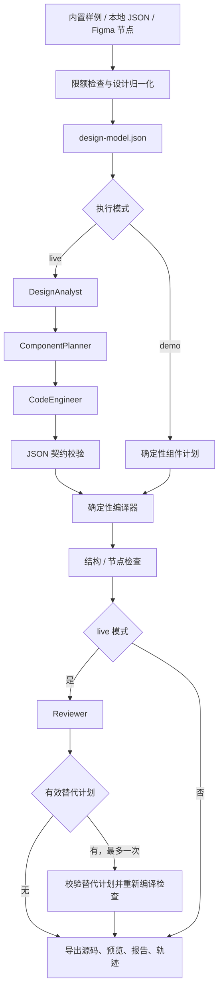

# FrameCraft 技术架构

## 目标与边界

输入一个 Figma Frame，输出保留节点来源的单页 React 工程及可检查的证据。毕业设计要回答两个问题：设计的几何事实如何稳定转成页面，以及模型对组件语义的判断如何受到约束并能被追踪。

项目采用有固定阶段的多智能体工作流。模型提出组件语义，编译器实现布局和样式；模型不获得 shell、文件写入、浏览器或通用网络工具。这个选择提高了结果的可复现性，代价是不能自由发明交互、复杂组件或跨页面工程结构。

## 数据流

## 模块职责

| 模块 | 责任与输出 |
| --- | --- |
| `main.py` | 解析命令，显式加载环境，选择输入及输出目录 |
| `d2c/figma.py` | 从可信 Figma URL 提取 file key / node ID，调用固定的官方 API |
| `d2c/design.py` | 选择 Frame，验证节点树，转换基础样式，记录不支持内容 |
| `d2c/agents.py` | 四个 `SimpleAgent`、受限输入摘要、严格 JSON 契约、调用计时 |
| 流水线与编译模块 | 串联阶段，把受控计划和设计模型编译成文件，执行确定性检查 |
| `d2c/artifacts.py` | 只写新目录，保存源码与证据，限制文件路径与大小 |
| `d2c/server.py` | 本地任务 API、静态预览、文件读取、ZIP 下载 |
| `web/` | 提交输入、展示任务状态、预览与报告 |

Figma 读取调用 `GET /v1/files/{file_key}/nodes?ids={node_id}`。用户提供的 URL 用于解析标识，不会被当作任意抓取地址。接口细节与返回结构以 [Figma 官方文档](https://developers.figma.com/docs/rest-api/file-endpoints/#get-file-nodes) 为准。

## Agent 的真实职责

| 角色 | 主要输入 | 可返回的数据 |
| --- | --- | --- |
| DesignAnalyst | 节点摘要和页面用途 | `summary`、`observations`、`warnings` |
| ComponentPlanner | 设计摘要与分析 | 现有节点的 `node_id`、组件 `name`、允许的 HTML `tag` |
| CodeEngineer | 候选计划与设计摘要 | 编译器接受的最终组件语义计划 |
| Reviewer | 设计、计划、确定性检查 | 评审摘要、问题列表、可选替代计划 |

`CodeEngineer` 这个角色的产物是代码生成计划，不是任意源码。坐标、颜色、文字等事实来自设计模型，最终源码由确定性代码生成逻辑创建。四个角色共享模型配置，但有各自的 `SimpleAgent` 和系统提示词；每次运行重新创建，不复用上一任务的对话历史。

正常 live 流程每个角色调用一次。Reviewer 可给出一个替代计划，随后仅做一次确定性重编译和检查，不启动无限反思循环。模型服务错误、无效 JSON 或未知节点引用会使运行失败；不会静默降级后标记在线成功。

demo 使用确定性计划，不实例化真实模型角色。它验证工程路径，不能证明多智能体质量；有记录的 live 运行才是模型集成证据。

## 契约与资源边界

设计输入最多 500 个节点、40 层。本地文件和 Web 请求最多 2 MB，Figma 流式响应最多 8 MB。对图片、矢量、渐变等不支持特征，保留对应节点并生成占位与警告，避免悄悄漏掉设计内容。

每个模型数据消息不超过 13,500 字符，为系统提示留出空间；输出 JSON 不超过 48,000 字符。组件计划最多 40 项，只能引用已导入的节点 ID，并从允许的语义标签中选择。没有进入语义计划的节点仍由编译器用默认标签保留。字符限制不是 token 计费上限；实际 token 数量和费用依赖模型服务。模型输出预算由 `LLM_MAX_TOKENS` 控制，默认 4096、允许 512–8192；网络超时由 `LLM_TIMEOUT` 控制，默认 60 秒、允许 5–120 秒。

JSON 校验拒绝额外字段、重复字段、非有限数值、未知节点、重复组件和不允许的标签。用户输入的层名、文案及补充说明均视为数据。仅靠提示词不能保证消除提示注入；真正限制影响范围的是模型不拥有执行工具，且输出必须符合受限契约。

产物必须为文本文件，路径不能为绝对路径或包含父目录跳转。输出目录已存在时拒绝写入。Web 只监听 `127.0.0.1`，限制跨站请求；预览使用内容安全策略与 sandbox。这些措施适用于个人本机原型，不能替代公网服务所需的用户认证、任务隔离和配额管理。

## 检查能证明什么

| 检查 | 可以支持的结论 | 不能推出的结论 |
| --- | --- | --- |
| JSON 契约 | 模型返回内容符合既定结构 | 设计理解一定正确 |
| 节点覆盖 | 设计节点能在输出结构中追溯 | 所有节点的位置和颜色一致 |
| 结构检查 | 已实现规则没有发现对应问题 | 全面可访问性、业务正确性 |
| React 构建 | 该次生成工程能通过实际构建 | 页面与 Figma 视觉一致 |
| 静态预览 | 基础 HTML / CSS 可查看 | React 运行时已经验收 |
| live 轨迹 | 实际角色调用与返回被记录 | 模型质量稳定或适用于所有设计 |

评估应分别记录单元测试、导入错误、离线端到端、生成工程构建、浏览器观察、真实 Figma 和真实模型服务。离线结果见 `docs/evaluation.json`，综合验证见 `docs/validation.json`；缺失的证据明确标记未执行。当前没有截图基准和像素差异计算，不能报告视觉还原准确率。

## 扩展时的主要代价

1. 图片与矢量需要资产下载、缓存、权限处理及失效策略，不能用占位覆盖后继续宣传完整还原。
2. 多页面和响应式需要设计约束、断点与业务规格；单个桌面 Frame 通常不足以推导。
3. 接入真实组件库需要组件索引、属性契约与可构建的示例，而不只是把名字替换成某个库组件。
4. 自动视觉修复需要同尺寸参考图、可重复浏览器环境、字体与资源准备，并引入截图和相似度计算成本。
5. 多用户部署需要身份与 Token 管理、隔离执行、存储清理、配额和任务恢复；当前内存任务列表不具备这些能力。

本项目使用的 HelloAgents 接口以固定依赖和本地验证为准；框架背景见 [Hello-Agents 官方仓库](https://github.com/datawhalechina/hello-agents)。
