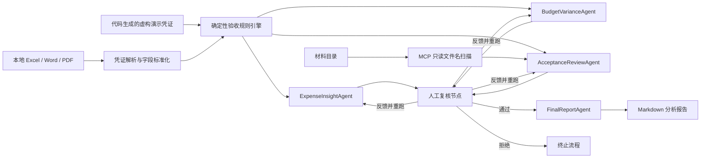

# FinanceAgent：科研经费支出与验收准备多智能体助手

> 面向科研项目财务验收场景，自动解析财务凭证、执行规则分类，并通过多智能体协作生成经费分析与验收准备报告。

## 📝 项目简介

科研项目在结题或验收前，通常需要从 Excel、Word、PDF 等财务材料中整理凭证，分析经费支出结构，并按照金额、费用类型和会议费等规则准备验收材料。人工处理这类工作耗时较长，也容易出现统计口径不一致、材料遗漏或大模型生成数据失真的问题。

FinanceAgent 将财务文档解析、确定性规则计算、多智能体分析和人工复核串联为一条可追踪的处理流水线：

- **解决的问题**：减少凭证整理、经费分析、验收范围识别和报告撰写中的重复劳动。
- **特色功能**：由规则引擎负责金额与分类结论，由大语言模型负责解释和报告表达，避免让模型自行编造财务数字。
- **适用场景**：科研项目结题验收、财务凭证复核、预算执行分析、验收材料准备和内部审计辅助。

> [!IMPORTANT]
> 本项目输出用于辅助材料准备和人工复核，不构成审计、会计或合规结论。材料真实性、签章有效性和最终验收判断仍需由专业人员确认。

### 工作流程



## ✨ 核心功能

- [x] **多格式凭证解析**：读取 `.xlsx`、`.xlsm`、`.docx` 和 `.pdf` 财务文件，统一转换为结构化 `VoucherRecord` 数据。
- [x] **规则化验收分类**：按照可配置策略识别大额凭证、会议费凭证和费用类型抽样凭证，保留规则命中依据。
- [x] **经费支出分析**：统计支出总额、费用结构、项目及资金去向，并识别需要重点关注的大额记录。
- [x] **预算差异分析**：在提供预算基准时计算预算执行和差异；缺少预算数据时明确提示，不生成虚构指标。
- [x] **验收材料准备分析**：生成待准备材料清单，并通过 MCP 工具对指定材料目录进行只读的文件名和元数据扫描。
- [x] **多智能体协作报告**：ExpenseInsightAgent、BudgetVarianceAgent、AcceptanceReviewAgent 和 FinalReportAgent 分工生成固定结构的 Markdown 报告。
- [x] **Human-in-the-loop**：支持人工直接通过、补充意见、指定 Agent 重跑或拒绝终止，并保护确定性金额和规则字段不被人工文本覆盖。
- [x] **可观测与可恢复执行**：记录流水线轨迹、状态快照和失败调试信息，可使用内存或 MySQL 保存 LangGraph 检查点。

## 🛠️ 技术栈

- **智能体编排**：LangGraph，采用状态图、并行分析节点、条件路由和中断恢复机制。
- **智能体范式**：基于工作流的多智能体协作，以及“确定性计算 + LLM 解释 + 人工审核”的 Human-in-the-loop 模式。
- **大模型接口**：OpenAI-compatible API，当前示例配置支持 DeepSeek，也可接入兼容接口的其他模型服务。
- **工具协议**：Model Context Protocol（MCP），用于受限、只读地扫描验收材料目录。
- **文档处理**：`openpyxl`、`python-docx`、`pdfplumber`、`pypdf`。
- **状态持久化**：LangGraph MemorySaver；可选 PyMySQL 与 `langgraph-checkpoint-mysql`。
- **测试框架**：Python `unittest`，使用 Mock LLM 完成离线流水线测试。

> [!NOTE]
> 当前代码使用 LangGraph 实现智能体编排，尚未接入 HelloAgents。若作为 Hello-Agents 教程毕业设计提交，需要在提交前完成 HelloAgents 适配，或向维护者确认是否接受其他多智能体框架实现。

## 🔐 隐私与公开提交

本仓库采用“代码和合成示例可公开、业务数据默认不公开”的策略：

- 默认演示由 `finance_agent/demo_data.py` 在内存中生成，所有人员、编号、描述、日期和金额均为虚构信息。
- `.env`、Excel、Word、PDF、`data/`、生成报告、Agent 轨迹和私有规则均由根目录 `.gitignore` 排除。
- 真实财务材料只作为本地 CLI 输入；处理后的 JSON、状态快照和报告仍可能包含敏感信息，同样不得上传。
- 公开仓库仅保留通用演示规则 `config/demo_acceptance_policy.json`，它不代表任何单位的真实制度。
- 如果密钥曾进入 Git 历史，应立即轮换密钥；删除工作区文件不能消除历史泄露。

提交前建议运行：

```bash
git status --short
git diff --cached --name-only
```

逐项确认暂存区中不存在 `.env`、Office/PDF 文件、`data/`、报告、运行轨迹或私有规则文件。

## 🚀 快速开始

### 环境要求

- Python 3.10+
- Windows、macOS 或 Linux
- 一个 OpenAI-compatible 大模型 API Key
- 可选：MySQL 8，用于持久化运行状态和 LangGraph 检查点

### 安装依赖

建议先创建并激活虚拟环境：

```bash
python -m venv .venv
```

Windows PowerShell：

```powershell
.\.venv\Scripts\Activate.ps1
pip install -r requirements.txt
```

macOS / Linux：

```bash
source .venv/bin/activate
pip install -r requirements.txt
```

### 配置 API 密钥

复制环境变量模板：

Windows PowerShell：

```powershell
Copy-Item .env.example .env
```

macOS / Linux：

```bash
cp .env.example .env
```

编辑 `.env` 并填写模型配置：

```dotenv
LLM_API_KEY=your_api_key_here
LLM_PROVIDER=deepseek
LLM_MODEL_ID=deepseek-v4-flash
LLM_BASE_URL=https://api.deepseek.com
LLM_TIMEOUT=60
```

请勿将包含真实密钥的 `.env` 文件提交到 Git 仓库。

### 运行项目

默认运行使用代码生成的 8 条虚构凭证，不读取或上传任何真实财务文件。流程会完成规则分类、多智能体分析和人工复核：

```bash
python main.py
```

按照终端提示选择复核操作：

1. 直接通过并生成最终报告；
2. 补充反馈，但不重跑 Agent；
3. 补充反馈并指定 Agent 重跑；
4. 拒绝并终止报告生成。

如需在演示或自动化环境中跳过交互式复核，可设置自动通过模式：

Windows PowerShell：

```powershell
$env:REPORT_REVIEW_MODE="auto_approve"
python main.py
```

macOS / Linux：

```bash
REPORT_REVIEW_MODE=auto_approve python main.py
```

仅解析自己的财务文档时，可传入本地文件路径。这些文件及其输出已经被 `.gitignore` 排除，不应加入 Git 暂存区：

```bash
python main.py path/to/vouchers.xlsx -o data/processed/custom_vouchers.json
```

解析命令支持以下参数：

```text
input                 输入的 .xlsx、.xlsm、.docx 或 .pdf 文件
-o, --output          结构化 JSON 输出路径
--archive-dir         原始文件归档目录
--include-debug       在输出中加入源单元格和字段映射等调试信息
```

### 可选：扫描验收材料目录

在 `.env` 中配置只读扫描根目录：

```dotenv
MATERIAL_ROOT=D:\path\to\project_materials
MATERIAL_SCAN_MAX_FILES=1000
```

扫描工具只读取文件名、相对路径和基础元数据，不读取或修改文件内容，也不会替代人工进行真实性和合规性判断。

### 可选：使用本地私有验收规则

默认使用通用演示规则 `config/demo_acceptance_policy.json`。如需应用自己的验收要求，请将规则文件保存在仓库之外，并在 `.env` 中配置绝对路径：

```dotenv
FINANCE_ACCEPTANCE_POLICY=D:\private\research_finance_acceptance.json
```

不要使用真实规则覆盖或替换公开演示规则文件，否则容易在提交时误上传内部要求。

## 📖 使用示例

### 示例一：运行完整演示流水线

```bash
python main.py
```

处理完成后，主要输出包括：

```text
data/processed/voucher_records.json
data/processed/acceptance_classification.json
data/processed/report_agent_outputs.json
data/processed/agent_runs/pipeline_trace.jsonl
data/processed/agent_runs/state_snapshots/
data/reports/research_finance_acceptance_report.md
```

公开演示包含 8 条完全虚构的凭证记录，总金额为 218,750.00 元。规则引擎会根据 `config/demo_acceptance_policy.json` 中的大额阈值、会议费全量检查和费用类型抽样策略确定演示验收准备范围，再由各 Agent 解释分析结果。

### 示例二：在代码中解析财务文件

```python
from finance_agent.demo_data import build_demo_voucher_payload


payload = build_demo_voucher_payload()

print(f"共解析 {payload['record_count']} 条凭证")
print(payload["records"][0])  # DEMO-001，仅包含虚构信息
```

### 示例三：运行离线测试

测试使用 Mock LLM，不需要真实 API Key：

```bash
python -m unittest discover -s tests -v
```

## 🎯 项目亮点

- **财务数据与生成式内容分离**：金额汇总、比例计算和规则分类由确定性代码完成，LLM 只能解释经过校验的数据。
- **带人工控制的多智能体流水线**：在最终报告生成前设置人工复核门，支持意见覆盖、局部重跑、暂停恢复和拒绝终止。
- **可审计的运行记录**：保存 Agent 输入输出、状态快照、差异和事件轨迹，便于定位模型输出或流水线失败原因。
- **安全受限的 MCP 工具**：材料扫描严格限定为文件名和元数据级别，避免 Agent 越权读取或修改验收材料。
- **配置驱动的规则体系**：大额阈值、抽样比例和验收范围集中在 JSON 策略文件中，可在不修改 Agent 提示词的情况下调整业务规则。

## 📊 性能评估

当前仓库以功能正确性和工作流可靠性测试为主，尚未建立面向真实财务数据集的准确率基准。

- **自动化测试**：14 项单元测试全部通过，包括合成数据安全边界、默认公开规则、自动审批、人工复核中断与恢复、拒绝终止、局部重跑及 MCP 只读扫描。
- **本地测试耗时**：最近一次完整测试约 10.9 秒；该数值受设备和依赖环境影响，仅供参考。
- **静态验证**：`main.py`、`finance_agent` 和 `tests` 均通过 Python `compileall` 检查。
- **模型响应时间**：取决于所配置的大模型服务、网络状况和重试次数，当前未提供统一基准。
- **准确率**：尚未在带人工标注的真实科研财务数据集上评估，不使用示例数据推断准确率。

## 🔮 未来计划

- [ ] 接入 HelloAgents 框架，使项目满足 Hello-Agents 教程毕业设计的技术栈要求。
- [ ] 增加带人工标注的脱敏财务测试集，评估字段解析、规则分类和材料匹配的准确率。
- [ ] 增加预算批复表解析，完善预算执行率、差异金额和差异率分析。
- [ ] 增加更多 PDF 表格、扫描件 OCR 和复杂 Word 表格测试用例。
- [ ] 提供 Web 操作界面和可视化经费分析图表。
- [ ] 完善敏感信息脱敏、访问控制和生产环境审计机制。

## 🤝 贡献指南

欢迎提交 Issue 和 Pull Request。提交代码前请：

1. 不要提交真实 API Key、未脱敏财务数据或其他敏感材料；
2. 为新增行为补充对应测试；
3. 运行 `python -m unittest discover -s tests -v` 并确认测试通过；
4. 在 PR 描述中说明变更目的、验证方式和可能影响。

## 📄 许可证

本项目计划采用 MIT License。正式发布前请在项目根目录补充 `LICENSE` 文件。

## 👤 作者

- GitHub：[@ObVious55](https://github.com/ObVious55)

## 🙏 致谢

感谢 Datawhale 社区和 Hello-Agents 项目提供的智能体学习资料与毕业设计实践指南，也感谢 LangGraph、MCP 及相关开源项目提供的技术支持。
