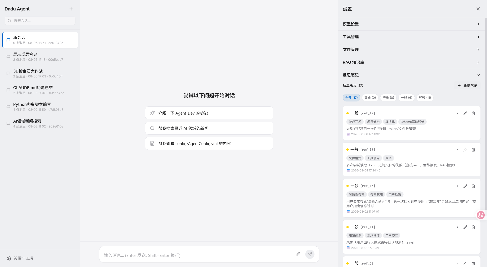
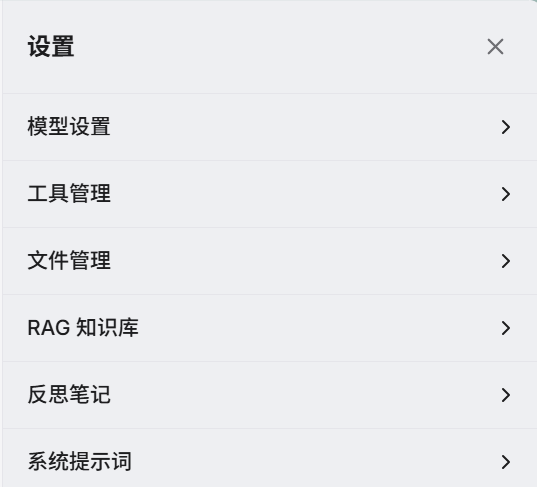
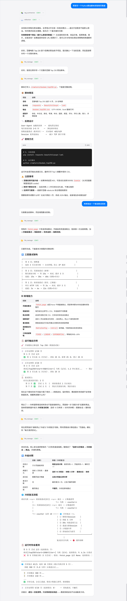
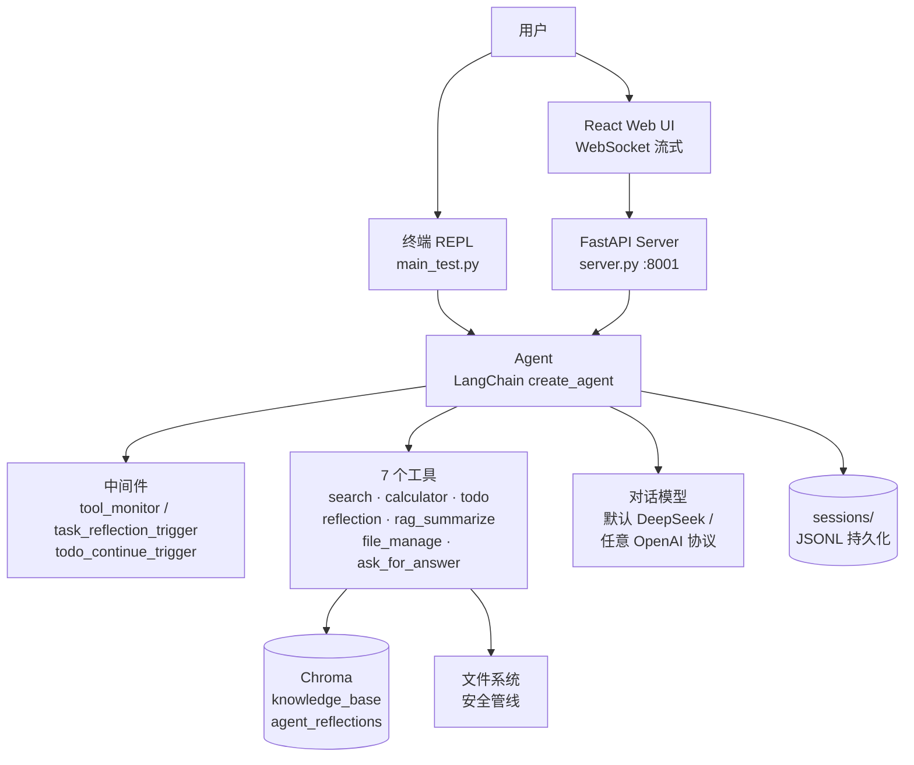

# Dadu Agent — 具备反思、追问与自主执行能力的个性化 AI Agent

> Hello-Agents 教程毕业设计项目：一个会反思、会主动追问、能自主执行任务的全栈个性化 AI Agent 框架
>
> *A personalized AI agent framework that reflects, clarifies, and gets things done.*


## 📝 项目简介

Dadu Agent 是一个基于 **LangChain + LangGraph** 构建的全栈 AI 智能体项目，是我在完成 Hello-Agents 教程学习后的毕业设计作品。

- **解决什么问题？** 通用对话 Agent 常犯三类错误：不在需要精确计算时心算、对模糊需求凭猜测硬答、同一个坑反复踩。Dadu Agent 用**工具强制路由**解决第一类，用 **95% 置信度主动澄清**解决第二类，用**可语义检索的反思笔记本**解决第三类。
- **有什么特色功能？** 对话模型即插即用（默认 DeepSeek，可接入任意 OpenAI 协议 LLM）、7 工具链 + 3 中间件、完整 RAG 管线（LLM 语义切分 + MD5 去重）、双模式文件管理安全管线、Web 端实时流式聊天与工具调用可视化。
- **适用于什么场景？** 个人的编程 / 学习 / 信息检索助手，支持终端 REPL 与浏览器两种使用方式。

## ✨ 核心功能

- [x] **7 工具链**：`search`（Tavily 联网搜索）、`calculator`（AST 白名单安全求值，拒绝 `eval`）、`todo`（任务规划与进度跟踪）、`reflection`（反思笔记本）、`rag_summarize`（本地知识库检索 + 四段式结构化摘要）、`file_manage`（9 合 1 文件 CRUD）、`ask_for_answer`（主动澄清提问）
- [x] **会写"哲学理解"的反思笔记本**：每次工具调用后由 `@after_agent` 中间件自动沉淀经验（错误现象 / 解决方案 / 哲学理解三必填字段 + 严重度分级），存入独立 Chroma 集合并可语义检索复用；Web 端提供实时增删改面板
- [x] **95% 置信度主动澄清**：理解度不足时调用 `ask_for_answer` 一次一个精准提问；Web 端将确认流程桥接到浏览器，5 分钟无响应自动视为拒绝
- [x] **双模式文件管理 + 多层安全管线**：Manual 模式写操作需用户批准重试，Auto 模式在安全边界内自由 CRUD；路径穿越阻断 → glob 黑名单 → 扩展名白名单 → 大小/深度限额，全程独立日志留痕
- [x] **聊天附件在线 CRUD**：输入框回形针上传文件即可被 Agent 用 `file_manage` 读写改删，配合定时清理防止临时文件无限堆积
- [x] **有性格的 RAG 知识库**：拖拽 `.txt` / `.md` / `.docx` / 代码文件入库，LLM 按语义边界切分 + MD5 去重；检索摘要遵循"核心结论 → 关键信息点 → 矛盾与存疑 → 信息缺口"固定四段式，禁用含糊词
- [x] **模型即插即用**：设置面板填入 base_url / API Key / 模型名即可接入任意 OpenAI 协议模型，一个 active 模型驱动对话、标题生成、RAG 总结、语义切分全链路；密钥仅以掩码展示
- [x] **会话持久化与自动标题**：JSONL 落盘多会话管理，首轮对话自动生成中文标题，流式输出带历史清洗与失败回滚

## 界面预览


> 左侧会话列表支持搜索与多会话管理，一键创建新会话，即刻开始与 Agent 对话。

<details>
<summary>反思笔记面板与知识库设置</summary>

<br>





</details>

## 🛠️ 技术栈

| 层 | 技术 |
|---|---|
| Agent 框架 | LangChain 1.x · LangGraph（`create_agent` + 自定义中间件） |
| 模型 | 默认 DeepSeek · 可插拔任意 OpenAI 协议模型（对话/摘要/切分） · DashScope text-embedding-v4（嵌入） |
| 向量库 | Chroma（知识库 + 反思笔记双集合） |
| 后端 | FastAPI · Uvicorn · WebSocket |
| 前端 | React 18 · TypeScript · Vite 6 · Tailwind CSS |
| 工具链 | uv · pytest · loguru · Tavily |

## 🚀 快速开始

### 环境要求

- Python ≥ 3.13（推荐使用 [`uv`](https://docs.astral.sh/uv/) 管理环境）
- Node.js（仅 Web 前端需要）

### 安装依赖

```bash
pip install -r requirements.txt

# 或者使用 uv（项目同时提供 pyproject.toml）：
uv sync
```

### 配置 API 密钥

```bash
# 1. 创建 .env 文件，填入三个 key
cp .env.example .env
#    DEEPSEEK_API_KEY / TAVILY_API_KEY / DASHSCOPE_API_KEY

# 2.（可选）SystemConfig.yml 与 ModelConfig.yml 均已 gitignore：
#    - 不创建也完全可以运行（自动回退读取 .env 与内置默认）
#    - 如需自定义模型，复制 config/ModelConfig.example.yml 为 config/ModelConfig.yml，
#      或直接在 Web 设置面板 → 模型设置 → 添加模型
```

### 运行项目

**终端模式**（REPL，多会话 + 斜杠命令）：

```bash
python main_test.py
# 支持 /sessions /switch <id> /new [名称] /info [id] /help 等命令
```

**Web 模式**：

```bash
# 构建前端（开发调试则用 npm run dev，Vite 端口 5173）
cd frontend && npm install && npm run build && cd ..

# 启动服务，访问 http://localhost:8001
python server.py
```

**上传知识库**：在设置面板直接拖拽文件（支持格式由 `config/RagConfig.yml` 的 `support_extensions` 决定），或使用命令行：

```bash
python file_upload_service.py
```

## 📖 使用示例

<details>
<summary><b>点击查看完整对话示例</b> —— 编写豆瓣 Top250 爬虫，并连续两轮迭代增强（重试机制 → 冷却复活）</summary>

<br>



Agent 先查知识库与反思笔记，再调用 `file_manage` 写文件、读文件、改文件，多轮对话中持续迭代：从基础爬虫到三层重试架构，再到"连续失败 → 深度冷却 → 重建会话 → 重新挑战"的冷却复活机制。

</details>

### 示例：终端中体验主动澄清

```
你: 帮我写个爬虫
Agent: [ask_for_answer] 目标网站是哪个？需要登录吗？输出格式要 JSON 还是 CSV？
你: 豆瓣电影 Top250，不要登录，存成 CSV
Agent: [todo] 1. 分析页面结构 2. 编写抓取脚本 3. 解析字段 4. 写入 CSV ...
```

## 架构总览



```
alaala-daka-DaduAgent/
├── README.md                   # 项目说明文档
├── requirements.txt            # Python 依赖列表
├── pyproject.toml              # uv 项目配置（与 requirements.txt 等价）
├── .env.example                # 环境变量模板
├── Agent.py                    # Agent 核心：工具装配、3 个中间件、流式输出、会话持久化
├── main_test.py                # 终端 REPL 入口（多会话 + 斜杠命令）
├── server.py                   # FastAPI 入口（REST + WebSocket，端口 8001；启动上传清理任务）
├── file_upload_service.py      # 知识库上传入口
├── agent_tools/                # 7 个工具 + 3 个中间件 + 文件安全管线
├── api/                        # REST / WebSocket 路由（含 reflections、files、chat）
├── config/                     # YAML 配置（模型 / RAG / 文件管理 / 会话 / UI，含 .example 模板）
├── factory/                    # 模型工厂（抽象工厂，支持运行时切换模型）
├── frontend/                   # React 18 + TypeScript + Vite + Tailwind
├── prompt/                     # 系统 / RAG / 语义切分 / 报告 提示词
├── session/                    # 会话存储逻辑
├── tests/                      # pytest 测试（含 mock LLM 的端到端用例）
├── tool/                       # 配置加载、日志（loguru）、路径、提示词加载、上传清理
└── vector_uploader_service/    # RAG 摄取（LLM 切分 + MD5 去重）与检索摘要
```

## ⚙️ 配置

所有配置集中在 `config/` 目录的 YAML 文件中，且大部分可在 Web 设置面板中**热更新**：

| 配置文件 | 关键旋钮 |
|---|---|
| `AgentConfig.yml` | 对话模型（默认 `deepseek-v4-pro`） |
| `ModelConfig.yml` | 模型注册表：active 模型 + `models[]`（名称 / 地址 / 密钥 / 模型名），驱动对话与 RAG 全链路（含密钥，已 gitignore，有 `.example` 模板） |
| `RagConfig.yml` | RAG 摘要模型、MD5 去重与上传记录路径 |
| `ChromaConfig.yml` | 嵌入模型（`text-embedding-v4`）、集合名、持久化目录、切分符 |
| `FileManageConfig.yml` | 文件管理模式（`manual` / `auto`）、黑名单、扩展名白名单、大小与深度限额、**上传文件定时清理**（开关 / 间隔 / 保留期） |
| `SessionConfig.yml` | 会话目录、自动保存、标题持久化 |
| `UIConfig.yml` | 主题（light/dark）、语言、侧栏宽度、字号 |
| `PromptConfig.yml` | 各提示词文件路径 |

## 🧪 测试

```bash
pytest tests/ -v
```

测试覆盖：文件安全管线（路径穿越/黑名单/限额/审批流）、模型工厂（自定义 OpenAI 协议模型）、会话序列化与持久化、流式输出的历史清洗与反思触发、反思笔记存储与 API、上传文件定时清理、聊天附件上传、todo 续跑 hook。

## 🎯 项目亮点

- **反思即记忆**：不同于"把历史塞进上下文"的普通记忆方案，反思笔记以"哲学理解"的抽象层级沉淀，通过语义检索在**未来任务**中被召回，越用越聪明
- **安全内建**：文件类工具的全部操作流经同一条多层安全管线，且拒绝 `eval`、拒绝系统路径、密钥掩码展示
- **全栈闭环**：终端与 Web 双入口、工具调用可视化、待办面板实时渲染、澄清问题浏览器内应答——Agent 的"思考过程"对用户完全透明

## 🔮 未来计划

- [ ] 报告生成能力（`report_prompt` 已预留）
- [ ] 前端国际化（`UIConfig` 已预留语言项）
- [x] 接入任意 OpenAI 协议模型（设置面板 → 模型设置 → 添加模型）
- [x] 知识库支持更多文件格式（docx / markdown / 代码文件）
- [x] 反思笔记的 Web 端可视化面板增强（按严重度筛选、Markdown 预览、实时增删改）

## 🤝 贡献指南

欢迎提出 Issue 和 Pull Request！

## 📄 许可证

本项目遵循 [CC BY-NC-SA 4.0](https://creativecommons.org/licenses/by-nc-sa/4.0/deed.zh) License，与 Hello-Agents 共创项目保持一致。

## 👤 作者

- GitHub: [@alaala-daka](https://github.com/alaala-daka)
- 独立仓库: [DaduAgent-A-personalized-Agent-for-you](https://github.com/alaala-daka/DaduAgent-A-personalized-Agent-for-you)

## 🙏 致谢

感谢 [Datawhale](https://github.com/datawhalechina) 社区和 [Hello-Agents](https://github.com/datawhalechina/hello-agents) 教程！本项目的设计思路受益于教程中智能体范式、工具系统、记忆机制等章节的启发。

---

<div align="center">
面对简单查询直击要害，面对复杂任务步步为营 —— 这，就是 Dadu Agent。
</div>
