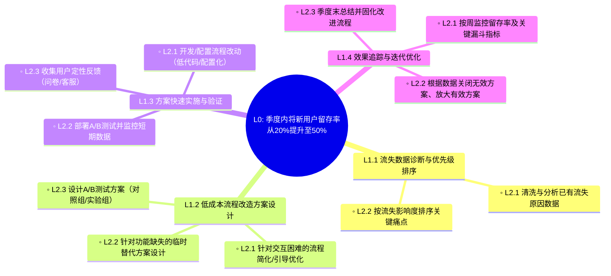
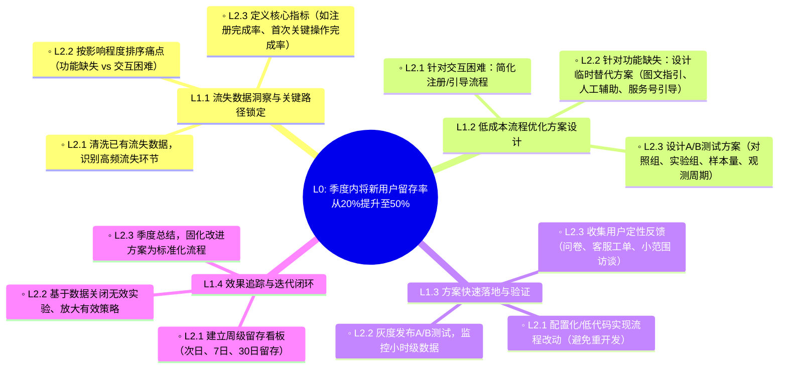
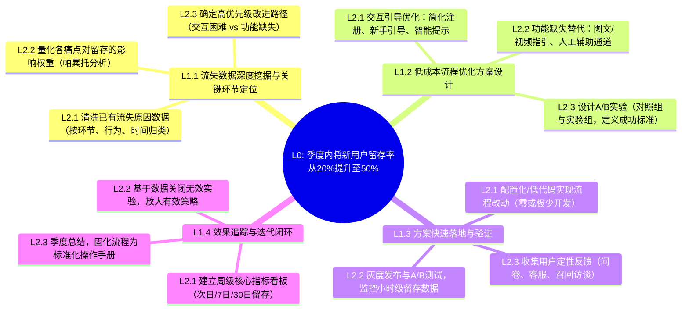

在终端互动中问题：

============================================================
      ThinkFlow - AI 思维教练
============================================================

请选择运行模式:
1. 交互模式（完整工作流）
2. 演示模式（预定义示例）

请输入选择 (1/2): 1

============================================================
      ThinkFlow - AI 思维教练
============================================================

您好！我是您的思维教练，帮助您理清思路、拆解任务。
请告诉我您目前遇到的困惑或想要实现的目标...

>>> 老板让提高留存率

=== [澄清期] ===

ClarifyAgent: 好的，我是您的认知脚手架工程师。我们先聚焦核心目标。

**第一轮追问：**

1. **Why（动机）**：老板提出“提高留存率”，背后最紧迫的驱动力是什么？比如是为了应对近期用户大规模流失、提升产品长期价值以获得下一轮融资，还是为了支撑某个关键业务指标（如GMV）？
2. **What（目标）**：具体是哪个产品/业务线的留存率？当前留存率数据大概是多少？老板有没有提出一个具体的提升目标（例如“30日留存从20%提升到35%”）？以及这次任务希望在多长时间内看到效果（比如一个月、一个季度）？

请先围绕这两个问题告诉我您了解的信息。

>>> 应对新用户注册，现在是20%，提高到50%，一个季度

ClarifyAgent: **第二轮追问：**

感谢您的补充。现在目标清晰了不少：**新用户注册后留存率从20%提升至50%，一个季度内完成**。

不过还有两个关键信息需要确认：

1. **Why（核心动机）再深入一层**：老板提出这个目标的深层原因是什么？比如是因为新用户流失导致付费转化率极低，从而影响整体营收？还是因为投资人要求核心指标翻倍？或者是产品本身处于从“拉新”转向“留人”的战略转型期？这会影响后续我们判断资源投入的优先级。

2. **How（资源与边界）**：目前团队对“如何提升留存”有任何初步设想或限制吗？比如：
   - 是否允许进行产品功能改动（如新增签到、社交功能）？
   - 是否有预算用于用户运营活动（如积分、优惠券）或外部工具？
   - 团队规模大概多少人？是否有数据分析支持？
   - 是否已有用户流失原因的数据分析报告？

请先回答这两个问题，我将在**下一轮对话**中为您输出清晰的目标陈述。

>>> 为了降低获客成本，有流失原因数据

ClarifyAgent: **第三轮追问（最后一轮）**  

感谢您提供的关键信息。基于“降低获客成本”的动机和已有流失原因数据，最后一个核心问题是：  

**您的老板或团队内部，对于“提升留存”的干预手段是否有明确的偏好或限制？** 具体来说：  
- 流失原因数据揭示的三大主因是否指向**产品体验问题**（如功能缺失、交互困难）？还是**运营激励不足**（如缺乏新用户引导、奖励机制）？  
- 在**一个季度的时间窗口**内，是否允许进行中等规模的产品功能迭代（如优化新手引导流程、增加个性化推荐）？还是更倾向于**纯运营策略**（如推送、优惠券、社群互动）？  
- 老板是否明确了**最高可接受的成本**（例如人力、技术、资金投入的硬性上限）？  

请简要回答，我将据此为您输出清晰的目标陈述。

>>> 功能缺失，交互困难，倾向于流程改造，低成本的解决

ClarifyAgent: 感谢您的清晰补充。基于三轮追问收集到的全部信息，我现在为您输出最终的目标陈述。

---

[CLARIFIED_GOAL]  
在一个季度内，以低成本流程改造为主，解决新用户注册后因功能缺失和交互困难导致的流失问题，将留存率从20%提升至50%，从而降低获客成本。  
（约束条件：已有流失原因数据；优先采用流程优化而非重功能开发；资源预算需在下游拆解阶段进一步明确。）
[/CLARIFIED_GOAL]

此目标陈述可直接作为后续拆解任务的基础。如果您确认无误，我们可以进入下一步的拆解环节。如果仍有细节需要调整，请告知。

已澄清目标：在一个季度内，以低成本流程改造为主，解决新用户注册后因功能缺失和交互困难导致的流失问题，将留存率从20%提升至50%，从而降低获客成本。  
（约束条件：已有流失原因数据；优先采用流程优化而非重功能开发；资源预算需在下游拆解阶段进一步明确。）
是否准确？(y/n): y

目标已确认，进入拆解阶段。

=== [拆解期] ===
拆解目标: 在一个季度内，以低成本流程改造为主，解决新用户注册后因功能缺失和交互困难导致的流失问题，将留存率从20%提升至50%，从而降低获客成本。  
（约束条件：已有流失原因数据；优先采用流程优化而非重功能开发；资源预算需在下游拆解阶段进一步明确。）

DecomposeAgent: 好的，基于您的目标，我将大目标拆解为四个相互独立且完全穷尽的模块，并细化为可执行的任务。以下是结构化的 WBS 拆解。

### 1. 可视化思维导图 (Mermaid)

### 2. 文本版 WBS 结构

- **L0: 季度内将新用户留存率从20%提升至50%**
  - **L1.1 流失数据诊断与优先级排序**
    - L2.1 清洗与分析已有流失原因数据（提取高频流失环节、行为模式）
    - L2.2 按流失影响度排序关键痛点（如首次登录失败、核心功能找不到、注册步骤卡顿等）
  - **L1.2 低成本流程改造方案设计**
    - L2.1 针对交互困难的流程简化/引导优化（如增加新手提示、减少必填项、一键跳转）
    - L2.2 针对功能缺失的临时替代方案设计（如用图文指引替代未开发的功能、手动辅助流程）
    - L2.3 设计A/B测试方案（对照组/实验组，定义成功标准及样本量）
  - **L1.3 方案快速实施与验证**
    - L2.1 开发/配置流程改动（利用现有平台配置、低代码工具，避免重开发）
    - L2.2 部署A/B测试并监控短期数据（比如1周内的次日留存变化）
    - L2.3 收集用户定性反馈（问卷、客服记录、用户访谈，验证改进效果）
  - **L1.4 效果追踪与迭代优化**
    - L2.1 按周监控留存率及关键漏斗指标（注册转化、次日留存、7日留存）
    - L2.2 根据数据关闭无效方案、放大有效方案（快速迭代，多轮优化）
    - L2.3 季度末总结并固化改进流程（输出标准化SOP，确保长期留存）

### 自我校验：MECE 检查

- **相互独立**：四个模块分别对应“分析问题 → 设计方案 → 实施验证 → 持续优化”，逻辑递进，无重叠。
- **完全穷尽**：
  - 数据诊断覆盖了已有数据的利用（L1.1）
  - 方案设计覆盖了交互和功能两类痛点（L1.2）
  - 实施过程包含了开发、测试、反馈（L1.3）
  - 效果跟踪覆盖了监控、迭代与总结（L1.4）
  - 未遗漏预算规划？预算在下游明确，当前阶段暂不列为独立模块（后续可在L1.2或L1.3中嵌入资源约束）
  - 未遗漏项目管理？可归入L1.3或L1.4中的协调性任务，暂不拆分以避免冗余
- **结论**：符合MECE原则。

### 下一步

您想优先深入拆解哪一个分支？例如：
- **L1.1 流失数据诊断与优先级排序**：具体如何从已有数据中定位关键环节？
- **L1.2 低成本流程改造方案设计**：需要具体的设计方法或实例？
- **L1.3 方案快速实施与验证**：如何以最低成本快速上线？
- **L1.4 效果追踪与迭代优化**：建立怎样的监控指标和决策机制？

请告诉我您的选择，我将继续向下拆解至更细的任务层级。

拆解完成！
请选择下一步操作：
1. 继续深入其他分支
2. 完成拆解
请输入选择 (1/2): L1.1 流失数据诊断与优先级排序

=== [拆解期] ===
拆解目标: 在一个季度内，以低成本流程改造为主，解决新用户注册后因功能缺失和交互困难导致的流失问题，将留存率从20%提升至50%，从而降低获客成本。  
（约束条件：已有流失原因数据；优先采用流程优化而非重功能开发；资源预算需在下游拆解阶段进一步明确。）

DecomposeAgent: 好的，我将基于您提供的目标，重新进行结构化的WBS拆解，确保符合MECE原则并生成Mermaid可视化代码。

### 1. 可视化思维导图 (Mermaid)

### 2. 文本版 WBS 结构

- **L0: 季度内将新用户留存率从20%提升至50%**
  - **L1.1 流失数据洞察与关键路径锁定**
    - L2.1 清洗已有流失数据，识别高频流失环节（如注册页、新手引导、首次使用）
    - L2.2 按影响程度排序痛点（区分功能缺失类和交互困难类的优先级）
    - L2.3 定义核心指标（如注册完成率、首次关键操作完成率、次日留存）
  - **L1.2 低成本流程优化方案设计**
    - L2.1 针对交互困难：简化注册/引导流程（减少必填字段、增加提示、一键跳转）
    - L2.2 针对功能缺失：设计临时替代方案（图文指引、人工辅助、服务号引导）
    - L2.3 设计A/B测试方案（对照组、实验组、样本量、观测周期）
  - **L1.3 方案快速落地与验证**
    - L2.1 配置化/低代码实现流程改动（利用现有平台，避免重开发）
    - L2.2 灰度发布A/B测试，监控小时级数据
    - L2.3 收集用户定性反馈（问卷、客服工单、小范围访谈）
  - **L1.4 效果追踪与迭代闭环**
    - L2.1 建立周级留存看板（次日、7日、30日留存）
    - L2.2 基于数据关闭无效实验、放大有效策略
    - L2.3 季度总结，固化改进方案为标准化流程

### 3. 自我校验：MECE 检查

- **相互独立**：四个模块按“洞察→设计→落地→迭代”的线性流程划分，无重叠。L1.1聚焦数据，L1.2聚焦方案，L1.3聚焦实施验证，L1.4聚焦持续优化。
- **完全穷尽**：
  - 覆盖了从数据到设计到落地到总结的全生命周期。
  - 包含交互困难和功能缺失两类痛点的应对（L1.2中已拆分）。
  - 包含定量（数据）和定性（反馈）两种验证手段。
  - 未遗漏资源分配？预算约束将在后续L1.2或L1.3中具体细化时体现，当前层级不需独立模块。
  - 未遗漏时间管理？时间约束隐含在季度周期内，各模块可并行或串行，后续拆解时可加入里程碑。
- **结论**：符合MECE原则。

### 4. 下一步

您想优先深入拆解哪一个分支？例如：

- **L1.1 流失数据洞察与关键路径锁定**：如何从已有数据分析出具体的高频流失环节？需要什么工具？
- **L1.2 低成本流程优化方案设计**：需要提供具体的设计方法或案例吗？
- **L1.3 方案快速落地与验证**：如何以最小成本快速上线改动并验证？
- **L1.4 效果追踪与迭代闭环**：如何建立监控体系并及时迭代？

请告诉我您的选择，我将继续向下拆解至任务级，并在必要时识别决策点。

拆解完成！
请选择下一步操作：
1. 继续深入其他分支
2. 完成拆解
请输入选择 (1/2): 流失数据洞察与关键路径锁定 

=== [拆解期] ===
拆解目标: 在一个季度内，以低成本流程改造为主，解决新用户注册后因功能缺失和交互困难导致的流失问题，将留存率从20%提升至50%，从而降低获客成本。  
（约束条件：已有流失原因数据；优先采用流程优化而非重功能开发；资源预算需在下游拆解阶段进一步明确。）

DecomposeAgent: 好的，我将基于您的目标，严格按照结构化拆解要求，输出包含 Mermaid 心形图、文本版 WBS 结构、MECE 自检及下一步引导的完整结果。

### 1. 可视化思维导图 (Mermaid)

### 2. 文本版 WBS 结构

- **L0: 季度内将新用户留存率从20%提升至50%**
  - **L1.1 流失数据深度挖掘与关键环节定位**
    - L2.1 清洗已有流失原因数据（按环节、行为、时间归类）
    - L2.2 量化各痛点对留存的影响权重（帕累托分析）
    - L2.3 确定高优先级改进路径（交互困难 vs 功能缺失）
  - **L1.2 低成本流程优化方案设计**
    - L2.1 交互引导优化：简化注册、新手引导、智能提示
    - L2.2 功能缺失替代：图文/视频指引、人工辅助通道
    - L2.3 设计A/B实验（对照组与实验组，定义成功标准）
  - **L1.3 方案快速落地与验证**
    - L2.1 配置化/低代码实现流程改动（零或极少开发）
    - L2.2 灰度发布与A/B测试，监控小时级留存数据
    - L2.3 收集用户定性反馈（问卷、客服、召回访谈）
  - **L1.4 效果追踪与迭代闭环**
    - L2.1 建立周级核心指标看板（次日/7日/30日留存）
    - L2.2 基于数据关闭无效实验，放大有效策略
    - L2.3 季度总结，固化流程为标准化操作手册

### 3. 自我校验：MECE 检查

- **相互独立**：四个模块逻辑递进，无重叠。L1.1 纯分析，L1.2 纯设计，L1.3 纯实施，L1.4 纯监控迭代，边界清晰。
- **完全穷尽**：
  - 覆盖了从数据输入到设计、实施、验证、固化全链路。
  - 交互困难与功能缺失两类痛点均在 L1.2 中得到专门应对。
  - 定量（留存数据）与定性（用户反馈）验证手段均涵盖。
  - 资源预算约束将在下游 L1.2 或 L1.3 中具体细化时加入，当前层级无需独立模块。
- **结论**：符合 MECE 原则，无遗漏或冲突。

### 4. 下一步

您想优先深入拆解哪一个分支？例如：

- **L1.1 流失数据深度挖掘与关键环节定位**：如何从已有数据中快速定位具体流失步骤？需要方法论或工具推荐？
- **L1.2 低成本流程优化方案设计**：需要提供具体的简化策略或替代方案示例？
- **L1.3 方案快速落地与验证**：如何在不开发的情况下快速上线改动？
- **L1.4 效果追踪与迭代闭环**：需要设计看板指标或迭代决策框架？

请告诉我您的选择，我将继续向下拆解至更细的任务级，并在必要时识别决策点。

拆解完成！
请选择下一步操作：
1. 继续深入其他分支
2. 完成拆解
请输入选择 (1/2): ^CTraceback (most recent call last):
  File "/Users/kusunoki/Desktop/Hello-Agents/代码/第十六章 毕业设计/hello-agents/Co-creation-projects/alan-6-6-6-ThinkFlow/main.py", line 646, in <module>
    controller.start()
  File "/Users/kusunoki/Desktop/Hello-Agents/代码/第十六章 毕业设计/hello-agents/Co-creation-projects/alan-6-6-6-ThinkFlow/main.py", line 572, in start
    choice = input("请选择下一步操作：\n1. 继续深入其他分支\n2. 完成拆解\n请输入选择 (1/2): ").strip()
             ^^^^^^^^^^^^^^^^^^^^^^^^^^^^^^^^^^^^^^^^^^^^^^^^^^^^^^^^^^^^^^^^^^^^^^^^^^^^^^^^^
KeyboardInterrupt

(Al_Agent) kusunoki@MacBook-Air-2 alan-6-6-6-ThinkFlow % python main.py
/Users/kusunoki/Desktop/Hello-Agents/代码/第十六章 毕业设计/hello-agents/Co-creation-projects/alan-6-6-6-ThinkFlow/main.py:92: SyntaxWarning: invalid escape sequence '\`'
  decompose_system_prompt = """

