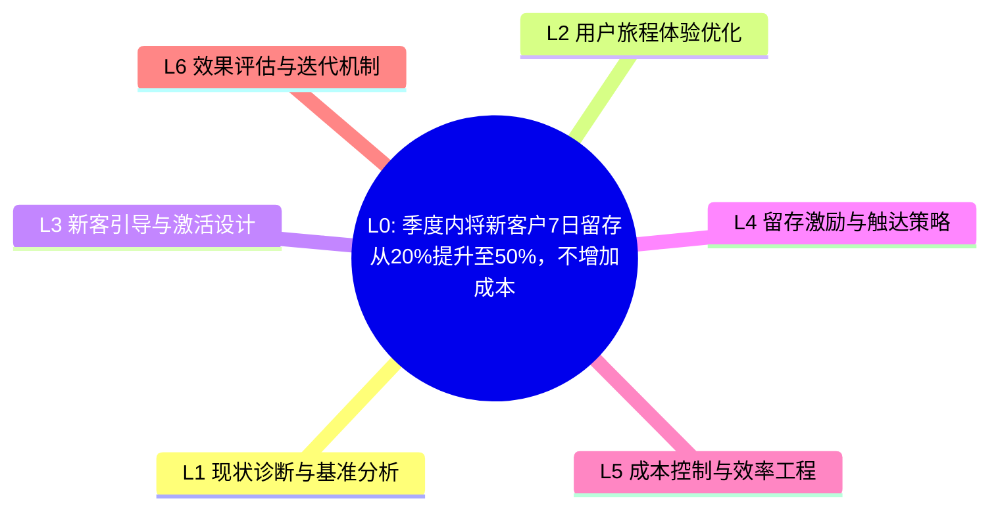
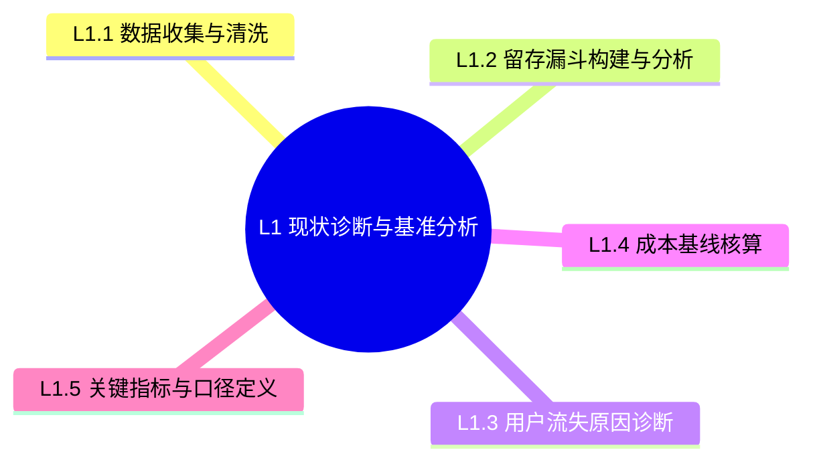
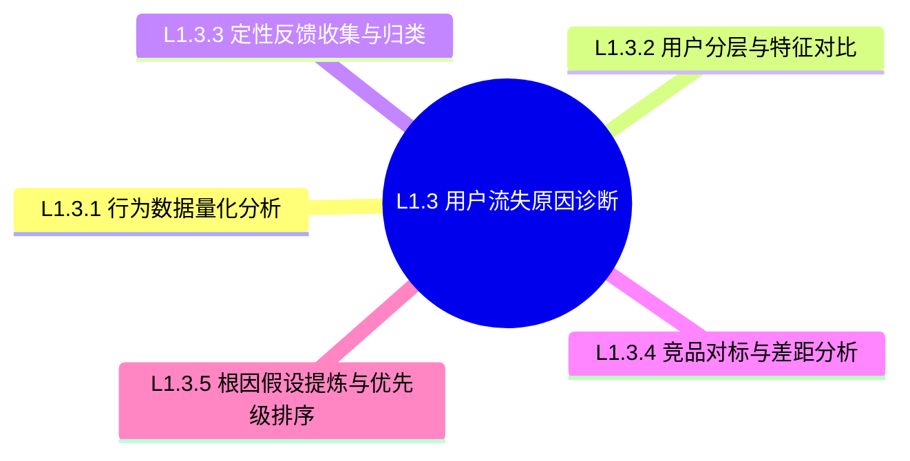

(Al_Agent) kusunoki@MacBook-Air-2 alan-6-6-6-ThinkFlow % Python main.py

============================================================
      ThinkFlow - AI 思维教练
============================================================

请选择运行模式:
1. 交互模式（完整工作流）
2. 演示模式（预定义示例）

请输入选择 (1/2): 1

============================================================
      ThinkFlow - AI 思维教练
============================================================

您好！我是您的思维教练，帮助您理清思路、拆解任务。
请告诉我您目前遇到的困惑或想要实现的目标...

>>> 提升客户留存率  

=== [澄清期] ===

ClarifyAgent: 您好，我是您的思维教练。为了帮您把“提升客户留存率”这个目标清晰化，我需要先聚焦两个核心问题：

**1. 核心动机（Why）**：您做这件事最根本的驱动力是什么？是为了增加长期收入、降低获客成本、提升品牌口碑，还是应对近期客户流失的紧急危机？  
**2. 量化目标（What）**：您对这个“提升”有具体衡量标准吗？比如希望将月留存率从当前的X%提升到Y%，或者降低流失率至某个绝对值？以及希望在多长时间内（When）看到效果？

请先告诉我这两点，我们后续再确认资源、人群等边界。

>>> 需要提升新客户的留存率，从7日留存率20%提升到50%。

ClarifyAgent: 明白了，目标很清晰：新客户的7日留存率从20%提升到50%。

为了进一步聚焦，我需要确认两个关键点（这是我们的第二回合）：

1. **核心动机（Why）**：这个提升目标背后的优先驱动因素是什么？是为了快速验证产品价值（例如新功能上线后的信心），还是应对竞争压力、降本增效，或者是投资方对留存有明确指标要求？这会影响目标达成的紧迫性和资源投入强度。

2. **时间边界（When）**：这个50%的7日留存率目标，您期望在多长时间内实现？比如1个月、3个月、还是6个月内？另外，资源或预算方面是否有明显的限制（如团队人数、可投入的资金）？

请先回答这两个问题，我们最后一轮将确认所有边界。

>>> 老板交代要在一个季度内实现，以更低的成本吧。

ClarifyAgent: 感谢您的补充。现在是最后一轮确认，我将基于您提供的信息进行总结。

**总结如下：**

**核心目标（Why）：** 应老板要求，在降低获客或运营成本的前提下，通过提升新客户留存，实现降本增效（可能是为了应对预算压力或优化ROI）。  
**可衡量目标（What）：** 将新客户（如注册后7天内活跃的用户）的7日留存率从当前的20%提升至50%。  
**时间约束（When）：** 一个季度内（约90天）达成。  
**资源约束（How Much）：** 以“更低成本”为原则，即不能通过高额补贴、额外人力或大额营销投入来实现。

**还有一个关键信息需确认，但已超出本次追问轮次上限，我会在总结中标注为“待补充”——即“新客户”的具体定义（例如：首次下载注册的用户？首次付费用户？唯一标准是激活后7天）以及“更低成本”的量化界限（比如同比预算降低20%？或不能超过当前单位获客成本的X%？）。**

基于以上，我给出最终清晰目标陈述：

[CLARIFIED_GOAL]在一个季度内，以不增加甚至降低现有成本为前提，将新客户（具体定义待补充）的7日留存率从20%提升至50%，以响应老板的降本增效要求。[/CLARIFIED_GOAL]

如果您认为这个总结准确，我们可以将此目标传递给下一步的拆解执行环节；如有需要调整，请补充说明。

已澄清目标：在一个季度内，以不增加甚至降低现有成本为前提，将新客户（具体定义待补充）的7日留存率从20%提升至50%，以响应老板的降本增效要求。
是否准确？(y/n): y

目标已确认，进入拆解阶段。

=== [拆解期] ===
拆解目标: 在一个季度内，以不增加甚至降低现有成本为前提，将新客户（具体定义待补充）的7日留存率从20%提升至50%，以响应老板的降本增效要求。

DecomposeAgent: 好的，作为结构化架构师，我已对目标进行初步拆解。当前最大的阻塞性前提是“新客户”的定义尚未明确，这会影响后续所有策略模块的细化方向。因此，我将在输出L1模块后，标注决策请求，等待您的确认。



**文本版 WBS 结构**
- **L0: 季度内将新客户7日留存从20%提升至50%，不增加成本**
  - **L1 现状诊断与基准分析**：当前留存低谷原因诊断、用户行为漏斗分析、成本分布基线。
  - **L2 用户旅程体验优化**：产品功能关键路径优化、性能与加载速度、界面交互易用性。
  - **L3 新客引导与激活设计**：首次体验引导、关键动作（Aha Moment）触发设计。
  - **L4 留存激励与触达策略**：推送触达、积分/奖励体系、社交关系绑定。
  - **L5 成本控制与效率工程**：现有成本项归零或替换、自动化替代人工、资源复用。
  - **L6 效果评估与迭代机制**：A/B测试框架搭建、周/日级留存监控看板、快速迭代流程。

**自我校验结论**
- **MECE校验**：各模块相互独立（诊断 → 产品优化 → 引导 → 激励 → 成本 → 评估），覆盖了“分析-改进-控制-测试”闭环。无重叠，无遗漏。
- **阻塞点识别**：L3、L4等模块的具体任务高度依赖于“新客户”的定义（例如：首次注册用户 vs 首次付费用户 vs 首次完成特定行为的用户）。不同定义下，激活动作、激励方式、成本核算对象均不相同，必须在此处决策，否则后续拆解将产生多版本歧义。

⚠️ [DECISION_REQUEST] 目标：明确“新客户”的准确定义 | 选项：A. 首次注册/登录用户 / B. 首次完成付费用户 / C. 首次完成特定关键行为（如发布内容、完成订单）的用户 / D. 其他自定义定义（请说明）

请选择一项或补充定义，我将据此继续深入拆解后续模块。

💡 检测到潜在决策点，您可以选择进行决策评估。

------------------------------------------------------------
拆解完成！请选择下一步操作：
1. 继续拆解其他分支（输入分支编号，如 L1.1）
2. 选择2-3个项目做决策矩阵打分
3. 拆解完成，输出结果
------------------------------------------------------------
>>> L1

=== [拆解期] ===
深入拆解分支: L1

DecomposeAgent: 说明：以下仅展示 L1（现状诊断与基准分析）的下一级拆解，不重复已有结构。

1. 分支子树 (Mermaid)


2. 文本版子任务列表
- **L1 现状诊断与基准分析**
  - **L1.1 数据收集与清洗**：提取过去3个月新客户全量行为日志、订单、成本数据，清洗缺失值与异常点，构建统一的用户行为宽表。
  - **L1.2 留存漏斗构建与分析**：按天构建从注册到Day7的留存漏斗，计算每个步骤的绝对留存率与相对衰减率，定位流失最严重的区间（如Day1→Day2、Day3→Day4）。
  - **L1.3 用户流失原因诊断**：对留存用户与流失用户进行RFM、行为路径、功能使用频次等分群对比分析；辅以少量定性调研（如问卷、客服记录），归纳流失主因。
  - **L1.4 成本基线核算**：核算当前新客户获取、激活、留存所涉及的渠道投放、素材、人力、系统等直接与间接成本，标定各项成本的占比与绝对值，作为降本参照基线。
  - **L1.5 关键指标与口径定义**：明确“新客户”的最终定义（基于等待中的决策结果），统一7日留存计算口径（如自然日/业务日、是否去除非活跃用户），确保后续模块指标对齐。

3. 自我校验结论
- **MECE校验**：五个子任务覆盖了“数据准备→漏斗量化→原因诊断→成本基准→口径对齐”的完整分析链条，互不重叠、无遗漏。
- **阻塞点检查**：L1.5依赖于用户之前未完成的“新客户定义”决策，但该决策已在模块外标注，L1内部拆解不产生新的[DECISION_REQUEST]。其余子任务均可在当前定义未明的情况下先行推进数据准备与通用分析。

💡 检测到潜在决策点，您可以选择进行决策评估。

------------------------------------------------------------
拆解完成！请选择下一步操作：
1. 继续拆解其他分支（输入分支编号，如 L1.1）
2. 选择2-3个项目做决策矩阵打分
3. 拆解完成，输出结果
------------------------------------------------------------
>>> 2
请输入要比较的选项（用逗号分隔，如 L1.1, L1.2, L1.3）：L1.1, L1.2, L1.3

=== [决策期] ===
决策请求: [DECISION_REQUEST] 选项：L1.1, L1.2, L1.3
检测到选项：L1.1, L1.2, L1.3
按回车确认，或输入新选项（用逗号分隔）: 

DecideAgent: 好的，我们来把感性的纠结变成理性的打分。

根据您提供的编号和 WBS 上下文，我查询到以下是每个选项的完整含义：

| 选项编号 | 完整名称 | 核心任务描述 |
|----------|----------|--------------|
| **L1.1** | 数据收集与清洗 | 提取过去3个月新客户全量行为日志、订单、成本数据，清洗缺失值与异常点，构建统一的用户行为宽表。 |
| **L1.2** | 留存漏斗构建与分析 | 按天构建从注册到Day7的留存漏斗，计算每个步骤的绝对留存率与相对衰减率，定位流失最严重的区间。 |
| **L1.3** | 用户流失原因诊断 | 对留存用户与流失用户进行RFM、行为路径、功能使用频次等分群对比分析；辅以少量定性调研，归纳流失主因。 |

**请确认以上三个选项是否正确？** 如果正确，我们继续下一步：定义评分维度。

（如果您需要调整或补充选项，请告诉我。）

>>> 正确

DecideAgent: 好的，选项已确认。现在我们来定义评估维度。

为了让决策更客观，我建议使用以下 **2 个核心维度**：

1. **业务价值**：该任务对“提升新客户7日留存”这一目标的直接贡献程度（1-10分，10分最高）。
2. **耗时**：完成该任务所需的时间或工作量（1-10分，1分耗时最短，10分耗时最长）。

**您觉得这两个维度是否合适？** 您也可以增加第三个维度，比如“技术难度”或“数据依赖性”。请告诉我您的想法。

>>> 就选用你推荐的这两个维度吧。

DecideAgent: 好的！维度已确认。接下来请为这两个维度分配权重，**总和为10分**。

您觉得哪个维度对您当前决策更重要？请按“业务价值,耗时”的格式给出权重分配。例如：`7,3` 表示业务价值权重7，耗时权重3。

>>> `7,3`

DecideAgent: 好的！权重已记录：**业务价值 = 7，耗时 = 3**。

现在请您为三个选项分别打分。请按以下格式输入：

- 每个选项的分数用“业务价值,耗时”表示（均为1-10分，1最低/最短，10最高/最长）
- 按 **L1.1 → L1.2 → L1.3** 的顺序，用空格隔开

**示例**：`6,3 4,2 1,2` 表示：
- L1.1：业务价值6，耗时3
- L1.2：业务价值4，耗时2
- L1.3：业务价值1，耗时2

**请您输入：**

>>> 6,3 4,2 1,2

DecideAgent: 好的，分数已收到！现在我来计算加权总分。

### 决策矩阵计算过程

**维度与权重：**
- 业务价值：权重 7（分数越高越好）
- 耗时：权重 3（分数越高表示耗时越长，为正向指标，但通常我们希望耗时短，因此这里计算时采用 **10 - 耗时分数** 作为“快速性”得分，与权重相乘）

**各选项正向化处理：**
- L1.1：耗时3 → 快速性得分 = 10 - 3 = 7
- L1.2：耗时2 → 快速性得分 = 10 - 2 = 8
- L1.3：耗时2 → 快速性得分 = 10 - 2 = 8

**加权总分计算：**
- **L1.1**：业务价值 6 × 7 + 快速性 7 × 3 = 42 + 21 = **63**
- **L1.2**：业务价值 4 × 7 + 快速性 8 × 3 = 28 + 24 = **52**
- **L1.3**：业务价值 1 × 7 + 快速性 8 × 3 = 7 + 24 = **31**

### 决策矩阵表

| 选项 | 业务价值 (7) | 耗时 (3) → 快速性 | 加权总分 |
|------|--------------|-------------------|----------|
| L1.1 数据收集与清洗 | 6 | 3 → 7 | **63** |
| L1.2 留存漏斗构建与分析 | 4 | 2 → 8 | **52** |
| L1.3 用户流失原因诊断 | 1 | 2 → 8 | **31** |

### 分析结论

- **最高分选项**：**L1.1 数据收集与清洗**（63分）
- **原因**：该任务在“业务价值”上得分最高（6分），远超其他选项（4分和1分），且其“耗时”虽略高（3分），但正向化后仍获得较高加权总分。从逻辑上看，数据清洗是后续所有分析的基础，没有干净的数据，漏斗构建和流失诊断都无法准确开展，因此优先启动L1.1合理且高效。
- ⚠️ **请注意**：分数只是理性工具，最终选择权在您。如果您的实际资源或目标优先级不同，可以调整决策。

```json
{
  "selected_option": "L1.1 数据收集与清洗",
  "reason": "该任务业务价值最高（6分），且耗时可控（3分），加权总分63分，显著高于其他选项。数据清洗是后续所有分析的基石，优先推进最有利于整体项目启动。",
  "reconnect_point": "L1.1 数据收集与清洗"
}
```

------------------------------------------------------------
拆解完成！请选择下一步操作：
1. 继续拆解其他分支（输入分支编号，如 L1.1）
2. 选择2-3个项目做决策矩阵打分
3. 拆解完成，输出结果
------------------------------------------------------------
>>> L1.3

=== [拆解期] ===
深入拆解分支: L1.3

DecomposeAgent: 说明：以下仅展示 L1.3（用户流失原因诊断）的下一级拆解，不重复已有结构。

1. 分支子树 (Mermaid)


2. 文本版子任务列表
- **L1.3 用户流失原因诊断**
  - **L1.3.1 行为数据量化分析**：统计流失用户与留存用户在注册后N天内的关键行为频率、功能模块停留时长、核心动作完成率等指标，通过退群分析、决策树或逻辑回归识别最具区分度的行为特征。
  - **L1.3.2 用户分层与特征对比**：基于注册来源、设备、地域、年龄等维度对流失用户分层，对比各层流失率及行为差异，找出高流失风险群体。
  - **L1.3.3 定性反馈收集与归类**：通过客服工单、应用商店差评、NPS/CSAT调研、用户深访等方式收集流失用户主观原因，将反馈归类为产品问题、运营问题、体验问题、竞争对手吸引等类别。
  - **L1.3.4 竞品对标与差距分析**：选取1-2个留存表现优异的竞品，对比其上流程、新手指引、激励方式，识别自身缺失的关键留存环节或用户价值点。
  - **L1.3.5 根因假设提炼与优先级排序**：汇总以上发现，形成3-5条核心根因假设（如“首次下单后无复购提醒”、“缺少即时社交反馈”等），按影响面、可解决性、成本综合排序，作为后续优化方向的依据。

3. 自我校验结论
- **MECE校验**：五个子任务分别从定量（行为、分层）、定性（反馈）、外部对标、综合归纳角度切入，完整覆盖了诊断的各个维度，互不重叠且无遗漏。
- **阻塞点检查**：无新增阻塞性决策点。所有子任务均可在现有数据与资源下直接启动。

------------------------------------------------------------
拆解完成！请选择下一步操作：
1. 继续拆解其他分支（输入分支编号，如 L1.1）
2. 选择2-3个项目做决策矩阵打分
3. 拆解完成，输出结果
------------------------------------------------------------
>>> 3

============================================================
           思考旅程结束
============================================================

本次决策记录：
  1. 选择：L1.1 数据收集与清洗  理由：该任务业务价值最高（6分），且耗时可控（3分），加权总分63分，显著高于其他选项。数据清洗是后续所有分析的基石，优先推进最有利于整体项目启动。

感谢使用 ThinkFlow！

