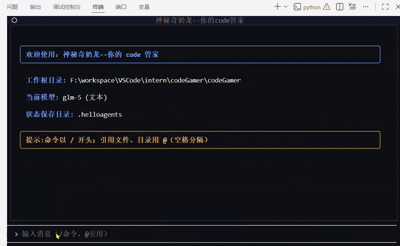

# Praxis

> 基于 YYHDBL-HelloCodeAgentCli 与 Hello-Agents 框架继续二次开发的本地代码仓库智能助手

<div align="center">


[](https://www.python.org/)
[](https://github.com/datawhalechina/hello-agents)
[](LICENSE)

</div>

## 📝 项目简介

Praxis 是一个面向本地代码仓库的 AI Code Agent 项目，直接基于 YYHDBL-HelloCodeAgentCli 继续做二次开发，并沿用其背后的 Hello-Agents 框架能力，目标是提供类似 Claude Code / Codex 的本地交互体验。

这个项目主要解决本地代码仓库分析、修改和验证流程割裂的问题，把代码理解、工具调用、补丁生成、修改确认和交互展示串成一个完整闭环。

它的特色在于：
- 同时提供 CLI 与 TUI 两套交互方式
- 支持 ReAct 多步推理与工具协同
- 支持标准补丁识别、确认、备份与落盘
- 支持 Skills 渐进加载与 MCP 扩展工具接入

它适用于：
- 本地代码仓库探索与结构分析
- 小范围代码修复与重构
- 代码审查辅助
- 演示 Agent 工程化落地能力

## ✨ 核心功能

- [x] 本地代码仓库问答与结构分析
- [x] ReAct 多步推理与工具调用
- [x] 标准补丁识别、确认、备份与落盘
- [x] CLI 与 TUI 双交互界面
- [x] 会话日志、导出与统计
- [x] Skills 机制接入，支持按需加载 SOP
- [x] MCP 扩展接入，支持外部工具服务器
- [x] 文件、目录、图片引用与 OCR / 多模态协同

## 🛠️ 技术栈

- Hello-Agents 0.2.7
- YYHDBL-HelloCodeAgentCli 二次开发基础
- ReAct Agent 工作流
- Python 3.12+
- Textual TUI
- OpenAI Compatible LLM API
- MCP 工具扩展
- Skills 渐进式知识加载

## 🚀 快速开始

### 环境要求

- Python 3.12+
- uv 或 pip
- 可访问的 OpenAI Compatible 模型服务

### 安装依赖

推荐使用 uv：

```bash
git clone https://github.com/aug618/Praxis.git
cd Praxis
uv venv
uv sync
```

如果使用 pip：

```bash
python -m venv .venv
.venv\Scripts\activate
pip install -r requirements.txt
```

### 配置API密钥

```bash
copy .env.example .env
```

编辑 .env 文件，填入你的模型配置，例如：

```dotenv
LLM_MODEL_ID=glm-4.7
LLM_BASE_URL=https://open.bigmodel.cn/api/paas/v4
ZHIPU_API_KEY=your_api_key

HELLOAGENTS_DIR=.helloagents
CODE_AGENT_MAX_REACT_STEPS=20
LLM_TIMEOUT=60
```

如果你使用 DeepSeek、Qwen、Ollama 或其他 OpenAI Compatible 后端，只需替换对应的模型名、Base URL 和 API Key。

### 运行项目

项目当前以 Python 脚本形式运行，不依赖 Jupyter Notebook。

启动 CLI：

```bash
python -m code_agent.hello_code_cli --repo .
```

启动 TUI：

```bash
python -m code_agent.hello_code_tui --repo .
```

如果使用 uv：

```bash
uv run python -m code_agent.hello_code_cli --repo .
uv run python -m code_agent.hello_code_tui --repo .
```

## 📖 使用示例

下面是几个典型交互示例：

```text
@dir(core/, tools/) 先告诉我这两个模块分别负责什么，再指出主要入口
```

```text
@file(core/config.py) 这里有弃用警告，帮我用最小改动修复
```

```text
修复完之后跑 pytest -q，若失败就根据输出继续改
```

CLI 演示截图：


TUI 动图演示：

</img>

## 🎯 项目亮点

- 本地仓库优先：围绕本地代码库分析、修改、验证设计，不依赖远端 SaaS 工作流。
- 安全修改闭环：通过标准补丁格式执行代码修改，落盘前支持确认与备份。
- 双界面体验：CLI 适合快速问答，TUI 适合长会话和过程观察。
- 扩展能力完整：不仅支持内置工具，还支持 Skills 和 MCP 两类扩展机制。
- 工程化更完整：包含日志、会话导出、计划生成、Todo 跟踪等能力。

## 📊 性能评估

当前项目以功能完整性和交互体验为主，尚未形成统一的量化 benchmark，现阶段可确认的结果包括：

- 已完成 CLI 与 TUI 两套可运行入口
- 已具备本地代码仓库分析与补丁执行闭环
- 已支持会话日志、导出、Todo、Skills 与 MCP 扩展能力
- 后续可补充任务成功率、平均响应时间和补丁应用成功率等指标

## 🔮 未来计划

- [ ] 支持会话恢复与断点续传
- [ ] 继续细化终端工具为更原子的命令工具
- [ ] 重构 Note Tool 与 Memory Tool 的交互方式
- [ ] 完善测试用例与自动化验证流程
- [ ] 增加更多可直接启用的 MCP 工具模板

## 🤝 贡献指南

欢迎提出 Issue 和 Pull Request。

## 📄 许可证

MIT License

## 👤 作者

- GitHub: [@aug618](https://github.com/aug618)
- 二次开发来源：YYHDBL-HelloCodeAgentCli
- 上游项目仓库：https://github.com/aug618/Praxis

## 🙏 致谢

感谢 Datawhale 社区和 Hello-Agents 项目。

同时感谢 YYHDBL-HelloCodeAgentCli 项目为本项目提供二次开发基础。