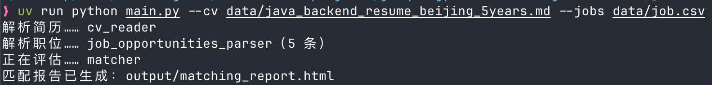
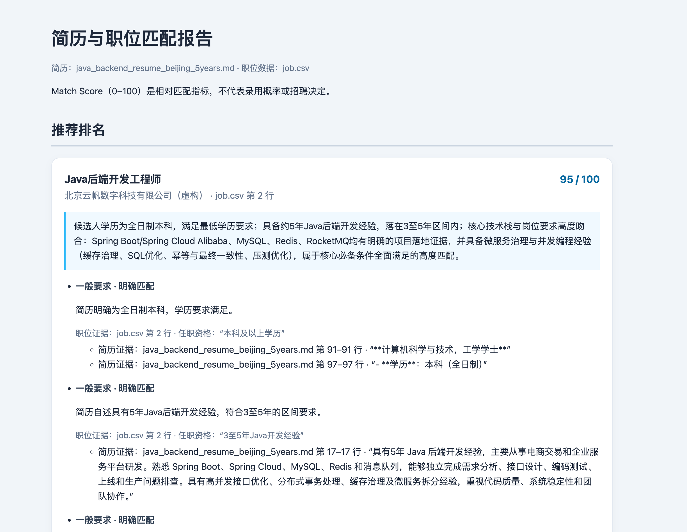

# JobMatch Agent

> 基于 HelloAgents 的简历与职位匹配演示项目，通过三个智能体解析简历、整理职位要求并给出匹配评估。

## 📝 项目简介

求职者筛选职位时，需要逐条对照简历经历与岗位要求。JobMatch Agent 接收一份 Markdown 简历和一份 CSV 职位列表，提取原文证据并评估各职位的匹配情况，成功后生成包含排名、缺失信息和学历筛选结果的 HTML 报告。

本项目用于学习 HelloAgents 和多智能体顺序协作，适合课程演示、本地实验与匹配结果的人工复核。它不是招聘决策系统，匹配分数也不代表录用概率。

## ✨ 核心功能

- **有据可查**：结构化解析简历与职位，校验原文引用与要求覆盖，降低模型幻觉风险；只按任职资格和简历证据匹配，不按职责、城市或薪资评分。
- **结果清楚**：可评估职位按 0–100 分排名；必备/一般要求缺少证据或最低学历无法确认时不评分，明确不满足最低学历时淘汰。加分项未知不加不扣，学历偏好不触发淘汰。
- **出错可修正**：解析或匹配未通过业务校验时，将错误交给大模型重新生成，每阶段最多重试 2 次；全部校验通过才生成报告。终端仅显示节点和重试进度。分数不代表录用概率，校验不能保证推理正确，仍需人工复核。

## 🛠️ 技术栈

- HelloAgents 0.2.0，使用 `SimpleAgent` 和 `HelloAgentsLLM`
- 三个智能体按固定顺序运行，分别负责简历解析、职位解析和匹配评估
- Pydantic 2 用于定义结构化数据契约
- uv 管理依赖

## 🚀 快速开始

### 环境要求

- Python 3.11 或更新版本
- [uv](https://docs.astral.sh/uv/)
- 可访问的模型服务及其 API 密钥

### 安装依赖

```bash
uv sync --locked
```

如果运行环境使用 SOCKS 代理，安装可选依赖：

```bash
uv sync --locked --extra proxy
```

### 配置 API 密钥

如果还没有 `.env` 文件，复制配置模板：

```bash
cp .env.example .env
```

编辑 `.env`，填写模型名称、密钥和服务地址：

```dotenv
LLM_PROVIDER=custom
LLM_MODEL_ID=你的模型名称
LLM_API_KEY=你的API密钥
LLM_BASE_URL=https://api.openai.com/v1

LLM_TIMEOUT=60
LLM_TEMPERATURE=0.2
```

`LLM_PROVIDER`、`LLM_MODEL_ID` 和 `LLM_API_KEY` 为必填项。`custom` 表示 OpenAI 兼容接口，还需填写对应服务的 `LLM_BASE_URL`。本地服务也需要提供其认可的密钥或占位值。

应用读取当前工作目录的 `.env`，已有的进程环境变量优先。不要覆盖已有配置，也不要提交真实密钥。项目已将 `.env` 加入 Git 忽略列表。

### 运行项目

使用项目自带的简历和职位样例：

```bash
uv run python main.py
```

指定输入文件：

```bash
uv run python main.py --cv data/java_backend_resume_beijing_5years.md --jobs data/job.csv
```

运行时终端仅显示节点和重试进度；全部结果通过校验后，默认生成 `output/matching_report.html`。可以用 `--report` 指定其他输出路径：

```bash
uv run python main.py --cv data/java_backend_resume_beijing_5years.md --jobs data/job.csv --report output/reports/matches.html
```

### 输入格式

- 简历使用 UTF-8 编码的 Markdown 文件

- 职位列表使用 UTF-8 编码的 CSV 文件，需包含以下列，列顺序不限：

```text
岗位名称,工作职责,任职资格,公司名字,公司地址
```

## 📖 使用示例

```bash
uv run python main.py
```





## 🎯 项目亮点

- **顺序协作**：三个智能体依次解析简历、职位并评估匹配，职责清晰、流程可观察。
- **证据可追溯**：判断关联简历和职位原文及行号；缺少证据时标记“无法评估”，不将未知直接当作不匹配。
- **校验后交付**：结构化校验发现问题时，定向重试出错环节；重试耗尽即停止，不展示未经校验的排名。

## 📂 项目结构

```text
junqiangyuan-JobMatchAgent/
├── README.md
├── pyproject.toml              # 项目与依赖配置
├── uv.lock                     # 依赖锁文件
├── .env.example                # 模型配置模板
├── main.py                     # CLI 入口与参数解析
├── data/                       # 简历与职位 CSV 样例
├── image/                      # 终端流程与匹配报告截图
├── output/                     # 示例 HTML 匹配报告
├── src/jobmatch/
  ├── agents.py               # 智能体创建与模型调用
  ├── contracts.py            # 结构化数据契约
  ├── pipeline.py             # 三阶段顺序编排
  ├── presentation.py         # 终端进度展示
  ├── prompts.py              # 智能体提示词
  ├── report.py               # HTML 匹配报告生成
  ├── retry.py                # 校验失败后的定向重试
  ├── validation.py           # 证据、学历与评分状态校验
  └── services/
      ├── cv_reader.py        # 简历读取与解析
      ├── job_parser.py       # 职位 CSV 解析
      └── matcher.py          # 简历与职位匹配

```

## 👤 作者

- 姓名：TypeThree
- 邮箱：[enfjalwayslove@gmail.com](mailto:enfjalwayslove@gmail.com)

## 🙏 致谢

感谢 Datawhale 社区和 Hello-Agents 项目提供的课程、框架与示例。
