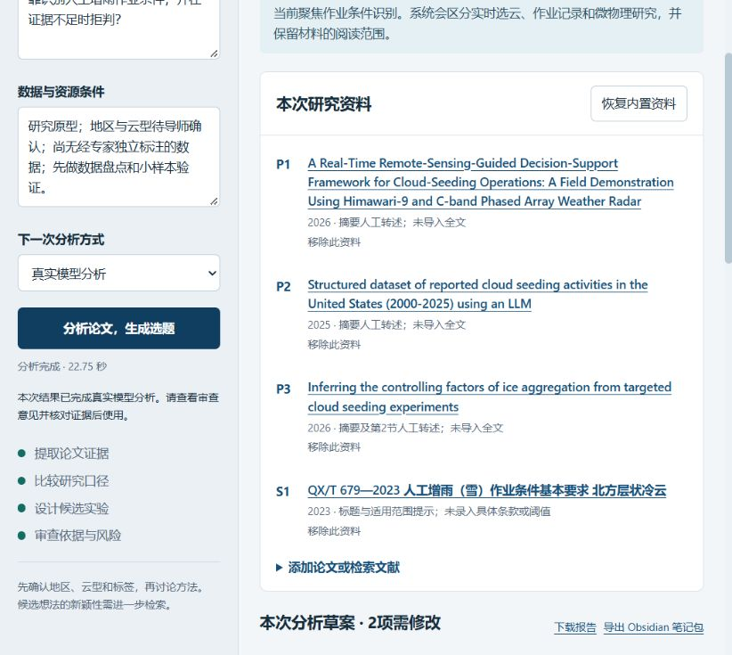

# CloudSeedResearchAgent：人工增雨科研选题助手

围绕“人工增雨作业条件识别”，比较多篇文献的任务、数据与评价口径，生成有来源支撑的候选假设和最小验证实验，并导出 Obsidian 笔记。

这是 Hello-Agents 第十六章毕业设计的第一版，面向科研文献整理和实验规划。尚未训练气象识别模型，也没有真实业务判识或增雨效果评估结果。

## 功能

- **四个 HelloAgents Agent**：论文分析 → 论文比较 → 选题与实验设计 → 证据审查，通过结构化 JSON 传递结果。
- **证据追踪**：每段输入有资料编号、证据编号、位置和材料类型；点击结果中的证据编号可查看实际输入与原始来源。
- **跨论文比较**：先检查任务、数据、标签和指标口径是否可比，避免把信息抽取准确率当成气象条件识别准确率。
- **候选研究问题**：生成两个假设，包含数据要求、基线、实验步骤、评价指标、风险和反证条件。
- **资料导入**：粘贴文本、导入 JSON、提取文本型 PDF；支持 Crossref 文献检索。缺少摘要的检索记录必须补充文本后才能分析。
- **Obsidian 与引用**：导出 Markdown 报告、对比矩阵、论文笔记、选题卡和 BibTeX；可向知识库 Inbox 新增本次笔记。
- **网页与 CLI**：本地网页无需 Node、前端构建或额外 Web 框架。
- **明确的离线示例**：内置手写结果用于验证流程，未调用模型；修改资料或研究问题后必须使用真实模型模式。

## 快速开始

需要 Python 3.10+。Windows PowerShell 示例：

```powershell
python -m venv .venv
.\.venv\Scripts\python.exe -m pip install -r requirements.txt

# 不需 API 密钥：先确认命令行流程可运行
.\.venv\Scripts\python.exe main.py analyze --mode demo

# 启动网页，打开 http://127.0.0.1:8765
.\.venv\Scripts\python.exe main.py serve
```

真实分析需要 OpenAI-compatible 模型配置。复制 `.env.example` 为 `.env`，填写 `LLM_API_KEY`、`LLM_MODEL_ID`、`LLM_BASE_URL`。示例采用 DeepSeek，也可以使用其他兼容端点。配置文件不会进入 Git、报告或下载包。

```powershell
Copy-Item .env.example .env
# 填写 .env 后
.\.venv\Scripts\python.exe main.py serve
.\.venv\Scripts\python.exe main.py analyze --mode live --out outputs/my-first-run

# 也可以直接使用已有配置，不必复制密钥
python main.py serve --env-file "D:\path\to\your\.env"

# 启动脚本：可指定已有虚拟环境
.\start.ps1 -Python "D:\path\to\venv\Scripts\python.exe" -EnvFile "D:\path\to\.env"
```

网页首次显示内置示例预览，明确标为“未调用模型”。点击“分析论文，生成选题”后才会执行所选模式。真实分析依次运行四个 Agent；生成结果是待人工核验的草案，审查发现的问题会保留在结果中。

## 五分钟演示

1. 打开网页，查看内置的三篇论文与一份标准；确认每项材料的阅读范围。
2. 选择“真实模型分析”，点击分析，观察四阶段进度。
3. 查看“论文对比”：P2 的信息抽取准确率不能与 P1 的实时选云或 P3 的微物理建模直接比较。
4. 查看两个候选选题和最小实验。点击 `P1-E1` 等编号追踪实际输入。
5. 查看审查意见，下载报告和 Obsidian 笔记包。

已有的真实运行结果在 [`examples/live_run/report.md`](examples/live_run/report.md)，结构化结果在 [`examples/live_run/result.json`](examples/live_run/result.json)。`meta.mode=live`、模型名和四阶段运行记录区分了真实调用与离线 fixture。耗时因模型与资料量变化，不代表固定性能承诺。



## 导入自己的论文

网页可添加文本、PDF 或符合 `data/sources.json` 格式的资料 JSON。导入 PDF 后，作者和年份默认“未核实”，不会由模型自动猜测引用信息。需要准确引用时，请编辑 JSON 的作者、年份、出版信息、DOI 和稳定链接。

```powershell
python main.py import-pdf paper1.pdf paper2.pdf --out outputs/my_sources.json
python main.py analyze --mode live --sources outputs/my_sources.json --out outputs/my_analysis

python main.py search "cloud seeding seedability radar satellite" --out outputs/search.json
# 检索记录的 needs_text=true 表示缺少摘要，补充pages文本后才能分析。
```

输入资料应含 2—10 份有文本的材料，总文本最多 100000 字符。PDF 支持可提取文本，不含 OCR、图像和表格结构理解；扫描件或无法正确抽取的公式和表格需要人工处理。文件导入和引用元数据均需核对原文。

## Obsidian 使用

网页下载的 ZIP 包含 `obsidian/` 下的论文笔记、对比矩阵和选题卡，可以先预览后放入知识库。CLI 也可以直接新增一个批次目录：

```powershell
python main.py analyze --mode live --vault "D:\your-vault" --out outputs/vault-run
```

笔记写入 `00_Inbox/CloudSeed-时间戳/`，不会替换已有手写笔记；链接指向本次批次，避免多次导出时混淆论文。审核后再移动到自己的正式目录。BibTeX 依据输入元数据生成，未核实信息会保留标记；当前不提供 GB/T 7714 自动排版。

## 示例来源与阅读范围

内置资料是核对过的元数据与简短**人工转述**，不是论文全文，也不是原文引句。数值描述保留原评价对象；研究者解释明确标注，不归因于论文作者。

| 编号 | 来源 | 本项目的使用范围 |
| --- | --- | --- |
| P1 | [Kotsuki et al., 2026, arXiv:2607.05050v1](https://arxiv.org/abs/2607.05050v1) | 摘要；实时卫星/雷达选云与人工决策支持，不作为播撒效果证据 |
| P2 | [Donohue & Lamb, 2025, arXiv:2505.01555v5](https://arxiv.org/abs/2505.01555v5) | 摘要；历史报告结构化抽取，作业记录与适宜条件标签的语义不同 |
| P3 | [Zhang et al., 2026, ACP](https://acp.copernicus.org/articles/26/1459/2026/) | 摘要及第2节转述；微物理冰晶聚合机制，不作为本地条件分类基线 |
| S1 | [QX/T 679—2023 官方 PDF](https://www.cma.gov.cn/zfxxgk/gknr/flfgbz/bz/202401/P020240125693736569729.pdf) | 标题与北方层状冷云范围提示；未录入条款阈值，不生成业务规则 |

来源核对日期：2026-09-29。这个小样本用于展示异类资料的分工和比较边界，不能证明科研新颖性。确定选题需要扩大检索并读全文。

## 实现结构

```text
main.py                     CLI：analyze / serve / search / import-pdf
cloudseed/
  sources.py                资料校验、PDF文本提取、Crossref检索、证据编号
  pipeline.py               四个SimpleAgent、结构化交接和引用校验
  demo.py                   明确标记的手写离线fixture
  exporter.py               报告、BibTeX、ZIP和Obsidian新增批次
  webapp.py                 标准库本地HTTP服务、异步任务与进度
ui/index.html               响应式浏览器界面
data/sources.json           有来源和阅读范围的公开示例
examples/live_run/          实际模型调用输出
tests/test_core.py          关键约束与导出测试
```

四个 Agent 分别负责提取、比较、构思和审查，属于任务流水线。Python 工具处理检索、PDF、校验和导出；本版未将工具封装成 MCP 服务，也未实现自主检索循环。

## 技术栈与协作方式

- HelloAgents 0.2.9：`SimpleAgent` 与 `HelloAgentsLLM`，四个角色按顺序协作，用 JSON 传递上一阶段的结果。
- Python 标准库 `http.server`：本地网页与后台任务；前端使用 HTML、CSS 和原生 JavaScript。
- pypdf、requests、python-dotenv：PDF 文本、Crossref 检索与外部模型配置。
- 本轮真实运行使用 DeepSeek `deepseek-chat`；离线示例不用模型密钥。

## 验证和已知限制

```powershell
python -m unittest discover -s tests -v
```

测试覆盖：完整离线流程、未知证据 ID、跨资料错误引用、遗漏资料、元数据无正文、无效 JSON、自定义输入不能伪装成离线分析、BibTeX 转义、ZIP 内容和新增知识库笔记。真实 DeepSeek 运行及浏览器操作另行验收，见示例输出和 [`docs/VALIDATION.md`](docs/VALIDATION.md)。

- 引用校验验证编号存在和来源归属，不保证证据真的支持结论；模型审查也不能替代人工核对。
- 选题和实验都是待验证草案，可能需要修改。未做准确率评测，不声称选题新颖或可投稿。
- 没有本地观测数据、专家标签和完整标准条款，因此不能提供实际作业适宜性判断。
- 真实分析将所选文本发送到你配置的模型服务；私有资料请按自己的数据使用约定处理。
- 网页仅监听 `127.0.0.1`，是个人本地演示工具，未做公网部署和多用户鉴权。

## 提交 Hello-Agents 作业

项目已按 `{GitHub用户名}-{项目名称}` 命名为 `kksdf286-CloudSeedResearchAgent`。可放入自己 Fork 的 `Co-creation-projects/` 后提交 PR，也可以先发布独立仓库。步骤见 [`docs/SUBMISSION.md`](docs/SUBMISSION.md)。

## 后续计划

- 扩大中英文文献检索，补充全文阅读与人工证据核验。
- 增加实验问题修订流程，让用户把审查意见反馈给选题 Agent。
- 在导师确认地区、云型、数据许可和专家标签后，验证具体的最小实验。
- 继续完善 Obsidian 笔记模板和引用格式；扫描 PDF 的 OCR 作为可选扩展。

## 作者与贡献

作者：[@kksdf286](https://github.com/kksdf286)。欢迎通过 Issue 描述可复现问题，或提交局限明确的改进 PR。修改后请运行 `python -m unittest discover -s tests -v` 和离线 CLI 示例；真实模型输出请同时保留阅读范围、运行记录和待核验项。

放入课程 Fork 后，本项目自带的 `.github/workflows/checks.yml` 位于项目子目录，不会自动成为课程仓库的 Actions 工作流；运行验证以本文的手动命令和验收记录为准。

MIT 许可适用于本项目原创代码与文档；论文和标准保持各自许可。致谢 [Datawhale Hello-Agents](https://github.com/datawhalechina/hello-agents)、论文作者和中国气象局。
