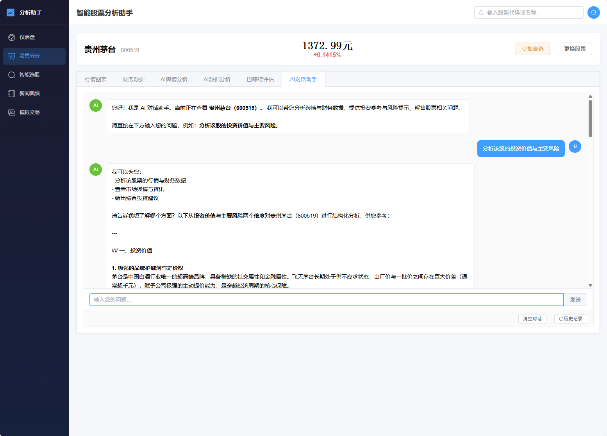

# 智能股票分析助手

基于**HelloAgents智能体协作框架**的 A 股投资分析工具，整合行情数据、财务分析、新闻舆情、智能选股、模拟交易等功能，提供数据驱动的投资决策辅助。

> ⚠️ **免责声明**：本工具所有分析结果仅供参考，**不构成任何投资建议**。投资有风险，入市需谨慎。

---

## 功能特性

| 模块 | 特性 | 状态 |
|------|------|------|
| 📊 **市场行情** | 个股实时行情、指数行情、板块行情 | ✅ |
| 📈 **财务分析** | 财务指标、公司概况（描述列表排版）、十大股东（多形态表格解析） | ✅ |
| 📉 **股票分析体验** | 优先加载行情与图表，财务/概况/股东异步加载 | ✅ |
| 🗣️ **AI舆情分析** | AI 自动搜索资讯并分析市场舆情，流式输出分析结果 | ✅ |
| 📉 **AI数据分析** | AI 自动查询行情/财务数据并生成分析报告，流式输出 | ✅ |
| 💬 **AI对话助手** | 协调者 Agent 解析用户需求，自动调度子 Agent，流式对话输出 | ✅ |
| 📰 **新闻资讯** | 金融资讯搜索、热点快讯浏览 | ✅ |
| 🔍 **智能选股** | 多条件组合筛选（行情+财务双维度） | ✅ |
| 🏛️ **巴菲特评估** | 价值投资框架，ReflectionAgent 反思优化流式生成报告，支持下载 Markdown | ✅ |
| ⭐ **自选股** | 妙想自选增/删/查；股票分析页与智能选股结果行「加自选」；移除需二次确认 | ✅ |
| 🏠 **仪表盘** | 启动三线程并行预热（指数/自选/热点），自选直接使用 API 返回价格数据 | ✅ |
| 💰 **模拟交易** | 模拟买入/卖出/撤单、持仓管理、收益曲线；下单/卖出二次确认防误触 | ✅ |
| 📝 **历史记录** | AI舆情/AI数据/巴菲特/AI对话 四种分析历史按天存储，支持查看/删除 | ✅ |
| 💾 **文件缓存** | 每只股票数据存为独立 JSON 文件，当日免刷新，支持 grep 关键词搜索 | ✅ |
| 🧠 **记忆系统** | 每日首启日期追踪，日切重新拉取仪表盘快照；在**已有自选记录**的前提下自选数量变化会触发记忆层刷新（前端仍会实时请求自选接口） | ✅ |
| ⚙️ **偏好设置** | 投资风格、风险偏好、行业偏好个性化定制 | ✅ |
| 🐳 **Docker 部署** | 一键容器化部署，前后端分离 | ✅ |
| 📦 **exe 打包** | PyInstaller 打包为独立 exe，免安装 Python/Node.js | ✅ |

---

## 项目亮点

- **多智能体协作**：采用 Reflection + ReAct + FunctionCall + PlanAndSolve 等多种范式；股票分析页各 Tab 可独立流式跑 Agent，AI 对话助手由协调者按需路由
- **AI对话助手**：单次 LLM 路由决策（`data` / `sentiment` / `advisor` 组合），子 Agent **非流式**跑完后由协调者整合；单维度直接推送结果，多维度由 LLM **流式**生成综合答复（含篇幅与字数上限控制，见 `agents/coordinator_agent.py`、`agents/text_truncation.py`）
- **流式 AI 分析**：舆情分析、数据分析、巴菲特评估均支持 NDJSON 流式输出，实时展示生成过程
- **巴菲特价值投资框架**：集成完整价值投资分析体系（8份参考文档），ReflectionAgent 自我反思优化评估报告
- **文件缓存系统**：每只股票的所有数据持久化到本地文件，优先读缓存再调 API，支持 grep 风格关键词检索
- **个性化投资分析**：支持用户偏好存储（风险偏好、投资风格、行业偏好），智能体自动注入偏好参数
- **全栈一体化**：Vue3 前端 + FastAPI 后端 + HelloAgents 智能体 + 东方财富妙想数据，全链路自包含
- **操作安全防护**：模拟交易下单/卖出、自选股移除等危险操作均需二次确认

---

## 技术栈

| 层级 | 技术 | 版本 |
|------|------|------|
| 前端 | Vue3 + Element Plus + ECharts | 3.x / 2.x / 5.x |
| 后端 | FastAPI + Uvicorn | 0.110+ |
| 数据库 | SQLite (SQLAlchemy + aiosqlite) | — |
| 智能体 | HelloAgents Optimized | 0.2.9 |
| LLM | DeepSeek / OpenAI 兼容 API | — |
| 金融数据 | 东方财富妙想 API | — |

---

## 快速开始

### 环境要求

- Python ≥ 3.10
- Node.js ≥ 18
- Docker ≥ 24（可选，生产部署）

### 配置环境变量

复制 `.env.example` 为 `.env` 并填入密钥。常用项如下（完整说明见 `.env.example` 内注释）：

```env
# LLM 大模型（与 HelloAgents 兼容）
LLM_MODEL_ID=deepseek-chat
LLM_API_KEY=sk-your-deepseek-key
LLM_BASE_URL=https://api.deepseek.com
# 可选：单次请求超时（秒）；后端会与更长下限合并，避免 ReAct/对话多轮过早断开
# LLM_TIMEOUT=180

# 巴菲特评估：可选反思轮数（见 .env.example 中 BUFFETT_MAX_REFLECTIONS）

# 东方财富妙想金融数据
MX_APIKEY=your-mx-apikey
# 可选：MX_API_URL、MX_CACHE_TTL_SECONDS、本地回放 MX_REPLAY_FIXTURES 等

# 服务端口：开发模式未设置时后端默认为 8000；PyInstaller exe 未覆盖时默认为 5174（与 run_exe.py 提示一致）
# 若修改 BACKEND_PORT，请同步修改 frontend/vite.config.js 中 dev server 对 /api 的 proxy.target
```

> 💡 DeepSeek API: https://platform.deepseek.com  
> 💡 妙想 API: https://dl.dfcfs.com/m/itc4  

### 本地开发启动

**后端**：

```bash
# 安装依赖（与下面等价：也可在仓库根目录执行 pip install -r requirements.txt）
pip install -r backend/requirements.txt

# 启动服务（从项目根目录）
python -m uvicorn backend.app.main:app --host 0.0.0.0 --port 8000 --reload
```

API 文档：http://localhost:8000/docs

**前端**：

```bash
cd frontend
npm install
npm run dev
```

前端界面：http://localhost:5173（开发模式自动代理 /api 到后端 8000 端口）

### Docker 部署

```bash
docker compose up -d
```

- 前端：http://localhost:8080
- 后端 API：http://localhost:8000/docs

详细部署说明见 [DEPLOY.md](./DEPLOY.md)

### exe 独立打包部署

将前后端打包为一个独立 `.exe` 文件，无需安装 Python/Node.js 即可运行。

#### 环境要求

| 组件         | 用途             | 仅打包时需要？ |
| ------------ | ---------------- | :------------: |
| Python 3.10+ | PyInstaller 打包 |       是       |
| Node.js 18+  | 前端构建         |       是       |
| PyInstaller  | Python → exe     |       是       |


#### 一键打包

```bash
# 1. 安装打包依赖
pip install pyinstaller

# 2. 执行打包脚本（从项目根目录）
python scripts/build_exe.py
```

### 运行效果

由于加载的数据比较多，最好等待数据预热后再进入界面，并且由于东方财富限制，**不能挂梯子**，不然会失败。




---

## 项目结构

```
智能股票分析器/
├── README.md
├── 功能修改方案.md               # 功能修改需求文档
├── 实现方案.md                   # 技术实现方案文档
├── requirements.txt              # 根目录聚合依赖
├── main.ipynb                    # Jupyter 实验入口（可选）
├── data/                         # 数据目录
│   ├── stock_cache/              #   文件缓存（每只股票独立 JSON）
│   └── memory/                   #   记忆系统状态持久化
├── outputs/                      # 报告/截图等输出示例目录
├── src/                          # 课程模板说明
├── backend/                      # 🖥️ 后端 FastAPI
│   ├── app/
│   │   ├── main.py               #   应用入口 + 生命周期
│   │   ├── config.py             #   配置管理
│   │   ├── api/                  #   API 路由模块
│   │   │   ├── chat.py           #     AI 对话助手流式接口
│   │   │   ├── sentiment.py      #     AI 舆情流式（实现约定路径）
│   │   │   ├── data_analysis.py  #     AI 数据流式（实现约定路径）
│   │   │   ├── agent_api.py      #     舆情/数据流式实现 + /agent 兼容路径
│   │   │   ├── history.py        #     分析历史记录 CRUD
│   │   │   ├── system_browser.py #     exe/桌面：后端唤起系统浏览器打开外链
│   │   │   ├── cache_api.py      #     文件缓存管理/grep搜索
│   │   │   └── ...               #     market/financial/news/screener 等
│   │   ├── services/             #   业务逻辑层
│   │   │   ├── chat_service.py   #     对话助手调度（协调者流式）
│   │   │   ├── memory_service.py #     记忆系统（日切+仪表盘预热等）
│   │   │   ├── stock_file_cache.py#    文件缓存（grep搜索支持）
│   │   │   ├── history_service.py#     历史记录 CRUD
│   │   │   └── ...               #     其余服务模块
│   │   ├── models/               #   数据模型
│   │   │   ├── report.py         #     AnalysisReport
│   │   │   ├── history_models.py #     分析历史 ORM（SQLite）
│   │   │   ├── history.py        #     兼容 re-export AnalysisHistory
│   │   │   ├── memory_models.py  #     MemorySnapshot 等记忆数据结构
│   │   │   └── preference.py     #     UserPreference
│   │   ├── middleware/           #   中间件
│   │   └── utils/                #   工具
│   ├── Dockerfile
│   └── requirements.txt
│
├── frontend/                     # 🎨 前端 Vue3
│   ├── src/
│   │   ├── views/                #   页面视图
│   │   │   ├── Dashboard.vue     #     仪表盘（自选直接价格展示）
│   │   │   ├── StockAnalysis.vue #     股票分析（6 Tab）
│   │   │   ├── StockScreener.vue #     智能选股
│   │   │   ├── NewsCenter.vue    #     新闻资讯
│   │   │   └── Simulation.vue    #     模拟交易（二次确认）
│   │   ├── components/           #   公共组件
│   │   │   ├── StreamOutput.vue  #     流式输出通用组件
│   │   │   ├── AIAnalysisPanel.vue#    AI分析面板
│   │   │   ├── ChatAssistant.vue #     AI对话助手
│   │   │   ├── HistoryDrawer.vue #     历史记录抽屉
│   │   │   └── NewsDetailDrawer.vue#   新闻详情
│   │   ├── api/                  #   Axios 封装
│   │   ├── router/               #   Vue Router
│   │   └── store/                #   Pinia 状态管理
│   ├── Dockerfile
│   ├── nginx.conf
│   └── package.json
│
├── agents/                       # 🤖 智能体层
│   ├── agent_system.py           #   统一 Agent 管理与流式调度
│   ├── coordinator_agent.py      #   AI对话助手（路由 LLM + 子Agent顺序调用 + 整合流式）
│   ├── text_truncation.py        #   协调者输出自然边界截断
│   ├── advisor_agent.py          #   巴菲特评估 Agent（Reflection+流式）
│   ├── general_advisor_agent.py  #   普通投资顾问 Agent
│   ├── sentiment_agent.py        #   舆情分析 Agent（流式支持）
│   ├── data_analysis_agent.py    #   数据分析 Agent（流式支持）
│   ├── screener_agent.py         #   选股 Agent
│   ├── trading_agent.py          #   交易执行 Agent
│   ├── preference_injector.py    #   偏好注入模块
│   └── tools/                    #   自定义工具封装
│
├── HelloAgents Optimized/        # 🧩 多智能体框架
│
├── skills/                       # 🔧 东方财富妙想 Skill 封装
│
├── docker-compose.yml
├── DEPLOY.md
├── run_exe.py                    # exe 打包入口
└── .env.example
```

---

## API 路由概览

| 路由组 | 前缀 | 说明 |
|--------|------|------|
| System | `/api/v1/system` | `GET /health`、`GET /config`（在 `main.py` 注册）；`POST /open-external-url` 由 `system_browser.py` 注册在同前缀下，供 exe 场景唤起本机浏览器打开 http(s) 链接 |
| Market | `/api/v1/market` | 个股行情、指数、板块 |
| Financial | `/api/v1/financial` | 财务指标、公司概况、股东 |
| Analysis | `/api/v1/analysis` | 个股深度报告 `POST /report/{code}`、`GET /report/{report_id}`、列表 `GET /reports` |
| News | `/api/v1/news` | 资讯搜索、舆情分析、热点 |
| Screener | `/api/v1/screener` | 条件选股、筛选条件 |
| Watchlist | `/api/v1/watchlist` | 自选股增删查 |
| Simulation | `/api/v1/simulation` | 模拟交易（买卖/撤单/持仓） |
| Buffett | `/api/v1/buffett` | 巴菲特评估（Reflection / advisor 流式生成，历史类型 `buffett`） |
| Preferences | `/api/v1/preferences` | 用户投资偏好 CRUD |
| **Chat** | `/api/v1/chat` | **AI对话助手** NDJSON 流式 `POST /stream` |
| **Sentiment** | `/api/v1/sentiment` | **AI 舆情** `POST /analyze/stream`（实现方案约定路径） |
| **Data analysis** | `/api/v1/data-analysis` | **AI 数据分析** `POST /analyze/stream`（实现方案约定路径） |
| **Agent（兼容）** | `/api/v1/agent` | 与上语义相同：`POST /sentiment/stream`、`POST /data-analysis/stream` |
| **History** | `/api/v1/history` | 分析历史列表/详情/删除/清空；`type` 含 `sentiment` / `data_analysis` / `buffett` / `chat` |
| **Cache** | `/api/v1/cache` | 文件缓存 grep / 统计 / 清除 |

> 完整 Swagger 文档：开发默认 http://localhost:8000/docs（端口以 `.env` 中 `BACKEND_PORT` 为准）

---

## 智能体协作流程

### AI 对话助手流程

```
用户对话消息
    │
    ▼
协调者（路由 LLM，单行关键字）
    │ none → 一般对话（协调者 LLM 流式回复，或股票上下文引导）
    │ data / sentiment / advisor 或其组合
    ▼
子 Agent 顺序执行（非流式，带字数上限）
    ├── data → run_data_analysis
    ├── sentiment → run_sentiment
    └── advisor → 将已有 data/sentiment 摘要写入顾问提示 → run_advisor
    │
    ▼
面向用户的流式输出
    ├── 仅单一子 Agent → 直接推送该结果（截断至上限）
    └── 多 Agent → 协调者 LLM stream_invoke 整合为结构化答复
```

### 巴菲特评估流程

```
用户点击「生成巴菲特评估报告」
    │
    ▼
advisor_agent (ReflectionAgent)
    │ 收集行情/财务/舆情数据
    ├── 初始分析 → 护城河/管理层/安全边际
    ├── 自我反思 → 数据准确性/逻辑自洽性
    └── 迭代优化 → 完善报告
    │
    ▼
流式输出最终评估报告 + 自动保存历史
```

---

## 股票分析页结构

进入个股分析（`/analysis` 或 `/analysis/:code`，`:code` 可选）时，共 **6 个 Tab**：

| Tab | 内容 | 说明 |
|-----|------|------|
| 📊 行情图表 | ECharts K线 + 行情明细 | 优先加载 |
| 📈 财务数据 | 财务指标卡片 + 公司概况 + 十大股东 | 异步加载 |
| 🗣️ AI舆情分析 | AI 自动搜索资讯分析市场情绪 | 流式输出 |
| 📉 AI数据分析 | AI 查询行情/财务并生成报告 | 流式输出 |
| 🧠 巴菲特评估 | ReflectionAgent 反思优化评估 | 流式输出 |
| 💬 AI对话助手 | 自由对话，自动调度子 Agent | 流式输出 |

每个分析 Tab 均支持查看历史记录和下载报告。

---

## 文件缓存系统

所有股票数据自动持久化到 `data/stock_cache/{股票代码}/` 目录：

```
data/stock_cache/
  _index.json           # 主索引
  600519/
    quote.json          # 行情数据
    financial.json      # 财务指标
    profile.json        # 公司概况
    holders.json        # 十大股东
    sentiment.json      # 舆情分析
```

- 当日缓存直接返回，不限小时数；跨天数据超 24h 自动过期
- 未命中时才调用 API 并自动写回文件
- 支持 `GET /api/v1/cache/search?keyword=贵州茅台` grep 风格关键词检索
- 服务重启后缓存持久保留

---

## 未来计划

- [ ] 增加技术指标分析（MACD、KDJ、RSI 等）
- [ ] 实现用户认证系统（JWT Token）
- [ ] 添加投资组合优化算法（马科维茨模型）
- [ ] 增加 A 股交易日历和节假日判断
- [ ] 添加策略回测引擎
- [ ] 增加历史记录全文搜索

---

## 贡献指南

欢迎提出 Issue 和 Pull Request！

### 开发流程

1. Fork 本仓库
2. 创建功能分支：`git checkout -b feature/your-feature`
3. 提交修改：`git commit -m "feat: 功能描述"`
4. 推送到分支：`git push origin feature/your-feature`
5. 创建 Pull Request

### 提交规范

| 类型 | 说明 |
|------|------|
| `feat` | 新增功能 |
| `fix` | 修复 bug |
| `docs` | 文档更新 |
| `style` | 代码格式调整（不影响功能） |
| `refactor` | 代码重构 |
| `test` | 测试相关 |
| `chore` | 其他修改（如依赖更新） |

### PR 自检清单

- [x] 代码能够正常运行，没有报错
- [x] 相关文档已更新
- [x] 有清晰的使用示例（如适用）
- [x] 代码有适当的中文注释
- [x] 处理了常见的异常情况

---

## 许可证

MIT License

---

## 作者

```
- GitHub: [@lcyting](https://github.com/lcyting)
- Email: lcy154745@163.com
```

---

## 致谢

- 感谢 [Hello-Agents](https://github.com/datawhalechina/hello-agents) 提供的多智能体框架
- 感谢 [Datawhale](https://www.datawhale.cn) 开源学习社区
- 感谢 [agi-queen](https://github.com/agi-now/buffett-skills/commits?author=agi-queen) 的开源bft-skills
- 感谢东方财富妙想 API 提供的金融数据服务
- 感谢所有GitHub开源贡献者
