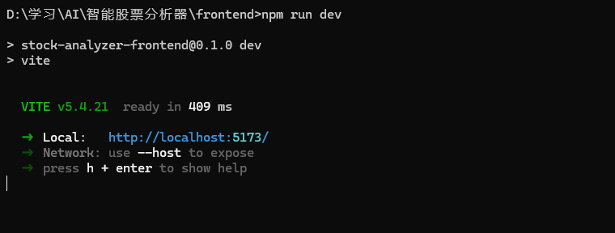
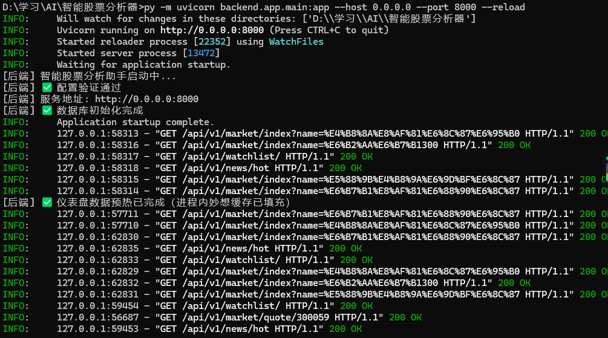
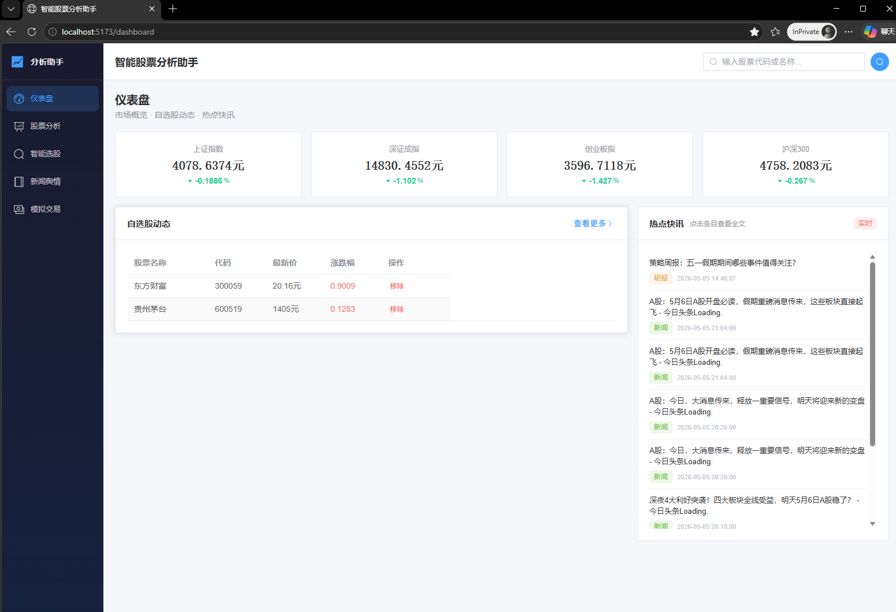
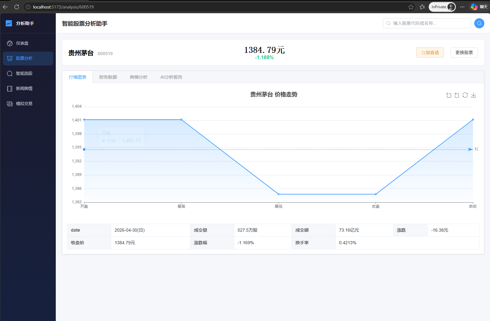
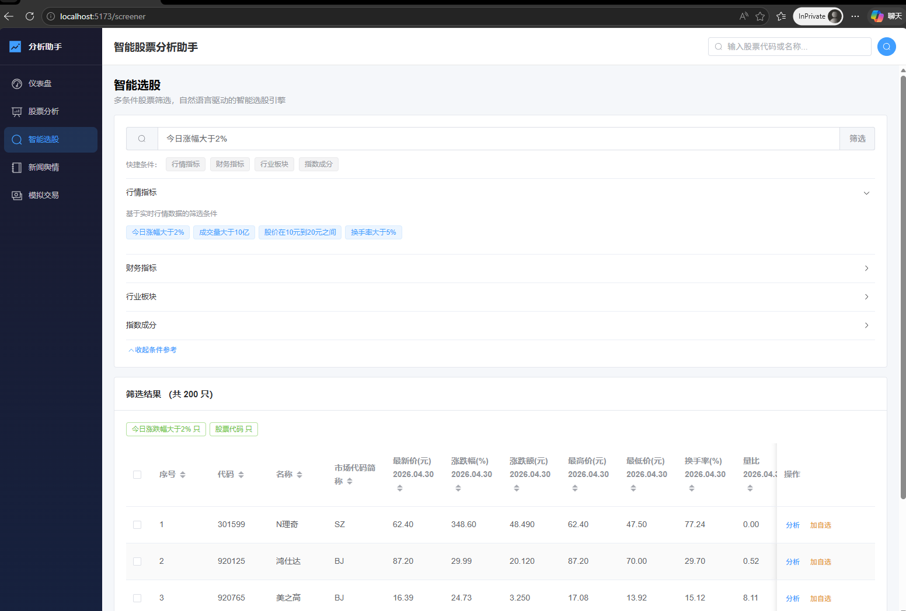
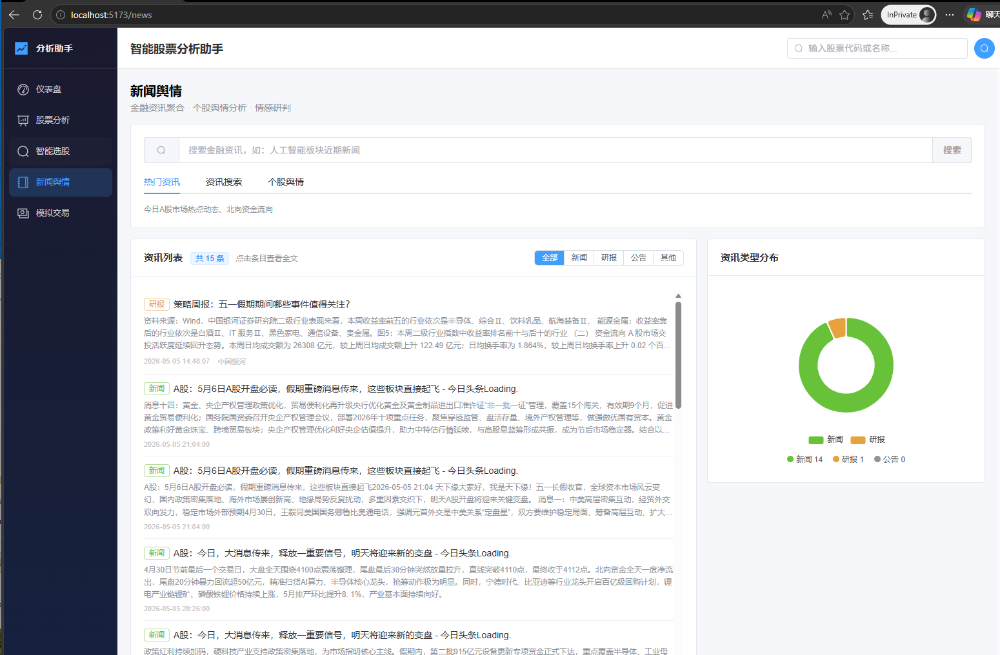
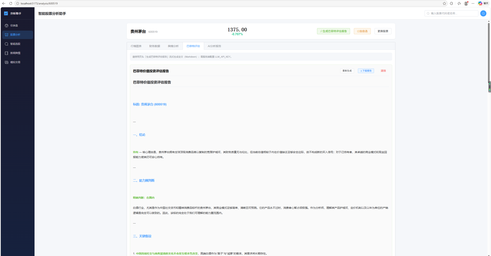

# 智能股票分析助手 

基于**HelloAgents智能体协作框架**的 A 股投资分析工具，整合行情数据、财务分析、新闻舆情、智能选股、模拟交易等功能，提供数据驱动的投资决策辅助。

> ⚠️ **免责声明**：本工具所有分析结果仅供参考，**不构成任何投资建议**。投资有风险，入市需谨慎。

---

## 功能特性

| 模块 | 特性 | 状态 |
|------|------|------|
| 📊 **市场行情** | 个股实时行情、指数行情、板块行情 | ✅ |
| 📈 **财务分析** | 财务指标、公司概况（描述列表排版）、十大股东（多形态表格解析） | ✅ |
| 📉 **股票分析体验** | 优先加载行情与图表，财务/概况/股东/舆情异步加载 | ✅ |
| 📰 **新闻舆情** | 金融资讯搜索、个股舆情分析、情感研判 | ✅ |
| 🔍 **智能选股** | 多条件组合筛选（行情+财务双维度） | ✅ |
| 📝 **投资报告** | 多 Agent 协作深度分析、综合投资建议 | ✅ |
| ⭐ **自选股** | 妙想自选增/删/查；股票分析页与智能选股结果行「加自选」 | ✅ |
| 🏠 **仪表盘缓存** | 妙想 query 进程内 TTL；自选列表同 TTL；前端快照与自选变更联动 | ✅ |
| 💰 **模拟交易** | 模拟买入/卖出/撤单、持仓管理、收益曲线 | ✅ |
| 🏛️ **巴菲特评估** | 价值投资框架；分析页页头流式生成全文，报告区可下载 Markdown | ✅ |
| ⚙️ **偏好设置** | 投资风格、风险偏好、行业偏好个性化定制 | ✅ |
| 🐳 **Docker 部署** | 一键容器化部署，前后端分离 | ✅ |
| 📦 **exe 打包** | PyInstaller 打包为独立 exe，免安装 Python/Node.js | ✅ |

---

## 项目亮点

- **多智能体协作**：采用 PlanAndSolve + ReAct + FunctionCall + Reflection 多种范式，协调者Agent 统一调度、专业Agent 并行执行，智能体间高效分工
- **巴菲特价值投资框架**：集成完整价值投资分析体系（8份参考文档），涵盖护城河分析、管理层评估、安全边际计算等维度，提供稀缺的分析视角
- **个性化投资分析**：支持用户偏好存储（风险偏好、投资风格、行业偏好），智能体自动注入偏好参数，实现千人千面的分析体验
- **全栈一体化**：Vue3 前端 + FastAPI 后端 + HelloAgents 智能体 + 东方财富妙想数据，全链路自包含
- **数据缓存优化**：进程内 TTL 缓存 + 前端 localStorage 快照，有效降低 API 调用频率，延长额度使用寿命
- **开箱即用**：Docker 一键部署 + PyInstaller 打包 exe，免安装依赖即可运行

---

## 技术栈

| 层级 | 技术 | 版本 |
|------|------|------|
| 前端 | Vue3 + Element Plus + ECharts | 3.x / 2.x / 5.x |
| 后端 | FastAPI + Uvicorn | 0.110+ |
| 数据库 | SQLite (SQLAlchemy + aiosqlite) | — |
| 智能体 | HelloAgents Optimized | 0.2.9 |
| LLM | DeepSeek / OpenAI 兼容 API | — |
| 金融数据 | 东方财富妙想 API | — |

---

## 快速开始

### 环境要求

- Python ≥ 3.10
- Node.js ≥ 18
- Docker ≥ 24（可选，生产部署）

### 配置环境变量

编辑 `.env` 文件，填入 API 密钥：

```env
# LLM 大模型
LLM_MODEL_ID=deepseek-chat
LLM_API_KEY=sk-your-deepseek-key
LLM_BASE_URL=https://api.deepseek.com

# 东方财富妙想金融数据
MX_APIKEY=your-mx-apikey
```

> 💡 DeepSeek API: https://platform.deepseek.com  
> 💡 妙想 API: https://dl.dfcfs.com/m/itc4  

### 本地开发启动

**后端**：

```bash
# 安装依赖（与下面等价：也可在仓库根目录执行 pip install -r requirements.txt）
pip install -r backend/requirements.txt

# 启动服务（从项目根目录）
python -m uvicorn backend.app.main:app --host 0.0.0.0 --port 8000 --reload
```

API 文档：http://localhost:8000/docs

**前端**：

```bash
cd frontend
npm install
npm run dev
```

前端界面：http://localhost:5173（开发模式自动代理 /api 到后端 8000 端口）

### Docker 部署

```bash
docker compose up -d
```

- 前端：http://localhost:8080
- 后端 API：http://localhost:8000/docs

详细部署说明见 [DEPLOY.md](./DEPLOY.md)

### exe 独立打包部署

将前后端打包为一个独立 `.exe` 文件，无需安装 Python/Node.js 即可运行。

#### 环境要求

| 组件         | 用途             | 仅打包时需要？ |
| ------------ | ---------------- | :------------: |
| Python 3.10+ | PyInstaller 打包 |       是       |
| Node.js 18+  | 前端构建         |       是       |
| PyInstaller  | Python → exe     |       是       |


#### 一键打包

```bash
# 1. 安装打包依赖
pip install pyinstaller

# 2. 执行打包脚本（从项目根目录）
python scripts/build_exe.py

```

### 运行效果

由于加载的数据比较多，最好等待数据预热后再进入界面，并且由于东方财富限制，**不能挂梯子**，不然会失败。



















---

## 项目结构

```
智能股票分析器/
├── README.md
├── requirements.txt           # 根目录聚合依赖（-r backend/requirements.txt）
├── main.ipynb                 # Jupyter Notebook
├── data/                      # 数据
├── outputs/                   # 报告/截图等输出示例目录
├── backend/                   # 🖥️ 后端 FastAPI
│   ├── app/
│   │   ├── main.py            #   应用入口 + 生命周期
│   │   ├── config.py          #   配置管理
│   │   ├── api/               #   API 路由（10个路由组）
│   │   ├── services/          #   业务逻辑层
│   │   ├── models/            #   数据模型（SQLAlchemy）
│   │   ├── middleware/        #   中间件
│   │   └── utils/             #   工具（含 mx_http / mx_quota / mx_fixture 等）
│   ├── tests/                 #   单元测试
│   ├── docs/                  #   后端专题文档（如妙想 Fixture 回放）
│   ├── fixtures/mx_raw/       #   本地妙想原始 JSON（*.json 已 gitignore）
│   ├── scripts/               #   辅助脚本（如 capture_mx_fixture.py）
│   ├── Dockerfile
│   └── requirements.txt
│
├── frontend/                  # 🎨 前端 Vue3
│   ├── src/
│   │   ├── views/             #   页面视图（仪表盘 / 股票分析 / 选股 / 资讯 / 模拟）
│   │   ├── utils/             #   工具（如 watchlist.js：加自选 + 仪表盘快照键）
│   │   ├── components/        #   公共组件
│   │   ├── api/               #   Axios 封装
│   │   ├── router/            #   Vue Router
│   │   └── store/             #   Pinia 状态管理
│   ├── Dockerfile
│   ├── nginx.conf
│   └── package.json
│
├── agents/                    # 🤖 智能体层
│   ├── coordinator_agent.py   #   协调者 Agent
│   ├── data_analysis_agent.py #   数据分析 Agent
│   ├── screener_agent.py      #   选股 Agent
│   ├── sentiment_agent.py     #   舆情分析 Agent
│   ├── advisor_agent.py       #   投资顾问 Agent
│   ├── trading_agent.py       #   交易执行 Agent
│   └── tools/                 #   自定义工具封装
│
├── HelloAgents Optimized/     # 🧩 多智能体框架
│
├── docker-compose.yml
├── .dockerignore
├── DEPLOY.md
├── run_exe.py                  # exe 打包入口
└── .env.example                # 环境变量模板
```

---

## API 路由概览

| 路由组 | 前缀 | 说明 |
|--------|------|------|
| System | `/api/v1/system` | 健康检查、系统配置 |
| Market | `/api/v1/market` | 个股行情、指数、板块 |
| Financial | `/api/v1/financial` | 财务指标、公司概况、股东 |
| News | `/api/v1/news` | 资讯搜索、舆情分析、热点 |
| Screener | `/api/v1/screener` | 条件选股、筛选条件 |
| Analysis | `/api/v1/analysis` | 个股分析报告生成与查询 |
| Watchlist | `/api/v1/watchlist` | 自选股增删查 |
| Simulation | `/api/v1/simulation` | 模拟交易（买卖/撤单/持仓） |
| Buffett | `/api/v1/buffett` | 巴菲特框架；含 AI 报告流式接口 `POST .../report/generate-ai/stream` |
| Preferences | `/api/v1/preferences` | 用户投资偏好 CRUD |

> 完整 Swagger 文档：http://localhost:8000/docs

---

## 智能体协作流程

```
用户请求（如"分析茅台投资价值"）
    │
    ▼
协调者 Agent (PlanAndSolve)
    │ 分解为子任务
    ├──→ 数据分析 Agent → 查询行情/财务数据
    ├──→ 舆情分析 Agent → 搜索研报/新闻/情绪分析
    └──→ 投资顾问 Agent → 综合评估 + 巴菲特框架
            │
            ▼
        输出综合投资报告
```

---

## 股票分析页数据加载顺序

进入个股分析（`/analysis/:code`）时：

1. **优先**：请求 **`/market/quote/{code}`**，更新头部报价、行情明细与「行情图表」Tab；搜索按钮的 loading 仅等待该请求结束。
2. **随后异步**：并发请求财务指标、公司概况、十大股东、个股舆情；财务 Tab 与舆情 Tab 分别显示各自 loading，互不阻塞首屏图表。

快速切换股票时使用序号丢弃过期响应，避免数据错位。

**巴菲特评估（前端）**：生成入口为页头「生成巴菲特评估报告」（唯一主按钮，自动切至「巴菲特评估」Tab，NDJSON 流式预览）。生成完成后可在报告标题栏使用「下载报告」导出 `.md` 文件。

---

## 未来计划

- [ ] 优化响应速度
- [ ] 增加技术指标分析（MACD、KDJ、RSI 等）
- [ ] 实现用户认证系统（JWT Token）
- [ ] 添加投资组合优化算法（马科维茨模型）
- [ ] 增加 A 股交易日历和节假日判断
- [ ] 添加策略回测引擎

---

## 贡献指南

欢迎提出 Issue 和 Pull Request！

### 开发流程

1. Fork 本仓库
2. 创建功能分支：`git checkout -b feature/your-feature`
3. 提交修改：`git commit -m "feat: 功能描述"`
4. 推送到分支：`git push origin feature/your-feature`
5. 创建 Pull Request

### 提交规范

| 类型 | 说明 |
|------|------|
| `feat` | 新增功能 |
| `fix` | 修复 bug |
| `docs` | 文档更新 |
| `style` | 代码格式调整（不影响功能） |
| `refactor` | 代码重构 |
| `test` | 测试相关 |
| `chore` | 其他修改（如依赖更新） |

### PR 自检清单

- [x] 代码能够正常运行，没有报错
- [x] 相关文档已更新
- [x] 有清晰的使用示例（如适用）
- [x] 代码有适当的中文注释
- [x] 处理了常见的异常情况

---

## 许可证

MIT License

---

## 作者

```
- GitHub: [@lcyting](https://github.com/lcyting)
- Email: lcy154745@163.com
```

---

## 致谢

- 感谢 [Hello-Agents](https://github.com/datawhalechina/hello-agents) 提供的多智能体框架
- 感谢 [Datawhale](https://www.datawhale.cn) 开源学习社区
- 感谢 [agi-queen](https://github.com/agi-now/buffett-skills/commits?author=agi-queen) 的开源bft-skills
- 感谢东方财富妙想 API 提供的金融数据服务
