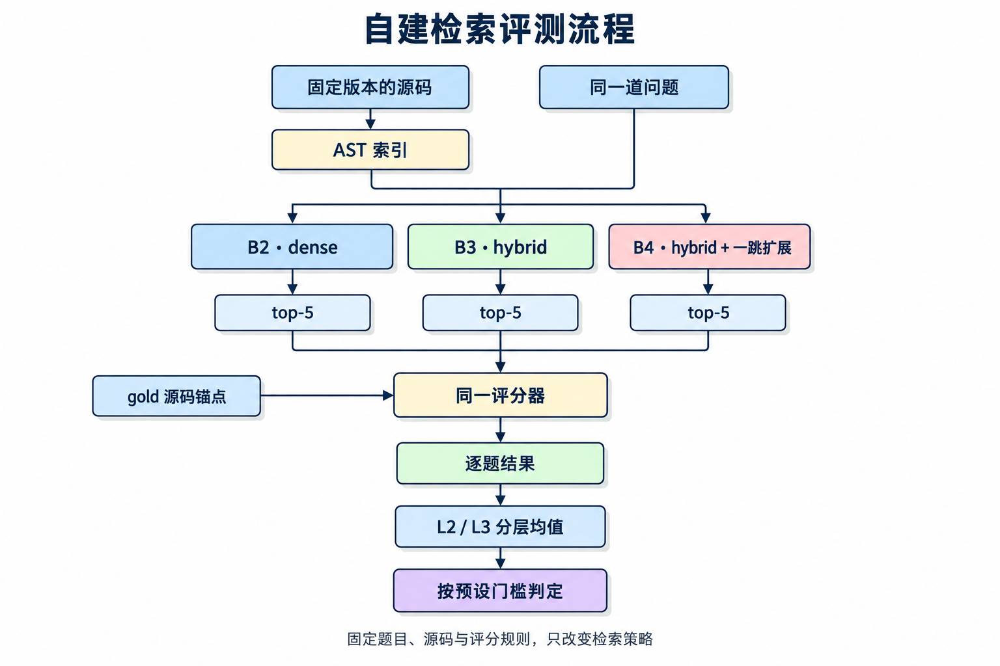
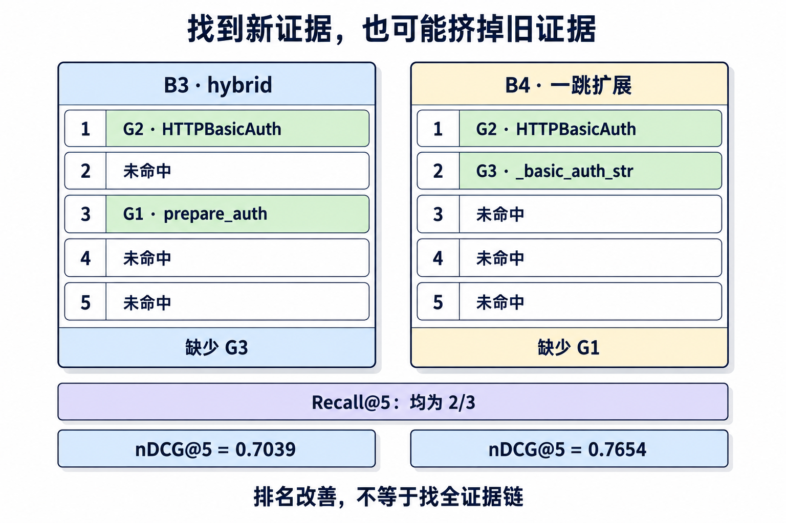
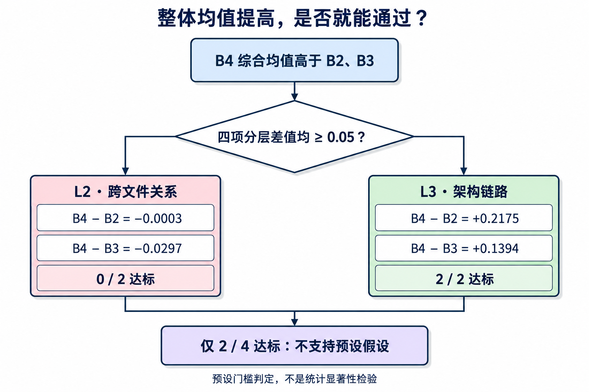

# 垂直场景 Agent 的自建评测：从一道题到可解释的对照实验

假设你做了一个代码库问答 Agent。它能搜索源码、继续读函数，再给出带引用的回答。现在你加了一项能力：检索之后，沿着函数里的调用继续找定义。

一次演示中，它确实找到了更深一层的代码。但你还想知道：这项能力是否值得保留？它会不会在找到新证据的同时，把原本正确的结果挤出前五名？

本章就从这样一道题开始。我们会把问题写成可自动评分的样本，手算一次检索结果，再搭三个对照版本，最后读懂一份没有通过预设门槛的报告。

[第十二章《智能体性能评估》](../docs/chapter12/第十二章%20智能体性能评估.md)介绍了公开基准与评估工具；[Extra12《旅行助手后训练实战》](./Extra12-旅行助手后训练实战.md)已经演示了冻结评测集、避免数据泄漏和区分评估口径。本章沿着这条线继续，重点放在三个问题：**源码证据怎样判分、模块收益怎样拆开、评分器本身怎样查错。**

主线使用一个可运行的教学例子：Requests 仓库、10 道题、六个检索版本。读完后，你应当能解释一条分数是怎么来的，以及它能支持什么结论。第八节再单独讨论含 LLM 合成的历史项目，说明为什么那类实验还需要消融与重复运行。

## 目录

- [一、先明确测的是哪一段](#一先明确测的是哪一段)
- [二、把一个问题写成三个源码锚点](#二把一个问题写成三个源码锚点)
- [三、跟着真实结果手算一次分数](#三跟着真实结果手算一次分数)
- [四、搭对照并写下通过条件](#四搭对照并写下通过条件)
- [五、评分器也会制造假象](#五评分器也会制造假象)
- [六、从一道题读到整份报告](#六从一道题读到整份报告)
- [七、引用都有效为什么答案仍可能错](#七引用都有效为什么答案仍可能错)
- [八、扩展案例：接入真实合成后的消融与重复](#八扩展案例接入真实合成后的消融与重复)
- [九、运行示例并迁移到自己的项目](#九运行示例并迁移到自己的项目)
- [参考文献](#参考文献)

## 一、先明确测的是哪一段

代码问答通常经过三步：找材料、选证据、组织回答。三步的结果可能不同。

| 对象 | 想回答的问题 | 本章使用的检查方式 |
|---|---|---|
| 检索候选 | 有没有把目标代码找出来，排得够不够靠前？ | 对 top-5 源码位置进行锚点匹配 |
| 最终引用 | 答案用了哪些来源，引用 ID 是否有效？ | 检查 ID 和本轮工具观察记录 |
| 答案内容 | 证据是否支持断言，条件和例外是否解释正确？ | 另行核查答案与源码，不能只看 ID |

配套 notebook 的 Part 4 测第一项：输入问题，返回前五条源码证据，再自动判分。它不调用 LLM。Part 3 则是独立的 ReAct 问答演示 [1]，稍后用它说明引用校验的边界。

先把这一段测清楚，才能判断一次检索改动的收益：

<div align="center">
  
  <p>图 Extra14.1 自建检索评测流程</p>
</div>

这里的“一跳扩展”是从种子 chunk 中找调用名，再查这些名字的定义。它是一种确定性检索策略，和 LLM 自己规划工具调用的 ReAct 循环要分开评估。

## 二、把一个问题写成三个源码锚点

贯穿本章的问题是：

> How is basic auth attached to a prepared request?
>
> Basic Auth 是怎样挂到已经准备好的请求上的？

先固定被问的源码：`psf/requests@414f0513c33883adf6f2b46901d4f0b38a455851`，仅索引 `src/requests`。配套实现从 19 个 Python 文件中得到 320 个 chunk，包含类、函数、方法和模块 docstring。

读过源码后，我们为这道题标三个目标：

| 目标 | 源码位置 | 为什么选它 |
|---|---|---|
| G1 | [models.py · prepare_auth · L670](https://github.com/psf/requests/blob/414f0513c33883adf6f2b46901d4f0b38a455851/src/requests/models.py#L670) | 请求准备阶段怎样处理传入的认证配置 |
| G2 | [auth.py · HTTPBasicAuth · L85](https://github.com/psf/requests/blob/414f0513c33883adf6f2b46901d4f0b38a455851/src/requests/auth.py#L85) | Basic Auth 对象怎样参与请求处理 |
| G3 | [auth.py · _basic_auth_str · L34](https://github.com/psf/requests/blob/414f0513c33883adf6f2b46901d4f0b38a455851/src/requests/auth.py#L34) | 用户名和密码怎样变成认证头的值 |

gold 是人工选定的目标证据，不是模型生成的答案。对应的题目记录为：

```json
{
  "id": "q03",
  "taxonomy": "L2",
  "source": "manual",
  "question": "How is basic auth attached to a prepared request?",
  "gt_targets": [
    {"file": "models.py", "symbol": "prepare_auth", "start_line": 670},
    {"file": "auth.py", "symbol": "HTTPBasicAuth", "start_line": 85},
    {"file": "auth.py", "symbol": "_basic_auth_str", "start_line": 34}
  ]
}
```

`id` 用来追踪题目；`taxonomy` 用来分层；`source` 记录构造来源；`gt_targets` 才是判分依据。L1/L2/L3 在这份题集中分别表示单文件事实、跨文件关系和架构链路题，它们是标注分类，不是算法自动测出的难度。

### 匹配规则要在评分前确定

配套实现采用 `strict-anchor-v2` 协议，要求文件、符号和起始行同时相等：

```python
def anchor_match(chunk, gold):
    return (chunk.file_path, chunk.symbol_name, chunk.start_line) == (
        gold["file"], gold["symbol"], gold["start_line"]
    )
```

为什么要带行号？因为同一个文件里可能有多个类都定义了 `__call__` 或 `send`。只匹配符号名，会把另一个类的方法算成正确结果。

还有一个需要主动选择的规则：**类块与方法块分别计分。** 检索到 `HTTPBasicAuth` 可以命中 G2；检索到它的 `__call__` 方法，不会替这个类锚点得分。反过来，某个类块包含一个目标方法，也不等于命中了该方法锚点。

这是严格定位协议的代价：相关代码不一定得分，gold 也不一定列全了所有合理证据。因此启动时先检查每个 gold 是否恰好对应一个 chunk；阅读结果时仍要查看具体候选。

这套坐标适合在同一源码版本下重建索引。更新源码后，行号或符号可能变化，需要重新校验或迁移锚点。

## 三、跟着真实结果手算一次分数

先看混合检索版本 B3 对 q03 返回的五条结果。下面的排名取自配套参考报告；为便于阅读，用源码坐标代替内部 ID。

| 排名 | 返回的源码位置 | 命中哪个 gold | 本位得分 |
|---|---|---|---:|
| 1 | auth.py · HTTPBasicAuth · L85 | G2 | 1 |
| 2 | auth.py · __call__ · L111 | 无；它是相关方法，但不是 G2 的类锚点 | 0 |
| 3 | models.py · prepare_auth · L670 | G1 | 1 |
| 4 | auth.py · HTTPProxyAuth · L116 | 无 | 0 |
| 5 | auth.py · __call__ · L119 | 无 | 0 |

相关性序列为 `[1, 0, 1, 0, 0]`，三个目标命中了两个，漏掉 G3。现在分别回答三个问题。

### 1. 找全了多少：Recall@5

```text
Recall@5 = 前五条覆盖的不同 gold 数 / gold 总数
         = 2 / 3
         ≈ 0.6667
```

重复返回同一个目标不会增加覆盖数。这个指标只看找全多少，不区分正确结果在第一名还是第五名。

### 2. 第一条正确证据在哪里：MRR@5

单题先算倒数排名 RR：第一条命中排在第 1 位，所以 `RR@5 = 1/1 = 1`。题集中逐题 RR 的均值才是 MRR。

配套报告为统一字段名，单题也存为 `mrr@5`。这里明确截断在前五条：前五条未命中时记 0，即使第六条正确也不计。

### 3. 多个正确目标排得怎么样：nDCG@5

nDCG 用位置折扣和理想排序归一化来衡量排序质量 [2]。本例采用二值增益：首次命中一个 gold 得 1，重复命中得 0。排名越后，折扣越大。

```text
第 r 名的折扣 = 1 / log2(r + 1)

DCG@5  = 1/log2(2) + 1/log2(4)
       = 1 + 0.5
       = 1.5

IDCG@5 = 1/log2(2) + 1/log2(3) + 1/log2(4)
       ≈ 2.1309

nDCG@5 = DCG@5 / IDCG@5
       ≈ 0.7039
```

IDCG 表示理想排序：三个 gold 都在，而且占据前三名。分母由 gold 决定，不能因为系统只找到两个，就把理想情况也缩成两个。

最后，示例的综合分取三项等权均值：

```text
composite = (0.6667 + 1.0000 + 0.7039) / 3 ≈ 0.7902
```

实际代码使用未舍入值，以上小数只用于展示。三项指标都来自证据命中，不是三份独立的质量证明；等权均值只是本例便于比较的工程约定。

### 用一段纯 Python 代码核对

下面不需要安装模型，也不依赖配套项目。元组就是刚才的源码锚点，运行后应得到相同结果。

```python
from math import log2


def score(ranked, gold, k=5):
    gold = set(gold)
    covered = set()
    gains = []
    rr = 0.0
    for rank, anchor in enumerate(ranked[:k], 1):
        hit = anchor in gold and anchor not in covered
        gains.append(int(hit))
        if hit:
            covered.add(anchor)
            if rr == 0:
                rr = 1 / rank
    recall = len(covered) / len(gold) if gold else 0.0
    dcg = sum(g / log2(i + 2) for i, g in enumerate(gains))
    ideal = sum(1 / log2(i + 2) for i in range(min(k, len(gold))))
    ndcg = dcg / ideal if ideal else 0.0
    return recall, rr, ndcg


gold = [
    ("models.py", "prepare_auth", 670),
    ("auth.py", "HTTPBasicAuth", 85),
    ("auth.py", "_basic_auth_str", 34),
]
ranked = [
    ("auth.py", "HTTPBasicAuth", 85),
    ("auth.py", "__call__", 111),
    ("models.py", "prepare_auth", 670),
    ("auth.py", "HTTPProxyAuth", 116),
    ("auth.py", "__call__", 119),
]
values = score(ranked, gold)
print("Recall@5 / RR@5 / nDCG@5:", *(f"{v:.4f}" for v in values))
print(f"composite: {sum(values) / 3:.4f}")
```

```text
Recall@5 / RR@5 / nDCG@5: 0.6667 1.0000 0.7039
composite: 0.7902
```

现在可以做一个小实验：把排名 2 和 3 对调。Recall 和 RR 不变，nDCG 会提高到约 0.7654。它奖励的是正确证据提前，不表示找到了更多目标。

## 四、搭对照并写下通过条件

有了同一套评分器，再定义三个版本。本章沿用配套代码中的名字 B2/B3/B4；“臂”就是一个实验版本。

| 臂 | 怎么生成前五条证据 | 相对前一臂增加了什么 |
|---|---|---|
| B2 | dense-only 检索 | 起点 |
| B3 | BM25 + dense + 加权 RRF | 稀疏检索与融合 |
| B4 | B3 种子 + 调用名扩展和显式符号跳转，再融合排序 | 一跳扩展策略 |

三个臂共享源码、切块、向量模型、gold 和评分器。RRF 按候选在各路结果中的名次倒数融合排序 [3]；本例进一步为两路设置权重。B3 的 RRF 使用 `K=60`、dense:sparse 为 `2:1`。B4 最多检查六个种子，查出调用名对应的定义后按来源名次与相关度排序，再与种子融合。

因此 `B4−B3` 可以描述新增扩展策略在这套配置下的增量；`B4−B2` 还包含混合检索的贡献，不能全部归因给扩展。名字匹配也不等于完整调用图：没有类型推断，同名定义可能引入误报。

### 先决定什么算通过

本例要检验的是：B4 在跨文件题和架构题上，是否都能超过两个对手至少 0.05。

```text
L2: (B4 − B2) >= 0.05 且 (B4 − B3) >= 0.05
L3: (B4 − B2) >= 0.05 且 (B4 − B3) >= 0.05
四项全过：supported
否则：unsupported
```

0.05 是事先选定的工程门槛，不是统计显著性水平。把四项明确列出来，可以避免跑完后只挑最有利的层级或对手来讲。

### 为判定留下可核查的上下文

| 要记录的内容 | 解决的问题 |
|---|---|
| 语料 commit 与索引范围 | 两次运行问的是不是同一份代码 |
| 题集 SHA256 与匹配协议 | 题目或评分规则有没有变 |
| 模型 revision、依赖和设备 | 运行环境是否一致 |
| 检索参数、预算和代码哈希 | 实际比较的是哪些实现 |
| 判据及冻结时间 | 通过条件是否在看结果前确定 |

哈希证明内容身份，运行前的协议记录和 commit 才能帮助核查时间顺序。把判据代码放在执行之前，方便组织流程，但不能自动成为预注册证据。

本章的 10 道题已经用于开发和修复，所以这份结果属于**固定规则下的教学诊断**。要做确认性验证，应先冻结实现与判据，再使用未参与调试的数据。

## 五、评分器也会制造假象

在相信 B4 的分数之前，还要检查“分数怎样被算出来”。下面两个问题都出现在配套实现的修订过程中。

### 案例一：只换 gold 顺序，nDCG 就从 0.613 变成 1

旧实现允许类块覆盖方法锚点，但计算 nDCG 时，一个返回块只分配给第一个尚未命中的 gold。单看这两条规则都容易理解，合起来却产生了问题。

用一个缩小的反例重现机制：有两个目标方法 a、b；第一条检索结果是同时覆盖 a、b 的大类块，第二条是方法 a 本身。

```text
检索排名不变：
  第 1 名：类 C，覆盖 a 和 b
  第 2 名：方法 a
```

仅调整 gold 列表的顺序：

| gold 顺序 | 第一条被分给谁 | 第二条还能得分吗 | 增益序列 | nDCG |
|---|---|---|---|---:|
| `[a, b]` | a | 不能，a 已计分 | `[1, 0]` | 0.6131 |
| `[b, a]` | b | 能，a 尚未计分 | `[1, 1]` | 1.0000 |

题目没变、检索结果没变，分数却变了。这里改变的只是标注文件里的排列方式。

下面是与旧逻辑等价的最小复现代码。它用于演示缺陷，不是推荐的评分实现：

```python
from math import log2


def old_ndcg(gold_order):
    candidates = [{"a", "b"}, {"a"}]
    covered, gains = set(), []
    for candidates_for_chunk in candidates:
        hit = next((g for g in gold_order
                    if g not in covered and g in candidates_for_chunk), None)
        gains.append(int(hit is not None))
        if hit is not None:
            covered.add(hit)
    dcg = sum(g / log2(i + 2) for i, g in enumerate(gains))
    return dcg / (1 + 1 / log2(3))


print(f"{old_ndcg(['a', 'b']):.4f}")  # 0.6131
print(f"{old_ndcg(['b', 'a']):.4f}")  # 1.0000
```

本例的修法是回到第二节的精确锚点协议：类 C 不代替方法 a 或 b 得分。两种 gold 顺序都会得到 `[0, 1]`，nDCG 约为 0.3869。分数降低了，但它现在测的是明确约定的“精确方法定位”。

若你的任务需要宽松覆盖匹配，应另行定义不依赖 gold 顺序的覆盖和增益规则。不能只把分数截到 1，就认为评分器修好了。

修复后至少保留这些检查：重复结果不重复得分、gold 换序不改分、同名方法不误匹配、空结果记零、gold 能唯一解析。它们测试的是指标的性质，而不是某次实验的漂亮数字。

### 案例二：177 个方法都被静默跳过

方法 chunk 保留了原文件中的缩进。把它单独交给 `ast.parse` 时，会遇到 `IndentationError`：

```python
import ast
import textwrap

source = "    def send(self):\n        return self.prepare()\n"
try:
    ast.parse(source)
except IndentationError:
    print("方法片段保留了类内缩进，直接解析失败")

tree = ast.parse(textwrap.dedent(source))
assert any(isinstance(node, ast.Call) for node in ast.walk(tree))
```

旧路径捕获 `SyntaxError` 后直接继续，而 `IndentationError` 正是它的子类。结果是所有 177 个方法 chunk 都没进入方法级调用分析，表面上整轮评测却能正常结束。

现在解析前统一去缩进，保留原始源码和行号用于展示，解析失败也不再静默吞掉。修复后的方法 chunk 都能解析；这不代表动态调用都能准确解析，只说明调用分析没有在入口丢掉整类输入。

两个案例提醒我们：分数变化可能来自检索策略，也可能来自评分器或数据处理缺陷。本章统一使用修复后的 `strict-anchor-v2` 报告，不能拿修复前后的分数差作为算法提升。

## 六、从一道题读到整份报告

### 先回到 q03：分数提高了，哪条证据变了？

B4 对同一道 Basic Auth 问题返回的前五条为：

| 排名 | 返回的源码位置 | 命中 |
|---|---|---|
| 1 | auth.py · HTTPBasicAuth · L85 | G2 |
| 2 | auth.py · _basic_auth_str · L34 | G3 |
| 3 | sessions.py · request · L557 | 无 |
| 4 | utils.py · get_auth_from_url · L1070 | 无 |
| 5 | auth.py · __call__ · L111 | 无 |

与第三节的 B3 对照：

| 指标 | B3 | B4 |
|---|---:|---:|
| Recall@5 | 0.6667 | 0.6667 |
| RR@5 | 1.0000 | 1.0000 |
| nDCG@5 | 0.7039 | 0.7654 |
| composite | 0.7902 | 0.8107 |
| 未找到的目标 | G3：认证头构造函数 | G1：请求准备入口 |

B4 找到了 G3，两个正确目标也更靠前了，但 G1 被挤出了前五名。所以这道题的综合分上涨来自排序改善，不能解释为认证链路已经找全。只看一个均值，会丢掉“漏掉了谁”这件重要的事。

<div align="center">
  
  <p>图 Extra14.2 q03 的证据替换与排序变化</p>
</div>

### 再看所有题，避免拿一个案例代替结论

10 道题中，L1/L2/L3 分别有 2/5/3 道。下表是逐题评分后再求均值的结果；三项均值的等权平均组成 composite。

| 臂 | Recall@5 | MRR@5 | nDCG@5 | composite |
|---|---:|---:|---:|---:|
| B2 | 0.542 | 0.633 | 0.477 | 0.551 |
| B3 | 0.612 | 0.717 | 0.555 | 0.628 |
| B4 | 0.637 | 0.750 | 0.577 | 0.655 |

主判据看分层结果：

| 层级 | B4−B2 | B4−B3 | 通过数 |
|---|---:|---:|---|
| L2（5 题） | −0.0003 | −0.0297 | 0/2 |
| L3（3 题） | +0.2175 | +0.1394 | 2/2 |

**四项通过两项，判定为 `unsupported`。** B4 整体均值更高，不等于它在两个层级都达到要求。L3 的 +0.1394 才是相对 B3 的扩展增量；+0.2175 还包含混合检索收益。计算与判定使用未舍入值，表格只负责展示。

<div align="center">
  
  <p>图 Extra14.3 从整体均值到分层判定</p>
</div>

### 后加诊断臂，解释查询改写的影响

另三个臂只用于诊断，不参与主判定：

| 臂 | 改动 | 整体 composite |
|---|---|---:|
| B3Q | 扩展查询同时给稀疏和稠密两路 | 0.623 |
| B3Qs | 只给稀疏路扩展查询 | 0.653 |
| B4Qs | B3Qs 的种子，加与 B4 相同的扩展函数 | 0.625 |

扩展查询使用同义词和符号表回填。B4Qs 的显式符号跳转仍使用原问题，避免在比较种子变化时又改变跳转条件。

只改稀疏路的整体分数高于改写两路。这支持“当前词表和模型配置下，只改稀疏路更好”的描述，不能推出 dense 查询改写普遍无效。回到 q03，B3Q 的 gold 首次出现在第 3 位，B3 的首次命中在第 1 位；排名记录让我们能观察退步发生在哪，而“语义偏移”还需要额外证据。

组合效果也要分层：相对 B3，B4Qs 在 L2 为 −0.074，在 L3 为 +0.209。两个改动不能只看一个整体均值就宣布“可叠加”或“不可叠加”。

### 题集来源和调参过程怎样影响解释

4 道题由已有调用关系反推，标为 `graph_reverse`，并集中在 L2/L3。它们可能漏掉解析器本来就看不到的链路，因此来源和难度存在混淆。

同题集还扫描过查询扩展预算 4/8/12/20，composite 分别为 0.6721/0.6961/0.6526/0.6562。默认保持 12，扫描结果作为敏感性分析公开。保留默认值不会把已经参与开发的题集变回独立测试集；下一步若要选参数，应另设开发数据，再验证未见题目。

## 七、引用都有效为什么答案仍可能错

前面的评分器测证据检索。接上 LLM 后，会出现另一类问题：找到了正确源码，却没有正确解释它。

配套 ReAct 演示曾用 `gpt-5.4-mini` 实跑这个问题：

> 重定向到不同主机时，Session 怎样决定是否剥离 Authorization？

最终一次运行经过 `search_code → Finish`，返回两个有效 ID，分别指向 `should_strip_auth` 和 `resolve_redirects`。引用 ID 有效率为 1.0，但答案把一个例外的适用范围讲漏了。

| 检查项 | 观察 |
|---|---|
| 引用位置 | 两个 ID 都存在，且在本轮工具输出中出现 |
| 正确部分 | 主机名不同会剥离认证 |
| 遗漏部分 | HTTP→HTTPS、标准端口下保留认证的例外，仅在同主机时成立 |
| 为什么能确定 | `should_strip_auth` 先检查主机名，不同就直接返回 True，再检查后续例外 |

因此 ID 校验只能证明来源位置有效。要确认解释正确，还得检查控制流、条件和例外。

配套实现把指标命名为 `citation_id_validity`：过滤前不同 ID 中，通过检查的比例；重复 ID 不重复计权，零引用记 0。这个比例不进入检索 composite。原始记录和答案缺陷保存在配套项目的 `reference/agent_smoke.json`。

当你为自己的问答系统增加答案评测时，可以先挑少量复杂条件题人工核查，再考虑自动化。不要用“引用都能打开”替代“答案解释正确”。

## 八、扩展案例：接入真实合成后的消融与重复

到这里，10 题例子已经走完。下面切换到另一个系统：原课程项目的 33 题实验，用来说明 LLM 合成与更多工具加入后，还需要补哪些验证。

**本节数字是作者提供的历史实验摘要。原服务与原始运行日志未随本章公开，配套 notebook 不复现这些数字。** 两套系统的 B2/B3/B4 名字相似，实现与计分对象不同，不能直接横向比较分数。

### 1. 加一个诊断臂，把两项变化拆开

历史项目的 B2 是 dense 检索后合成，B3 是 hybrid + rerank 后合成，B4 则增加取证循环和图工具。B4 相对 B3 多了两项能力，直接相减无法分清各自贡献。

因此增加 B3.5：保留取证循环与读文件能力，关闭图工具。B2/B3/B3.5/B4 共享合成模型、prompt、引用协议和步数上限，并统一按最终引用证据计分。

| 层级 | B3.5−B3：增加无图取证循环 | B4−B3.5：在该循环上开放图工具 |
|---|---:|---:|
| L2 | +0.0221 | +0.0218 |
| L3 | +0.1466 | +0.0226 |

L3 上前一个差值约为后一个的 6.5 倍，说明这两个具体条件下的增量不同。它不能被推广成工具类别的普遍优劣；开放工具还可能改变整条执行轨迹。

### 2. 重复运行，观察判定是否敏感

这套实验有 33 题，L1/L2/L3 分别为 5/16/12。B1/B2/B3/B3.5/B4 五个内部臂各运行三轮，共 `33 × 5 × 3 = 495` 次 arm-question 执行。外部搜索参照 B0 不在这 495 次之内。

逐题平均三轮后，四项主比较通过三项，L2 的 B4−B3 为 +0.0439，距离 0.05 门槛差 0.0061。看每一轮，又得到不同的判定：

| 轮次 | L2 的 B4−B3 | 单轮主判定 |
|---|---:|---|
| 1 | +0.0376 | unsupported |
| 2 | +0.0057 | unsupported |
| 3 | +0.0884 | supported |

极差为 `0.0884−0.0057 = 0.0827`，约 0.083，大于门槛本身。这揭示了判定对运行波动的敏感性。三轮仍不足以稳定估计小效应，但已经能看出只报第三轮会掩盖什么。

聚合时先对同一道题求重复均值，再按层汇总。同一道题的重复、不同臂的输出，都不能当成新的独立题目。495 次执行不是 495 个独立样本。

### 3. 扩题和重复解决不同问题

增加题目扩展任务覆盖；重复运行检查同题的随机波动。确定性检索反复运行主要检查复现一致性，LLM 最终引用选择则可能需要多轮观察。

从前面的 10 题例子扩展到真实 Agent 时，先统一候选、最终引用和答案三种计分对象，再决定哪条路径需要重复。这样，增加实验预算才有明确用途。

## 九、运行示例并迁移到自己的项目

### 配套入口

- [项目说明与安装步骤](../Co-creation-projects/Odiethebest-CodebaseOnboardingAgent/README.md)
- [四部分 notebook](../Co-creation-projects/Odiethebest-CodebaseOnboardingAgent/main.ipynb)
- [精确锚点评分器](../Co-creation-projects/Odiethebest-CodebaseOnboardingAgent/evaluation.py)
- [逐题参考结果](../Co-creation-projects/Odiethebest-CodebaseOnboardingAgent/reference/h1_report.json)

配套项目与本章分别投稿；若项目目录尚未收录，可先运行第三节和第五节的纯 Python 示例。

在配套目录中，使用 Python 3.12：

```bash
python -m venv .venv
source .venv/bin/activate
pip install -r requirements.txt
python -m unittest -v
python run_evaluation.py --check-reference
```

首次需要联网下载语料和 embedding 模型，不需要 API Key。运行命令按 notebook 顺序执行，跳过 LLM 演示，报告写入 `results/h1_report.json`。参考检查比较代码与题集身份、逐题排名、指标和判定；跨环境结果不同，应先核对依赖、模型 revision 和数值计算环境。

### 迁移时先改哪几处

| 文件或步骤 | 需要替换或确认的内容 |
|---|---|
| notebook 的语料与索引部分 | 你的仓库、索引范围与语言解析方式 |
| `data/questions.jsonl` | 真实问题、gold、层级和构造来源 |
| `evaluation.py` | 领域坐标、精确或覆盖匹配规则、去重语义 |
| notebook 的各个臂 | 你真正要比较的检索或工具策略 |
| 判据与记录 | 工程门槛、分层方式、冻结时间与运行环境 |

框架主包不需要先增加一组新 API。先让自己的评分器与对照能独立运行，再根据复用需求拆分题集加载、指标计算和评估器。

最后可以用三个小练习检查是否掌握了方法：

1. 把第三节的第 5 条结果替换成 G2，Recall 为什么不会提高？
2. 如果 B4 的整体均值更高，但 L2 对 B3 没过门槛，应报告哪个判定？
3. 如果引用 ID 有效率为 1.0，还需要什么证据才能判断回答正确？

这套流程最终留下的应当不只是一张分数表，还包括每道题返回了什么、评分器为什么这样计分，以及下一步最值得检查哪一类问题。

## 参考文献

[1] Yao, S., Zhao, J., Yu, D., et al. *ReAct: Synergizing Reasoning and Acting in Language Models*. ICLR, 2023. [论文](https://arxiv.org/abs/2210.03629)。对应第一节的 ReAct 问答演示；本章的确定性一跳检索不属于该推理与行动循环。

[2] Järvelin, K., & Kekäläinen, J. *Cumulated Gain-Based Evaluation of IR Techniques*. ACM Transactions on Information Systems, 20(4), 422–446, 2002. [DOI: 10.1145/582415.582418](https://doi.org/10.1145/582415.582418)。对应第三节的折扣累积增益与理想排序归一化；具体二值匹配和去重规则以本章评分协议为准。

[3] Cormack, G. V., Clarke, C. L. A., & Büttcher, S. *Reciprocal Rank Fusion Outperforms Condorcet and Individual Rank Learning Methods*. SIGIR, 758–759, 2009. [DOI: 10.1145/1571941.1572114](https://doi.org/10.1145/1571941.1572114)。对应第四节的排序融合方法；dense:sparse 的 2:1 权重是配套实现的配置。

相关阅读：[第十二章《智能体性能评估》](../docs/chapter12/第十二章%20智能体性能评估.md)、[Extra12《旅行助手后训练实战》](./Extra12-旅行助手后训练实战.md)。本章教学实验的数据与逐题排名见第九节链接的配套参考报告，不能用上述论文替代实验记录。
